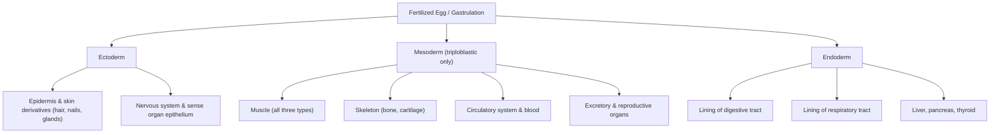



## Overview

Before comparing a human heart to a fish heart, or a human gut to an earthworm's, you need a precise, shared vocabulary for describing *any* animal body — not just the four broad categories (symmetry, tissue type, germ layer, coelom type) but the underlying mechanisms that produce them. This page is deliberately more mechanistic than a typical "definitions" page: every later page in this section — the ten Human Anatomy pages, the three Vertebrate Anatomy pages, and the two Animal Kingdom pages — assumes fluency with the material here, including the histological and developmental detail, not just the terms.

## Key Concepts

### Symmetry and Cephalization

| Type | Description | Examples |
|---|---|---|
| **Asymmetry** | No axis of symmetry | Most sponges (Porifera) |
| **Radial symmetry** | Divisible into similar halves through any of several planes containing the central axis | Cnidarians; adult echinoderms (secondarily) |
| **Biradial symmetry** | A single plane of radial-like symmetry plus one perpendicular plane that also divides the body into mirror halves (a structural intermediate) | Ctenophores (comb jellies) |
| **Bilateral symmetry** | One sagittal plane divides the body into mirror-image halves; produces distinct anterior/posterior and dorsal/ventral axes | Nearly all triploblastic animals |

Bilateral symmetry is mechanistically linked to **cephalization**: an animal that moves consistently in one direction (enabled by having distinct anterior/posterior ends) experiences new environmental stimuli at its anterior end first, creating selective pressure to concentrate sensory structures and integrative nervous tissue there. This is why cephalization (a defined head bearing a brain/cerebral ganglion and major sense organs) tracks so closely with bilateral symmetry across the phyla covered in [Invertebrate Body Plans I](../invertebrate-body-plans-1/) and [II](../invertebrate-body-plans-2/).

Adult echinoderms display **secondary radial symmetry** — bilaterally symmetric, free-swimming larvae undergo a metamorphic shift to pentaradial symmetry as they settle and adopt a sessile-to-slow-moving adult lifestyle, where an all-around sensory field is more useful than a directional one. This dissociation between developmental/phylogenetic classification and adult body plan is one of the most reliably tested inference points on IBO papers.

### Tissue Histology

The four primary tissue types, in more structural/functional detail than a simple list:

**Epithelial tissue** — classified along two independent axes: cell shape (squamous = flat, cuboidal = cube-shaped, columnar = tall/rectangular) and layering (simple = one cell layer, stratified = multiple layers, pseudostratified = one layer but with nuclei at staggered heights, giving a false appearance of stratification). Function follows structure tightly: **simple squamous** (minimal diffusion distance) lines alveoli and capillaries; **simple columnar** (often with microvilli/cilia, tall cells accommodate more organelles for active transport/secretion) lines the intestine and respiratory tract; **stratified squamous** (the surface layer sacrificial, protecting the basal proliferative layer) covers the epidermis and esophagus; **pseudostratified ciliated columnar** lines the trachea, where coordinated ciliary beating physically sweeps trapped particles. Epithelial tissue is avascular (no blood vessels penetrate it — nutrients diffuse from the underlying connective tissue across a **basement membrane**) and has high mitotic turnover.

**Connective tissue** — unified by having cells sparsely distributed within an extracellular matrix (ECM) rather than packed cell-to-cell like epithelium; the ECM composition (ratio of ground substance to fiber type — collagen for tensile strength, elastin for recoil) determines mechanical properties. **Loose connective tissue** (sparse fibers, viscous ground substance) surrounds organs and vessels; **dense regular connective tissue** (parallel collagen bundles) forms tendons and ligaments; **dense irregular connective tissue** (collagen in multiple directions, resisting multidirectional stress) forms the dermis; **cartilage** (chondrocytes in lacunae, avascular, matrix rich in collagen + proteoglycans) and **bone** (osteocytes, mineralized collagen matrix — full detail on the [Human Skeletal System](../human-skeletal-system/) page) are rigid connective tissues; **blood** counts as connective tissue because it is cells (formed elements) suspended in a fluid extracellular matrix (plasma) — detailed on the [Human Circulatory System](../human-circulatory-system/) page.

**Muscle tissue** and **nervous tissue** — structural detail deferred to the [Human Muscular System](../human-muscular-system/) and [Human Nervous System](../human-nervous-system/) pages respectively, since both require dedicated treatment beyond a definitional summary.

Exam tip A classic IBO practical station shows an unlabeled micrograph and asks for tissue identification from structure alone — practice distinguishing simple squamous (thin, flat, single layer) from stratified squamous (thick, multiple layers, protective) from simple/pseudostratified columnar (tall cells, often ciliated) before the practical exam, not just memorizing the names.

### Gastrulation and Germ Layers

**Gastrulation** is the process converting a hollow ball of cells (the blastula) into a multilayered embryo, mechanistically achieved through coordinated cell movements — invagination (in-folding, as in sea urchin gastrulation), involution (inward turning at the blastopore lip), and epiboly (a sheet of cells spreading to enclose deeper layers) act together depending on the species. The process produces two or three primary germ layers:

- **Diploblastic** animals (ectoderm + endoderm only, no mesoderm) — Cnidaria and Ctenophora.
- **Triploblastic** animals (ectoderm, mesoderm, and endoderm) — every bilaterally symmetric animal.

In triploblastic embryos, the mesoderm arises adjacent to the **notochord** (a transient rod of mesodermal tissue, present at some developmental stage in every chordate, including humans — see the [Fish & Amphibian Anatomy](../fish-amphibian-anatomy/) page for its role in non-human chordates). The notochord performs **primary embryonic induction**: it signals the overlying ectoderm to thicken into the **neural plate**, which then rolls into the **neural tube** — the direct embryonic precursor of the entire CNS (detailed on the [Human Nervous System](../human-nervous-system/) page). This is a mechanistic, not just descriptive, link between germ-layer formation and organ-system origin, and a frequently tested inductive-signaling example.

### Cleavage Patterns and Development

Early cell division (**cleavage**) of the fertilized egg follows one of two patterns, which correlate tightly with the protostome/deuterostome split introduced below:

| Feature | Protostomes | Deuterostomes |
|---|---|---|
| Cleavage geometry | **Spiral** — daughter cells offset diagonally over the parent cells | **Radial** — daughter cells stack directly over parent cells |
| Developmental fate | **Determinate (mosaic)** — each blastomere's fate is fixed early; isolating one blastomere produces an incomplete embryo | **Indeterminate (regulative)** — early blastomeres retain the potential to form a complete embryo if isolated (the developmental basis of identical twinning in humans) |
| Blastopore fate | Becomes the **mouth** | Becomes the **anus**; the mouth forms secondarily |
| Coelom formation | **Schizocoely** — the coelom forms by a splitting of a solid mass of mesoderm | **Enterocoely** — the coelom forms by an outpocketing of the archenteron (embryonic gut) wall |
| Examples | Mollusks, annelids, arthropods | Echinoderms, chordates (including all vertebrates) |

This table is worth returning to directly when reading the [Invertebrate Body Plans](../invertebrate-body-plans-1/) pages (protostome examples) against the Vertebrate Anatomy tier (deuterostome examples) — it is the single most useful axis for placing an unfamiliar phylum's development into context on an exam.

### Coelom Types

The **coelom** is a fluid-filled body cavity fully lined by mesoderm-derived tissue (**peritoneum**):

| Type | Description | Examples |
|---|---|---|
| **Acoelomate** | No body cavity; mesenchyme (mesoderm-derived packing tissue) fills the space between gut and body wall | Platyhelminthes |
| **Pseudocoelomate** | Body cavity present, derived from the blastocoel, only partially lined by mesoderm | Nematoda |
| **Eucoelomate (coelomate)** | True coelom, fully mesoderm-lined on both the body-wall and gut sides | Annelida, Mollusca, Arthropoda, Echinodermata, Chordata |

A coelom performs concrete mechanical work: it cushions internal organs, allows the gut to move independently of the body wall (necessary for effective peristalsis, since a fluid-filled cavity transmits muscular force without the gut and body wall dragging against each other), and — in soft-bodied coelomates lacking a rigid skeleton — doubles as a **hydrostatic skeleton**, an incompressible fluid volume that transmits force when surrounding muscle contracts (detailed with earthworm locomotion on the [Invertebrate Body Plans I](../invertebrate-body-plans-1/) page).

### Segmentation

**Metameric segmentation** — a body built from a linear series of repeated units (segments/somites) — arises from a mechanistically conserved genetic toolkit across distantly related phyla: **Hox gene** expression along the anterior-posterior axis specifies regional identity segment by segment, with the same broad gene family (though not identical genes) implicated in annelid, arthropod, and vertebrate segmentation. In vertebrates this produces **somites** (blocks of paraxial mesoderm flanking the developing neural tube), which give rise to the segmented vertebral column, associated ribs, and the segmental pattern of spinal nerves — a structural echo of the more completely segmented adult bodies of annelids and arthropods, covered on the [Invertebrate Body Plans I](../invertebrate-body-plans-1/) page.

## Comparative Structures

| Feature | Cnidaria | Platyhelminthes | Nematoda | Annelida/Mollusca/Arthropoda | Echinodermata | Chordata |
|---|---|---|---|---|---|---|
| Symmetry | Radial | Bilateral | Bilateral | Bilateral | Radial (adult) / Bilateral (larva) | Bilateral |
| Germ layers | Diploblastic | Triploblastic | Triploblastic | Triploblastic | Triploblastic | Triploblastic |
| Coelom | None | Acoelomate | Pseudocoelomate | Eucoelomate | Eucoelomate | Eucoelomate |
| Cleavage | — | Spiral | Spiral | Spiral | Radial | Radial |
| Development | — | Protostome | Protostome | Protostome | Deuterostome | Deuterostome |
| Coelom formation | — | — (none) | — (partial only) | Schizocoely | Enterocoely | Enterocoely |

## Common Exam Questions

- "Given a cross-section micrograph, identify the tissue type and justify your answer using cell shape, layering, and vascularity."
- "Explain the mechanistic link between notochord signaling and neural tube formation, and name this phenomenon."
- "A blastomere is isolated from a 4-cell embryo and develops into a complete, viable organism. Is this embryo's cleavage pattern more consistent with protostome or deuterostome development? Justify your answer."
- "Distinguish schizocoely from enterocoely as coelom-formation mechanisms, and state which is associated with which developmental lineage."
- "Explain why echinoderms are classified as deuterostomes despite adult radial symmetry, using developmental (not adult anatomical) evidence."

## Visual Reference

**Interactive**

- **Coelom morph slider (SVG/JS)** — one slider that morphs a generic body cross-section continuously from acoelomate → pseudocoelomate → eucoelomate, showing the mesoderm lining progressively wrap the body cavity — replaces three static snapshots with one continuous transformation a student can scrub back and forth.
- **Clickable germ-layer tree (extends the Mermaid diagram above)** — clicking "ectoderm" / "mesoderm" / "endoderm" isolates and highlights only that branch's derivatives, dimming the rest; a "quiz me" toggle hides all labels so a student can self-test before revealing them.

**Static**

- Symmetry types (asymmetry / radial / biradial / bilateral) drawn side by side on the same generic body outline
- Gastrulation sequence (blastula → invagination/involution → gastrula) with germ layers colored consistently with the Mermaid diagram
- Notochord-induced neural tube formation, cross-section sequence (neural plate → neural groove → neural tube)
- Spiral/determinate vs. radial/indeterminate cleavage, first three divisions compared side by side
- Schizocoely vs. enterocoely coelom formation, cross-section sequence
- Coelom-type cross-sections: acoelomate, pseudocoelomate, eucoelomate, side by side (paired with the interactive morph slider above)

## Practice Problems

1. A student observes an animal with a body cavity only partially lined by mesoderm, derived from the blastocoel. Name this coelom type and one phylum that has it.
2. List the three germ layers and, for each, name one derivative structure not already shown in the Mermaid diagram above.
3. A sea star embryo shows radial, indeterminate cleavage, a blastopore that becomes the anus, and a coelom forming by enterocoely. What developmental classification does this place it in, and what other major group shares every one of these features?
4. Explain, mechanistically, why isolating one blastomere from a mosaic (determinate) 2-cell embryo produces only a half-embryo, while the same manipulation on a regulative (indeterminate) embryo can produce two complete embryos.
5. Explain why a coelom is mechanically necessary for effective peristalsis, referencing the independence of gut and body-wall movement.
