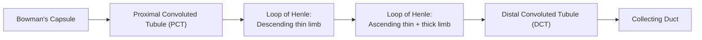



## Overview

The kidney's structure is inseparable from its function as a high-pressure filter followed by a long, regionally specialized reabsorption/secretion tube — nearly every anatomical feature covered on this page exists because it serves that specific two-stage logic.

## Key Concepts

### Kidney Gross Anatomy

Each kidney is enclosed by a thin fibrous **renal capsule**, structurally divided into an outer **cortex** and inner **medulla**; the medulla is organized into 8–18 cone-shaped **renal pyramids** (separated by cortical extensions, the **renal columns**), each pyramid's apex (**renal papilla**) draining urine into a cup-shaped **minor calyx**; minor calices converge into **major calices**, which converge into the funnel-shaped **renal pelvis**, continuous with the **ureter** exiting at the **hilum** (the same structural entry/exit point for the renal artery and renal vein, a standard labeled-cross-section exam feature).

### The Nephron: Renal Corpuscle

The nephron (~1 million per kidney) is the functional unit, with two main structural parts. The **renal corpuscle** comprises the **glomerulus** (a capillary tuft fed by an **afferent arteriole** and drained by an **efferent arteriole** — both arterioles, not an arteriole-then-venule, meaning the glomerulus is unusually positioned between two resistance vessels, keeping capillary pressure high enough to force filtration) surrounded by **Bowman's (glomerular) capsule**. The capsule's inner (visceral) layer is made of specialized cells, **podocytes**, wrapping the glomerular capillaries with foot-like processes (**pedicels**) that interdigitate, leaving narrow **filtration slits** between them; together with the fenestrated (pored) glomerular capillary endothelium and a shared basement membrane, this three-layer structure forms the **filtration membrane** — permeable to water and small solutes, but structurally excluding blood cells and most plasma proteins by size and the basement membrane's negative charge (which repels similarly negatively charged proteins like albumin). Fluid crossing this membrane (the **filtrate**) collects in Bowman's capsule space and enters the renal tubule.

### The Nephron: Renal Tubule

The filtrate then passes through a sequence of structurally and functionally distinct tubule regions:

- **Proximal convoluted tubule (PCT)** — cuboidal epithelium with a prominent **brush border** (dense microvilli, maximizing surface area) and high mitochondrial density (supporting active transport); reabsorbs the bulk (~65%) of filtered water, ions, and essentially all filtered glucose and amino acids — its structural profile (brush border + mitochondria) is a direct histological signature of a high-throughput active-reabsorption region, directly comparable in logic to small intestinal absorptive epithelium (see [Human Digestive System](../human-digestive-system/)).
- **Loop of Henle** — a hairpin turn descending from cortex into medulla and back; the **descending thin limb** is highly permeable to water but not solutes, while the **ascending limb** (thin, then thick segment) is permeable to solutes (actively transporting Na⁺/K⁺/Cl⁻ out) but impermeable to water. This asymmetric permeability pattern is the structural basis of the kidney's **countercurrent multiplier** mechanism, which establishes a progressively concentrated interstitial gradient deep in the medulla — necessary for producing concentrated urine.
- **Distal convoluted tubule (DCT)** — shorter, fewer microvilli than the PCT; site of regulated (hormonally controlled) reabsorption, fine-tuning final urine composition.
- **Collecting duct** — receives filtrate from many nephrons; its water permeability is variable, regulated by antidiuretic hormone (ADH) acting on **aquaporin** channels — the specific structural target of the kidney's main water-balance control point.

### Two Nephron Populations

Not all nephrons are structurally identical: **cortical nephrons** (~85%, glomerulus in the outer cortex, short loops of Henle barely entering the medulla) handle the bulk of filtration volume, while **juxtamedullary nephrons** (~15%, glomerulus near the cortex-medulla border, very long loops of Henle penetrating deep into the medulla, paralleled by specialized capillaries, the **vasa recta**) are structurally responsible for establishing the deep medullary concentration gradient that makes concentrated urine possible at all — a direct minority-population, disproportionate-function structural point worth stating explicitly.

### Juxtaglomerular Apparatus

At the point where the ascending thick limb of the loop of Henle passes back between its own nephron's afferent and efferent arterioles, two structurally specialized cell populations meet: the **macula densa** (modified tubule epithelial cells, monitoring fluid Na⁺/Cl⁻ concentration as it passes) and **juxtaglomerular (granular) cells** (modified smooth muscle cells in the afferent arteriole wall, secreting renin in response to macula densa signaling or reduced arteriole stretch). This structure — the **juxtaglomerular apparatus** — is the kidney's built-in blood-pressure/filtration-rate sensor and the anatomical starting point of the renin-angiotensin-aldosterone hormonal axis, a direct structural link between kidney anatomy and systemic blood pressure regulation.

### Renal Blood Supply

Blood flow through the kidney passes through **two** capillary beds in series, a structurally unusual arrangement (most organs have only one) that directly enables the filtration-then-reabsorption logic: renal artery → afferent arteriole → **glomerular capillaries** (high pressure, filtration) → efferent arteriole → **peritubular capillaries** (low pressure, surrounding the PCT/DCT, positioned to reabsorb what the tubule reclaims) and, for juxtamedullary nephrons, the **vasa recta** (running alongside the loop of Henle, maintaining rather than washing out the medullary concentration gradient) → renal vein.

### Lower Urinary Tract

Urine draining from collecting ducts passes through the calyces/pelvis into the **ureter** (a muscular tube, peristaltic contraction of its wall — same general smooth-muscle logic as GI peristalsis, see [Human Digestive System](../human-digestive-system/) — actively propels urine toward the bladder rather than relying on gravity alone), into the **urinary bladder** (a distensible muscular sac; its wall's **detrusor muscle** contracts to expel urine), through the **urethra**. The ureters, bladder, and proximal urethra are lined by **transitional epithelium** — a specialized stratified epithelium structurally capable of stretching (cells flatten and the apparent layer count decreases as the bladder fills) uniquely suited to an organ whose luminal surface must accommodate large volume changes, unlike any epithelium described on the [Human Digestive System](../human-digestive-system/) page. Urine release (**micturition**) involves an **internal urethral sphincter** (smooth muscle, involuntary) and an **external urethral sphincter** (skeletal muscle, voluntary) — the same involuntary/voluntary sphincter pairing pattern seen at the anal canal.

## Comparative Structures

The nephron's filtration-then-reabsorption logic has a structurally simpler invertebrate analog in the annelid **nephridium** (see [Invertebrate Body Plans I](../invertebrate-body-plans-1/)) — a segmentally repeated, much less elaborate filtration unit lacking the nephron's regional tubule specialization or countercurrent-multiplier concentrating mechanism. Among vertebrates, nephron structure (particularly loop-of-Henle length and the proportion of juxtamedullary nephrons) correlates directly with an animal's need to concentrate urine and conserve water, a theme picked up on the [Fish & Amphibian Anatomy](../fish-amphibian-anatomy/), [Reptile & Bird Anatomy](../reptile-bird-anatomy/), and [Mammalian Comparative Anatomy](../mammalian-comparative-anatomy/) pages (e.g. desert mammals show a much higher proportion of long-looped juxtamedullary nephrons than aquatic mammals).

## Common Exam Questions

- "Trace a molecule of glucose from the glomerular capillary to the point it is normally fully reabsorbed, naming every structure it passes through."
- "Explain why the glomerulus, unlike a typical capillary bed, sits between two arterioles rather than an arteriole and a venule, and what functional advantage this provides."
- "Explain the structural basis of the countercurrent multiplier, referencing the differential water/solute permeability of the descending and ascending loop of Henle limbs."
- "A patient has a mutation preventing aquaporin insertion in the collecting duct in response to ADH. Predict the effect on urine concentration."
- "Identify the two cell types of the juxtaglomerular apparatus and state what each detects or secretes."
- "Explain why transitional epithelium, rather than the stratified squamous epithelium seen elsewhere in the body, lines the bladder."

## Visual Reference

*Planned diagrams (CC-BY sourcing follow-up) — kidney gross anatomy (cortex/medulla/pyramids/calyces/pelvis), labeled nephron showing all tubule regions and the two-capillary-bed blood supply, renal corpuscle detail (glomerulus/Bowman's capsule/podocytes/filtration slits), cortical vs. juxtamedullary nephron comparison, juxtaglomerular apparatus at the vascular pole, transitional epithelium in relaxed vs. stretched bladder wall.*

## Practice Problems

1. Name, in order, every structure urine passes through from the collecting duct to leaving the body.
2. Explain why juxtamedullary nephrons, despite being a minority (~15%) of all nephrons, are disproportionately important for producing concentrated urine.
3. A structure in the nephron has cuboidal epithelium with a dense brush border and high mitochondrial density. Identify it and explain what these two structural features indicate about its function.
4. Describe the two-capillary-bed path of blood flow through the kidney and explain why this arrangement (rather than a single capillary bed) is structurally necessary.
5. Distinguish the internal and external urethral sphincters by muscle type and voluntary/involuntary control.
