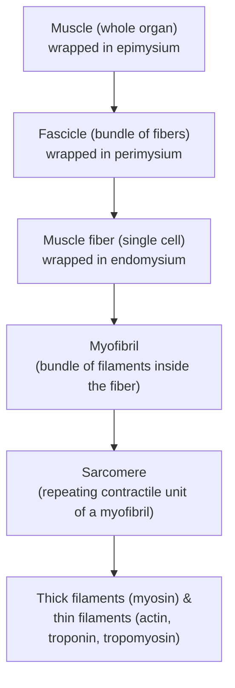



## Overview

Muscle tissue — one of the four primary tissue types introduced on the [Body Plans](../body-plans/) page — converts chemical energy (ATP) into mechanical force. This page covers structural anatomy at every scale from organ to protein filament, including the structural (not just biochemical) basis of how a nerve signal becomes a contraction — the neuromuscular junction and excitation-contraction coupling — since IBO practical and theory papers test this as anatomy/histology, not pure biochemistry.

## Key Concepts

### Three Muscle Tissue Types

| Type | Appearance | Control | Location | Key structural feature |
|---|---|---|---|---|
| **Skeletal** | Striated | Voluntary | Attached to bone via tendons | Long, multinucleated fibers (multiple peripheral nuclei per cell, from fusion of embryonic myoblasts) |
| **Cardiac** | Striated | Involuntary | Heart wall only | Branched, mononucleate fibers joined by intercalated discs |
| **Smooth** | Non-striated | Involuntary | Walls of hollow organs (gut, blood vessels, airways, bladder) | Spindle-shaped, single central nucleus, thin/thick filaments present but not organized into visible sarcomeres |

**Intercalated discs** (cardiac muscle only) contain both **desmosomes** (mechanically link adjacent cells so contraction force transmits cell-to-cell rather than tearing the tissue) and **gap junctions** (electrically couple adjacent cells via low-resistance channels, allowing an action potential to spread cell-to-cell almost instantaneously) — the anatomical basis for the heart wall contracting as a single coordinated **functional syncytium**, expanded on with the cardiac conduction system on the [Human Circulatory System](../human-circulatory-system/) page. Smooth muscle also has gap junctions in most locations (**single-unit/visceral smooth muscle**, e.g. the gut wall, contracting as coordinated sheets) though some locations instead have sparse gap junctions and largely independent fiber-by-fiber control (**multi-unit smooth muscle**, e.g. the iris).

### Skeletal Muscle: Organ to Protein

Skeletal muscle anatomy is organized as a hierarchy, each level wrapped in its own connective tissue sheath:

The three connective-tissue wrappings (epi-/peri-/endomysium) converge at the muscle's ends to form the **tendon**, anchoring muscle to bone via the periosteum (see [Human Skeletal System](../human-skeletal-system/)) — a direct structural link between the two pages.

**The sarcomere** is the functional contractile unit, defined as the segment between two adjacent **Z-discs**:

- **A-band** — the full length of the thick (myosin) filaments; stays constant length during contraction.
- **I-band** — region containing only thin filaments; shortens during contraction.
- **H-zone** — central region of the A-band containing only thick filaments; shortens during contraction.
- **Z-disc** — protein structure (containing **α-actinin**) anchoring thin filaments; defines sarcomere boundaries; adjacent Z-discs move closer together during contraction.
- **M-line** — central line within the H-zone, anchoring thick filaments in register.

**Thin filaments** are not pure actin: alongside the polymerized **actin** strand, **tropomyosin** (a rod-shaped protein lying along the actin groove, blocking myosin-binding sites at rest) and the **troponin complex** (troponin C binds calcium, troponin I inhibits actin-myosin binding at rest, troponin T anchors the complex to tropomyosin) together form the structural switch that gates contraction — calcium binding to troponin C shifts tropomyosin's position, exposing the myosin-binding sites this is the direct structural link between a calcium signal and the sliding-filament mechanism below.

### Neuromuscular Junction and Excitation-Contraction Coupling

A motor neuron's axon terminal forms a specialized synapse, the **neuromuscular junction (NMJ)**, onto a specific site on the muscle fiber, the **motor end plate** — a region of extensively folded sarcolemma (muscle cell membrane) that increases surface area for **acetylcholine (ACh)** receptors. Arrival of an action potential at the axon terminal triggers ACh release into the **synaptic cleft**; ACh binding at the motor end plate depolarizes the sarcolemma, generating a muscle action potential.

This electrical signal is carried into the fiber's interior by **T-tubules** (transverse tubules — deep, tubular invaginations of the sarcolemma, penetrating between myofibrils at regular intervals aligned with the sarcomere pattern), which lie immediately adjacent to the **sarcoplasmic reticulum (SR)** — a specialized smooth ER wrapping each myofibril and storing a large intracellular calcium reserve. A T-tubule flanked by two SR terminal cisternae forms a structural unit called a **triad**. Depolarization of the T-tubule membrane is mechanically/electrically coupled (via voltage-sensing **DHP receptors** on the T-tubule linked to **ryanodine receptors**, which are calcium-release channels, on the adjacent SR) to rapid calcium release from the SR into the sarcoplasm — this triad structure is the specific anatomical basis of **excitation-contraction coupling**, the process linking a surface electrical signal to filament sliding deep within the fiber. Released calcium binds troponin C (above), exposing myosin-binding sites and permitting the cross-bridge cycle to proceed; when nervous stimulation ends, calcium is actively pumped back into the SR, tropomyosin re-blocks the binding sites, and the muscle relaxes.

### The Cross-Bridge Cycle and Sliding Filament Model

With binding sites exposed, contraction proceeds through a repeating cycle at each myosin head: **(1)** an ATP-bound myosin head hydrolyzes ATP to ADP + Pi, cocking into a high-energy conformation; **(2)** the cocked head binds an exposed site on actin, forming a cross-bridge; **(3)** release of Pi triggers the **power stroke** — the head pivots, pulling the thin filament past the thick filament (the ADP is released at the end of this step); **(4)** a new ATP molecule binds the myosin head, causing it to detach from actin, resetting the cycle. Because myosin heads along a thick filament act asynchronously (some attached and pulling while others detach and reset), contraction is smooth rather than jerky — and because the thin and thick filaments themselves do not change length, only slide past each other, the A-band stays constant while the I-band and H-zone shorten, the direct histological signature of this mechanism.

### Skeletal Muscle Fiber Types

Not all skeletal muscle fibers are structurally identical; three types differ in metabolic machinery, with direct structural correlates:

| Fiber type | Mitochondria / capillary density | Myoglobin | Contraction speed | Fatigue resistance | Typical role |
|---|---|---|---|---|---|
| **Type I (slow oxidative)** | High | High (red appearance) | Slow | High | Postural muscles, endurance activity |
| **Type IIa (fast oxidative-glycolytic)** | Moderate | Moderate | Fast | Moderate | Mixed-use muscles |
| **Type IIx (fast glycolytic)** | Low | Low (pale appearance) | Fast | Low | Short, powerful bursts (e.g. sprinting) |

Myoglobin content (an oxygen-binding pigment structurally analogous to hemoglobin, but retained within the muscle fiber as an internal oxygen reserve) is directly responsible for the color difference between "red" and "white" muscle fibers/meat — a structural, histologically visible correlate of a fiber's metabolic strategy. Most human muscles are a mixed population of fiber types, with the proportion varying by muscle and (within limits) by training.

### Motor Units

A single motor neuron and every muscle fiber it innervates together form a **motor unit** — the smallest functionally controllable unit of contraction, since a motor neuron fires all-or-none and activates every fiber it contacts simultaneously. Motor unit size (fibers per neuron) is structurally tuned to function: fine-control muscles (e.g. extraocular eye muscles) have very small motor units (as few as ~10 fibers per neuron), while large postural/power muscles (e.g. the gastrocnemius) have motor units of a thousand fibers or more — a direct structure-function link between innervation ratio and the precision of movement a muscle is capable of.

### Major Muscle Groups (Gross Anatomy)

High-yield named muscles for practical/dissection-style questions, organized by region:

- **Head/neck**: masseter (jaw closing), sternocleidomastoid (neck rotation/flexion, a key surface landmark).
- **Trunk**: rectus abdominis, external/internal obliques, diaphragm (the primary muscle of respiration — structurally a skeletal muscle, functionally central to the [Human Respiratory System](../human-respiratory-system/)).
- **Upper limb**: deltoid (shoulder abduction), biceps brachii/triceps brachii (antagonistic elbow flexor/extensor pair).
- **Lower limb**: quadriceps femoris (knee extension), hamstrings (knee flexion, hip extension — antagonistic to quadriceps), gastrocnemius/soleus (ankle plantarflexion).

**Antagonistic pairs** are worth understanding as a general principle: because muscles only generate pulling force, any joint movement requires an opposing muscle (or gravity) to reverse it. Flexor/extensor pairs across the elbow and knee are the standard testable examples.

## Comparative Structures

The three muscle tissue types, the triad-based excitation-contraction coupling mechanism, and the sarcomere-level sliding filament model are conserved across all vertebrates (see the Vertebrate Anatomy tier), making this page's structural content directly transferable. What differs across taxa is gross muscle arrangement (e.g. the highly derived flight muscles of birds, covered on [Reptile & Bird Anatomy](../reptile-bird-anatomy/)) and, in invertebrates, muscle acting without a rigid endoskeleton to pull against (obliquely striated muscle acting on a hydrostatic skeleton — see [Invertebrate Body Plans I](../invertebrate-body-plans-1/)).

## Common Exam Questions

- "Given a labeled sarcomere diagram at rest and mid-contraction, identify which bands shorten and which stay constant, and explain why."
- "Trace the excitation-contraction coupling pathway from ACh release at the NMJ to calcium binding troponin C, naming every structure the signal passes through."
- "Distinguish cardiac from skeletal muscle using both a structural feature (intercalated discs) and a functional consequence (coordinated involuntary contraction)."
- "A biopsy shows a muscle fiber with high mitochondrial density, high myoglobin, and a red color. Classify the fiber type and predict its fatigue resistance."
- "Explain why an eye muscle has a much smaller motor unit size than the gastrocnemius, connecting the answer to the function each muscle performs."

## Visual Reference

**Interactive**

- **Sarcomere contraction slider (Plotly or SVG+JS)** — drag from "fully relaxed" to "fully contracted" and watch the A-band, I-band, and H-zone lengths update live on a labeled sarcomere, with a numeric readout of each band's current length — the clearest possible demonstration that filaments slide rather than shorten.
- **Excitation-contraction coupling walkthrough (click-through)** — click through ACh release at the NMJ → sarcolemma depolarization → T-tubule → SR calcium release via the triad → troponin C binding → binding-site exposure, lighting up each structure in sequence.

**Static**

- Muscle organ hierarchy cross-section (epimysium/perimysium/endomysium)
- Sarcomere banding diagram at rest vs. contracted, troponin/tropomyosin position shown on the thin filament in both states
- Neuromuscular junction and motor end plate, synaptic vesicles and ACh receptors labeled
- T-tubule/SR triad structure in 3D-style cutaway
- Cross-bridge cycle, all four steps illustrated in sequence
- Fiber type comparison (Type I/IIa/IIx) by color and mitochondrial/capillary density
- Major muscle groups labeled, anterior and posterior view

## Practice Problems

1. Order the following from largest to smallest structural unit: sarcomere, myofibril, muscle fiber, fascicle.
2. A microscope slide shows branched, striated cells joined end-to-end by structures containing gap junctions. Identify the tissue type and justify your answer.
3. Explain the role of the troponin-tropomyosin complex in preventing contraction at rest, and how calcium release changes this.
4. Name the two structures that form a "triad" and explain why this arrangement is necessary for rapid, coordinated calcium release throughout the fiber.
5. A sprinter's leg muscle biopsy shows low mitochondrial density and low myoglobin. Predict the fiber type and the muscle's likely fatigue characteristics.
