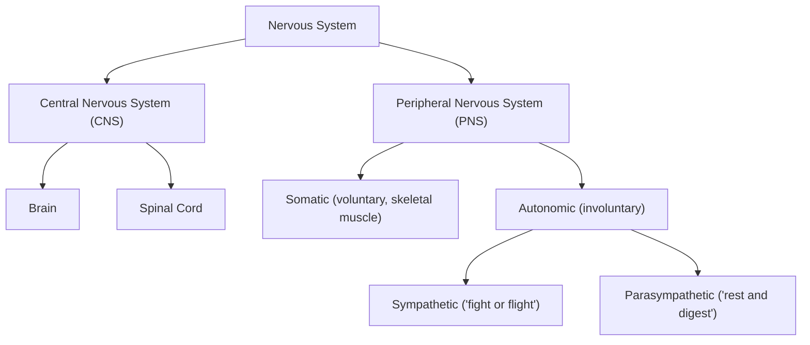



## Overview

The nervous system is nervous tissue (see [Body Plans](../body-plans/)) organized into a signal-processing network. This page is structural: anatomical divisions, neuron/glial/synapse anatomy, detailed brain and spinal cord regional organization, and the peripheral/autonomic nerve plan. Sense-organ structure (eye, ear) is deep enough to warrant its own page — see [Human Sensory Organs](../human-sensory-organs/). Cephalization (introduced on the Body Plans page) means this page carries a disproportionate share of IBO exam weight relative to its position in the reading order.

## Key Concepts

### Anatomical Divisions

The **CNS** (brain + spinal cord) is protected by bone (skull, vertebral column — see [Human Skeletal System](../human-skeletal-system/)), three connective-tissue **meninges** — **dura mater** (outermost, tough, two-layered, encloses venous sinuses draining the brain), **arachnoid mater** (middle, web-like, encloses the **subarachnoid space**, through which CSF circulates and major blood vessels run), **pia mater** (innermost, delicate, adheres directly to the brain/spinal cord surface, following every gyrus and sulcus) — and cerebrospinal fluid.

**CSF** is produced by the **choroid plexus** (specialized, highly vascularized ependymal tissue) within the brain's four **ventricles** (paired lateral ventricles, third ventricle, fourth ventricle, connected in sequence), circulates through the ventricular system and central canal of the spinal cord, exits into the subarachnoid space, and is reabsorbed into the venous system via **arachnoid granulations**. Structurally, CSF performs three roles: mechanical cushioning (the brain effectively floats, reducing its effective weight against the skull), chemical stability (a tightly regulated extracellular environment for neurons), and buoyant/waste clearance function. Obstruction of this circulation pathway (e.g. at a narrow ventricular connection) causes CSF to accumulate proximally — the structural basis of hydrocephalus, a common applied-anatomy question.

The **PNS** comprises 12 pairs of **cranial nerves** (emerging directly from the brain/brainstem) and 31 pairs of **spinal nerves** (emerging from the spinal cord between vertebrae, each formed by the union of a dorsal and ventral root — see below).

### Neuron and Synapse Structure

A **neuron** has three structural regions: **dendrites** (branched, receive synaptic input, increasing surface area for connections), **cell body (soma)** (nucleus, most organelles, integrates incoming signals), and **axon** (single, conducts an action potential away from the soma, ending in **axon terminals**).

**Resting membrane potential** (structurally maintained by unequal ion distribution across the membrane, set up by the Na⁺/K⁺-ATPase pump and leak channels) and the **action potential** (a rapid, self-propagating depolarization driven by sequential opening of voltage-gated Na⁺ channels, then voltage-gated K⁺ channels) are physiological processes with a direct structural dependency worth stating precisely: axons wrapped in **myelin** (produced by **Schwann cells** in the PNS, one Schwann cell per axon segment; by **oligodendrocytes** in the CNS, one oligodendrocyte extending processes to myelinate segments of several different axons — a structural PNS/CNS difference worth remembering) conduct faster because voltage-gated Na⁺ channels are concentrated at the unmyelinated gaps, the **nodes of Ranvier**, where the action potential regenerates and appears to "jump" node to node (**saltatory conduction**) rather than regenerating continuously along the entire membrane.

At the axon terminal, a **chemical synapse** transmits the signal to the next cell: an action potential arriving at the terminal opens voltage-gated Ca²⁺ channels, triggering **synaptic vesicles** (membrane-bound sacs of neurotransmitter) to fuse with the presynaptic membrane and release their contents into the **synaptic cleft**; neurotransmitter diffuses across and binds **postsynaptic receptors**, altering the postsynaptic cell's membrane potential (excitatory or inhibitory depending on the specific neurotransmitter-receptor pair). This same structural logic — vesicle fusion, cleft diffusion, receptor binding — is reused at the neuromuscular junction, detailed on the [Human Muscular System](../human-muscular-system/) page.

**Other glial cells**, largely supportive rather than signal-conducting: **astrocytes** (CNS, form the blood-brain barrier by inducing tight junctions in brain capillary endothelium, provide metabolic support and regulate the extracellular ion environment), **microglia** (CNS, immune defense — the CNS's resident macrophage-like cells), **ependymal cells** (CNS, line the ventricles, produce CSF as part of the choroid plexus).

**Gray matter vs. white matter**: gray matter is composed mainly of neuron cell bodies, dendrites, and unmyelinated fibers (found at the cerebral/cerebellar cortex, and centrally within the spinal cord); white matter is composed of myelinated axon tracts (myelin's lipid content gives it a pale color) and lies centrally in the brain, peripherally in the spinal cord — the brain and spinal cord invert this arrangement relative to each other, a frequently tested point.

### Major Brain Regions

| Region | Key structures | Primary functions |
|---|---|---|
| **Cerebrum** | Two hemispheres, each with frontal/parietal/temporal/occipital lobes; outer cerebral cortex (gray matter, extensively folded into gyri/sulci to increase surface area); underlying white matter tracts including the **corpus callosum** (connects the two hemispheres) | Voluntary movement, sensory processing, language, reasoning, memory |
| **Diencephalon** | Thalamus, hypothalamus | Thalamus: sensory relay station to the cortex (nearly all sensory input, except olfaction, synapses here first). Hypothalamus: homeostatic control (temperature, hunger, thirst), links nervous and endocrine systems via direct control of the pituitary gland |
| **Cerebellum** | Highly folded cortex, dorsal to the brainstem, connected to it by three paired **cerebellar peduncles** | Motor coordination, balance, fine-tuning of movement (not initiation) |
| **Brainstem** | Midbrain, pons, medulla oblongata | Relays signals between brain and spinal cord; medulla contains vital involuntary control centers (breathing rhythm, heart rate, blood pressure) |

**Cerebral cortex functional areas**, a further level of structural detail within the cerebrum, high-yield for IBO: the **primary motor cortex** (precentral gyrus, frontal lobe — initiates voluntary movement, organized somatotopically as a "motor homunculus" with body-region representation proportional to the precision of control required, not literal body size) and **primary somatosensory cortex** (postcentral gyrus, parietal lobe, directly posterior to the motor cortex — receives touch/pressure/temperature/pain input, also somatotopically organized) sit on either side of the **central sulcus**. Language-specific areas are typically lateralized to one hemisphere (left, in most people): **Broca's area** (frontal lobe — speech production; damage produces halting, effortful speech with preserved comprehension) and **Wernicke's area** (temporal lobe — language comprehension; damage produces fluent but nonsensical speech), connected by a white-matter tract (the arcuate fasciculus) — a classic structure-function dissociation exam topic. Beneath the cortex, the **basal ganglia** (a group of subcortical gray-matter nuclei) regulate voluntary movement initiation and smoothing (their degeneration is the structural basis of Parkinson's disease, a useful applied-anatomy reference point), and the **limbic system** (including the hippocampus, for memory consolidation, and the amygdala, for emotional processing, both in the temporal lobe) links cortical processing to emotional and memory function.

### Spinal Cord Organization and the Reflex Arc

In cross-section, the spinal cord shows a butterfly/H-shaped core of gray matter (dorsal and ventral horns, plus lateral horns at thoracic/upper lumbar levels containing sympathetic preganglionic neurons) surrounded by white matter tracts (ascending sensory tracts and descending motor tracts). **Dorsal root** = sensory (afferent) input entering the cord, with cell bodies clustered in the **dorsal root ganglion** just outside the cord; **ventral root** = motor (efferent) output leaving the cord — a structural asymmetry (the Bell-Magendie law) that is a reliable exam fact. Dorsal and ventral roots merge just distal to the dorsal root ganglion to form a single mixed **spinal nerve**.

The **reflex arc** is the clearest anatomical demonstration of spinal cord organization, using the knee-jerk (patellar) reflex as the standard example: stretch receptor in the quadriceps muscle → sensory neuron → dorsal root → direct synapse onto a motor neuron in the ventral horn (a **monosynaptic reflex**, the fastest reflex type, since it involves no interneuron) → ventral root → motor neuron → quadriceps contraction — occurring without requiring the brain, though the brain normally receives a parallel signal and can modulate the reflex.

### Cranial and Spinal Nerves

The 12 pairs of cranial nerves are conventionally numbered I–XII and each carries a specific, named functional role — a standard IBO memorization/mapping topic: **I Olfactory** (smell), **II Optic** (vision), **III Oculomotor**, **IV Trochlear**, **VI Abducens** (these three jointly control most eye-muscle movement), **V Trigeminal** (facial sensation, jaw muscles), **VII Facial** (facial expression muscles, taste anterior 2/3 tongue), **VIII Vestibulocochlear** (hearing, balance), **IX Glossopharyngeal** (taste posterior tongue, pharynx), **X Vagus** (the major parasympathetic nerve to thoracic/abdominal organs — by far the most extensive distribution of any cranial nerve), **XI Accessory** (neck/shoulder muscles), **XII Hypoglossal** (tongue muscles). The 31 pairs of spinal nerves are grouped by the vertebral level they exit (8 cervical, 12 thoracic, 5 lumbar, 5 sacral, 1 coccygeal); nerves from adjacent levels often interweave into **plexuses** (e.g. the brachial plexus, supplying the upper limb) before redistributing into named peripheral nerves.

### Autonomic Nervous System Structure

Both autonomic divisions use a two-neuron chain from CNS to target organ — a structural feature distinguishing autonomic from somatic motor pathways (which use a single motor neuron all the way to skeletal muscle): a **preganglionic neuron** (cell body in the CNS) synapses onto a **postganglionic neuron** (cell body in a peripheral autonomic ganglion), which then innervates the target organ. The two divisions differ structurally in exactly where this synapse occurs and what neurotransmitter the postganglionic neuron releases:

| Feature | Sympathetic | Parasympathetic |
|---|---|---|
| CNS origin | Thoracic and lumbar spinal cord | Brainstem (via cranial nerves, especially the vagus) and sacral spinal cord |
| Ganglion location | Close to the spinal cord (sympathetic chain ganglia) — short preganglionic, long postganglionic neuron | Close to or within the target organ — long preganglionic, short postganglionic neuron |
| Postganglionic neurotransmitter | Norepinephrine (mostly) | Acetylcholine |

This preganglionic/postganglionic length difference is itself a useful structural mnemonic: sympathetic responses (widespread, rapid, "fight or flight") are anatomically set up for broad, fast-diffusing activation from ganglia near the spinal cord, while parasympathetic responses (localized, "rest and digest") are anatomically set up for targeted, organ-specific control from ganglia embedded in or near the organ itself.

## Comparative Structures

The tripartite CNS/PNS/autonomic organization and core neuron/synapse structure are conserved across all vertebrates, but relative brain-region proportions differ substantially by lifestyle and taxon — expanded on across the Vertebrate Anatomy tier. Invertebrate nervous systems trade the centralized brain + spinal cord plan for nerve nets (cnidarians, no true brain) or ganglia (a more distributed plan, seen in annelids and arthropods, including the notably centralized cephalopod brain) — see [Invertebrate Body Plans I](../invertebrate-body-plans-1/) and [II](../invertebrate-body-plans-2/).

## Common Exam Questions

- "Explain, structurally, why damage to the ventral root causes motor but not sensory deficits."
- "A patient has fluent but nonsensical speech with intact comprehension of written instructions. Which cortical area is most likely damaged, and where is the deficit lateralized?"
- "Trace the two-neuron pathway of a sympathetic signal from the spinal cord to a target organ, naming the ganglion location and the postganglionic neurotransmitter."
- "Explain why obstruction of CSF flow within the ventricular system causes fluid accumulation proximal to the blockage, and name the resulting condition."
- "A CNS axon and a PNS axon are both myelinated. Name the glial cell responsible in each case and describe one structural difference between them."

## Visual Reference

**Interactive**

- **Myelinated vs. unmyelinated conduction chart (Plotly)** — plot membrane potential against distance/time for both axon types side by side, with a speed readout, turning "saltatory conduction is faster" into a directly comparable animated race rather than a stated fact.
- **Knee-jerk reflex arc walkthrough (click-through)** — click through stretch receptor → sensory neuron → dorsal root → synapse in the ventral horn → motor neuron → muscle on a spinal cord cross-section, each click lighting up the relevant structure and explaining why this reflex bypasses the brain.

**Static**

- Meninges layers in cross-section (dura/arachnoid/pia)
- Ventricular system and CSF circulation pathway, from choroid plexus to arachnoid granulations
- Brain sagittal section with all major regions labeled
- Cerebral cortex lateral view with motor/somatosensory/Broca's/Wernicke's areas labeled and the central sulcus marked
- Spinal cord cross-section (dorsal/ventral horns and roots) paired with the reflex arc above
- Cranial nerve base-of-brain view with all 12 numbered and named
- Sympathetic vs. parasympathetic ganglion-location schematic, pre-/postganglionic neuron lengths visibly different

## Practice Problems

1. Name the three meningeal layers from outermost to innermost and state which one directly contacts brain tissue.
2. A patient loses fine motor coordination but retains the ability to initiate movement. Which brain region is most likely affected?
3. Explain why gray matter is central in the spinal cord but peripheral (cortical) in the brain, in terms of what gray matter is made of.
4. Name the cranial nerve responsible for the majority of parasympathetic output to the thoracic and abdominal organs.
5. Distinguish the sympathetic and parasympathetic divisions by ganglion location and preganglionic/postganglionic neuron length, and explain how this structural difference supports each division's characteristic response pattern.
