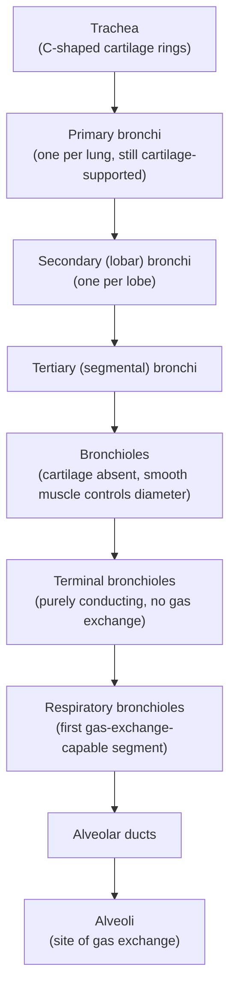



## Overview

This page covers the structural anatomy of the airway from nose to alveolus, the mechanical structures that drive ventilation, and the histological basis of gas exchange — the structural half of a system whose functional partner, blood-based gas transport, is covered on the [Human Circulatory System](../human-circulatory-system/) page.

## Key Concepts

### Upper Respiratory Tract

Air entering through the **nasal cavity** passes over three bony **conchae (turbinates)**, projections that increase surface area and create turbulent airflow — structurally maximizing contact with the mucous membrane lining, which warms, humidifies, and filters incoming air (trapped particles are swept posteriorly by ciliated pseudostratified columnar epithelium, see [Body Plans](../body-plans/), toward the pharynx to be swallowed). The **pharynx** (nasopharynx, oropharynx, laryngopharynx) is a shared passage for both air and food, structurally requiring the protective reflexes at the larynx described below.

### Larynx

The larynx sits at the pharyngo-tracheal junction, built around a cartilaginous framework: the large **thyroid cartilage** (its anterior prominence forms the "Adam's apple"), the **cricoid cartilage** (a complete ring, the only one in the airway, sitting inferior to the thyroid cartilage), and the leaf-shaped **epiglottis** (attached at the thyroid cartilage, projecting upward), which folds down to cover the laryngeal opening during swallowing — a direct, structurally simple mechanism preventing food/liquid from entering the trachea, and a common applied-anatomy question (aspiration occurs when this mechanism fails or is bypassed). Within the larynx, paired **vocal folds (cords)** — folds of mucous membrane overlying the **vocalis muscle** — vibrate as air passes between them; the muscles controlling fold tension and the width of the gap between them (the **glottis**) determine pitch and volume.

### Trachea and Bronchial Tree

The **trachea's C-shaped cartilage rings** are open posteriorly (the gap bridged by smooth muscle, the **trachealis**), so the adjacent esophagus can bulge forward slightly during swallowing without obstruction, while the cartilage still keeps the airway rigidly open elsewhere around its circumference. Moving distally through the bronchial tree, cartilage support progressively diminishes and disappears entirely at the bronchiole level, replaced functionally by smooth muscle — meaning bronchiole diameter (and therefore airway resistance) is actively regulated by smooth muscle tone (bronchoconstriction/bronchodilation) rather than fixed by rigid cartilage, a direct structural link to conditions like asthma. The distinction between **terminal bronchioles** (purely conducting airway, no alveoli, contributing to **anatomical dead space** — air that never reaches a gas-exchange surface) and **respiratory bronchioles** (the first airway generation bearing scattered alveoli) is a specific, testable structural boundary.

### Lung Gross Anatomy and Pleura

The right lung has **three lobes** (superior, middle, inferior), the left lung has **two lobes** (superior, inferior) plus a small tongue-shaped **lingula** (structurally displaced by the heart's position) — this left/right asymmetry is a standard structural fact worth stating precisely rather than assuming symmetry. Each lung is invaginated into a double-layered serous sac: the **visceral pleura** (adherent directly to the lung surface) and **parietal pleura** (lining the thoracic wall and diaphragm), separated by a thin film of pleural fluid in the **pleural cavity**. This arrangement is mechanically essential to ventilation: the pleural cavity's slightly negative (subatmospheric) pressure holds the visceral and parietal layers in close apposition (similarly to two wet glass slides resisting separation while still sliding freely against each other), so that when the thoracic wall/diaphragm moves, the lung is mechanically dragged along with it rather than collapsing inward on its own elastic recoil — a **pneumothorax** (air entering the pleural cavity, eliminating the negative pressure) causes lung collapse, direct evidence of this structural dependency.

### Alveolar Structure

**Alveoli** are the functional gas-exchange unit: thin-walled sacs, clustered in grape-like arrangements at the end of alveolar ducts, with two structurally distinct cell types in their wall. **Type I alveolar cells** (squamous, the majority of the surface area) provide the thin gas-exchange surface — together with the adjacent capillary endothelium and a fused shared basement membrane, only two cell layers separate air from blood, a minimal diffusion distance that is the entire structural basis for efficient gas exchange. **Type II alveolar cells** (cuboidal, fewer in number but more numerous by cell count since they are smaller) secrete **surfactant** — a phospholipid mixture that reduces surface tension at the air-liquid interface lining each alveolus, preventing smaller alveoli from collapsing into larger ones (by Laplace's law, surface tension would otherwise generate higher collapsing pressure in smaller-radius alveoli) — a direct structure-function link tested via surfactant-deficiency conditions in premature infants, where Type II cells have not yet matured. Adjacent alveoli are additionally connected by small openings, the **pores of Kohn**, allowing collateral air movement and pressure equalization between neighboring alveoli.

### Ventilation Mechanics

Ventilation is driven mechanically by the **diaphragm** (see [Human Muscular System](../human-muscular-system/)) and the **intercostal muscles**, converting muscular contraction into the pressure changes that move air, via Boyle's law (pressure and volume are inversely related at constant temperature): diaphragm contraction (flattening downward) and external intercostal contraction (elevating the rib cage) together increase thoracic cavity volume, decreasing intrapulmonary pressure below atmospheric pressure and driving air inward (**inspiration**, always an active, muscular process). At rest, **expiration** is passive: muscles relax, elastic recoil of the lungs and thoracic wall reduces cavity volume, raising intrapulmonary pressure above atmospheric and driving air out; forced expiration (e.g. during exercise) additionally recruits the internal intercostals and abdominal muscles to actively reduce thoracic volume further.

### Lung Volumes and Capacities

A standard structural/functional breakdown, measured by spirometry: **tidal volume (TV)** — air moved in a single normal breath (~500 mL); **inspiratory reserve volume (IRV)** — additional air that can be forcibly inhaled beyond a normal tidal inspiration; **expiratory reserve volume (ERV)** — additional air that can be forcibly exhaled beyond a normal tidal expiration; **residual volume (RV)** — air remaining in the lungs after maximal forced expiration, which cannot be measured by spirometry directly (since it's never exhaled) and structurally exists because small airways collapse before the lung is completely empty. Sums of these define clinically/exam-relevant capacities: **vital capacity** (IRV + TV + ERV, the maximum air that can be actively moved) and **total lung capacity** (vital capacity + RV).

### Control of Breathing

Though primarily a physiology topic, the anatomical substrate is worth stating precisely: the **medullary respiratory center** (in the brainstem medulla, see [Human Nervous System](../human-nervous-system/)) generates the basic rhythm of breathing, sending signals via the phrenic nerve (to the diaphragm) and intercostal nerves. **Central chemoreceptors** (in the medulla, sensitive to CSF pH, itself reflecting blood CO₂ via dissolved CO₂ crossing the blood-brain barrier and forming carbonic acid) provide the dominant drive to breathe under normal conditions; **peripheral chemoreceptors** (in the carotid bodies and aortic bodies, structurally positioned at major arterial branch points to directly sample arterial blood) respond primarily to blood O₂ (and, secondarily, CO₂/pH), becoming the dominant drive only when oxygen levels fall significantly.

## Comparative Structures

The alveolar, tidal-ventilation lung plan described here contrasts directly with the gill-based (fish), hybrid (amphibian), and unidirectional air-sac (bird) systems on the [Fish & Amphibian Anatomy](../fish-amphibian-anatomy/) and [Reptile & Bird Anatomy](../reptile-bird-anatomy/) pages — worth rereading together, since the alveolar "dead-end sac" design is specifically why tidal (in-and-out) ventilation is necessary in mammals, unlike the continuous, unidirectional airflow the avian air-sac system permits.

## Common Exam Questions

- "Explain the specific structural mechanism preventing food from entering the trachea during swallowing."
- "A patient sustains a chest wound that allows air into the pleural cavity. Explain, structurally, why this causes the affected lung to collapse."
- "Distinguish terminal bronchioles from respiratory bronchioles by structure and by their contribution to anatomical dead space."
- "Explain the role of pulmonary surfactant in preventing alveolar collapse, referencing Type II alveolar cells and surface tension."
- "Trace the muscular and pressure changes that occur during a normal inspiration, from diaphragm contraction to air entering the alveoli."
- "A spirometry trace shows normal tidal volume but a reduced inspiratory reserve volume. Explain what this measurement represents structurally."

## Visual Reference

**Interactive**

- **Ventilation mechanics animator (SVG/JS)** — animate diaphragm position, thoracic volume, and intrapulmonary pressure together through one full breathing cycle — a live, visual Boyle's law demonstration rather than a static before/after pair.
- **Lung volumes explorer (Plotly)** — a segmented spirometry-trace chart where toggling TV/IRV/ERV/RV highlights each volume's contribution to vital capacity and total lung capacity.

**Static**

- Upper respiratory tract sagittal section with conchae labeled
- Larynx structure with cartilages and vocal folds
- Full bronchial tree from trachea to alveoli, cartilage support fading out at the bronchiole level
- Lung lobes (right 3 vs. left 2 + lingula) with pleura layers shown
- Alveolar wall cross-section showing Type I/II cells and the capillary interface
- Diaphragm position and rib cage movement, inspiration vs. expiration, paired with the interactive animator above

## Practice Problems

1. List, in order, every airway structure air passes through from the trachea to an alveolus.
2. Explain why bronchiole diameter, unlike tracheal diameter, can be actively and reversibly regulated, referencing the structural difference between the two airway levels.
3. A premature infant lacks mature Type II alveolar cells. Predict the mechanical consequence for the infant's smaller alveoli and explain why using Laplace's law reasoning (without requiring the equation itself).
4. Distinguish the roles of central and peripheral chemoreceptors in the control of breathing, including what each primarily senses and where each is located.
5. Explain why residual volume cannot be measured directly by spirometry, referencing the structural reason small airways don't fully empty.
