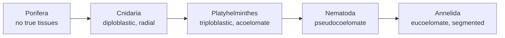



## Overview

This is the first of the two Animal Kingdom pages — deliberately the lightest-depth tier of this section relative to the Human tier (see the [section landing page](../) for the 5:3:2 rationale), but still covering named cell types and specific structural mechanisms, not just phylum-level generalities. Five phyla here, organized as a structural complexity gradient using the vocabulary from [Body Plans](../body-plans/): Porifera, Cnidaria, Platyhelminthes, Nematoda, Annelida.

## Key Concepts

### Porifera (Sponges)

The structural outlier of the animal kingdom: sponges have **no true tissues** — cells are specialized but not organized into tissue-level structures, making Porifera asymmetrical and the only major phylum genuinely outside the symmetry/germ-layer framework from [Body Plans](../body-plans/). The body wall has specific named cell types: **pinacocytes** (flattened cells forming the outer covering, the **pinacoderm**, structurally the closest thing sponges have to an epithelium, though not a true one), **choanocytes** (flagellated "collar cells" lining internal chambers — each collar is a ring of microvilli that traps food particles while the flagellum drives water flow, combining feeding and water pumping in one cell), **amoebocytes/archaeocytes** (mobile cells in the gelatinous **mesohyl** between the two cell layers, distributing nutrients, and capable of differentiating into any other sponge cell type — the structural basis of sponges' remarkable regenerative capacity), and **sclerocytes** (secrete skeletal spicules, see below).

Sponge body organization is classified by the structural complexity of its water-canal system — a direct, testable structural progression: **asconoid** (simplest — a single body-wall layer, choanocytes line the central cavity directly, water flows straight in through pores and out the osculum), **syconoid** (body wall folded into radial canals lined by choanocytes, increasing choanocyte surface area beyond what a simple tube allows), and **leuconoid** (most complex, most common in larger sponges — choanocytes restricted to numerous small internal chambers fed and drained by a branching canal network, maximizing both surface area and total water-processing capacity relative to body size). The skeleton is built from **spicules** (calcium carbonate or silica, composition and shape are taxonomically diagnostic) secreted by sclerocytes, or from **spongin** (a flexible collagen-like protein fiber network) secreted by spongocytes, or both.

*Source: user-sourced (originally via ThoughtCo). Exact match, exceeds spec with a full color-coded cell-type legend.*

  

    <h3 style="margin:0; color:#1a472a;">🧽 Sponge Water-Flow Simulator</h3>
    

      <button id="spongeBtnAsco" class="sponge-btn" style="padding:6px 14px; border:none; border-radius:30px; background:#2d6a4f; color:white; cursor:pointer; font-weight:500; font-size:0.82rem;">Asconoid</button>
      <button id="spongeBtnSyco" class="sponge-btn" style="padding:6px 14px; border:none; border-radius:30px; background:#e2e8f0; color:#1e293b; cursor:pointer; font-weight:500; font-size:0.82rem;">Syconoid</button>
      <button id="spongeBtnLeuco" class="sponge-btn" style="padding:6px 14px; border:none; border-radius:30px; background:#e2e8f0; color:#1e293b; cursor:pointer; font-weight:500; font-size:0.82rem;">Leuconoid</button>
    

  

  

    

      <svg id="sponge-asco" class="sponge-diagram" viewBox="0 0 200 260" style="width:100%; max-width:220px; display:block; margin:0 auto;">
        <path id="ascoPath1" d="M 70 220 C 40 180, 40 100, 100 40" fill="none" stroke="none"/>
        <rect x="70" y="40" width="60" height="200" rx="25" fill="#eaf3ea" stroke="#2d6a4f" stroke-width="3"/>
        <rect x="82" y="55" width="36" height="170" rx="14" fill="none" stroke="#1f5c99" stroke-width="2" stroke-dasharray="3,3"/>
        <circle cx="70" cy="150" r="4" fill="#8b5e34"/>
        <text x="30" y="153" font-size="9" fill="#8b5e34">pore</text>
        <text x="75" y="30" font-size="9" fill="#c0392b">osculum</text>
        <circle r="5" fill="#1f5c99"><animateMotion dur="3s" repeatCount="indefinite" path="M 70 150 C 85 150, 100 150, 100 100 C 100 80, 100 60, 100 45"/></circle>
        <circle r="5" fill="#1f5c99" opacity="0.6"><animateMotion dur="3s" begin="1s" repeatCount="indefinite" path="M 70 150 C 85 150, 100 150, 100 100 C 100 80, 100 60, 100 45"/></circle>
      </svg>
      <svg id="sponge-syco" class="sponge-diagram" viewBox="0 0 200 260" style="width:100%; max-width:220px; display:none; margin:0 auto;">
        <rect x="75" y="40" width="50" height="200" rx="20" fill="#eaf3ea" stroke="#2d6a4f" stroke-width="3"/>
        <ellipse cx="55" cy="90" rx="18" ry="10" fill="#eaf3ea" stroke="#1f5c99" stroke-width="2"/>
        <ellipse cx="145" cy="90" rx="18" ry="10" fill="#eaf3ea" stroke="#1f5c99" stroke-width="2"/>
        <ellipse cx="55" cy="150" rx="18" ry="10" fill="#eaf3ea" stroke="#1f5c99" stroke-width="2"/>
        <ellipse cx="145" cy="150" rx="18" ry="10" fill="#eaf3ea" stroke="#1f5c99" stroke-width="2"/>
        <ellipse cx="55" cy="205" rx="18" ry="10" fill="#eaf3ea" stroke="#1f5c99" stroke-width="2"/>
        <ellipse cx="145" cy="205" rx="18" ry="10" fill="#eaf3ea" stroke="#1f5c99" stroke-width="2"/>
        <text x="80" y="30" font-size="9" fill="#c0392b">osculum</text>
        <circle r="4" fill="#1f5c99"><animateMotion dur="2.5s" repeatCount="indefinite" path="M 37 90 C 60 90, 75 90, 100 90 C 100 70, 100 55, 100 45"/></circle>
        <circle r="4" fill="#1f5c99" opacity="0.6"><animateMotion dur="2.5s" begin="0.8s" repeatCount="indefinite" path="M 163 150 C 140 150, 100 150, 100 130 C 100 100, 100 70, 100 45"/></circle>
        <circle r="4" fill="#1f5c99" opacity="0.3"><animateMotion dur="2.5s" begin="1.6s" repeatCount="indefinite" path="M 37 205 C 60 205, 100 205, 100 180 C 100 130, 100 80, 100 45"/></circle>
      </svg>
      <svg id="sponge-leuco" class="sponge-diagram" viewBox="0 0 200 260" style="width:100%; max-width:220px; display:none; margin:0 auto;">
        <rect x="65" y="40" width="70" height="200" rx="24" fill="#eaf3ea" stroke="#2d6a4f" stroke-width="3"/>
        <circle cx="85" cy="80" r="10" fill="#eaf3ea" stroke="#1f5c99" stroke-width="2"/>
        <circle cx="115" cy="70" r="9" fill="#eaf3ea" stroke="#1f5c99" stroke-width="2"/>
        <circle cx="82" cy="115" r="9" fill="#eaf3ea" stroke="#1f5c99" stroke-width="2"/>
        <circle cx="118" cy="110" r="10" fill="#eaf3ea" stroke="#1f5c99" stroke-width="2"/>
        <circle cx="90" cy="150" r="9" fill="#eaf3ea" stroke="#1f5c99" stroke-width="2"/>
        <circle cx="112" cy="155" r="8" fill="#eaf3ea" stroke="#1f5c99" stroke-width="2"/>
        <circle cx="85" cy="190" r="9" fill="#eaf3ea" stroke="#1f5c99" stroke-width="2"/>
        <circle cx="115" cy="195" r="10" fill="#eaf3ea" stroke="#1f5c99" stroke-width="2"/>
        <circle cx="100" cy="215" r="8" fill="#eaf3ea" stroke="#1f5c99" stroke-width="2"/>
        <text x="70" y="30" font-size="9" fill="#c0392b">osculum</text>
        <circle r="3.5" fill="#1f5c99"><animateMotion dur="2s" repeatCount="indefinite" path="M 85 80 C 90 70, 95 55, 100 45"/></circle>
        <circle r="3.5" fill="#1f5c99" opacity="0.6"><animateMotion dur="2s" begin="0.5s" repeatCount="indefinite" path="M 90 150 C 92 110, 96 70, 100 45"/></circle>
        <circle r="3.5" fill="#1f5c99" opacity="0.3"><animateMotion dur="2s" begin="1s" repeatCount="indefinite" path="M 100 215 C 100 160, 100 90, 100 45"/></circle>
      </svg>
    

    

      
Asconoid

      
Simplest body plan: a single body-wall layer, choanocytes line the central cavity (spongocoel) directly. Water flows straight in through pores and out the osculum.

      
Effective choanocyte surface area (relative): <strong id="spongeArea">1×</strong>

    

  

### Cnidaria (Jellyfish, Sea Anemones, Corals)

The first phylum with true tissues, matching the **diploblastic** and **radial symmetry** categories from [Body Plans](../body-plans/): an outer **epidermis** and inner **gastrodermis** sandwich a largely acellular gelatinous layer, the **mesoglea** (thin in polyps, thick and structurally significant — providing the "jelly" in jellyfish — in medusae). Two body forms, often alternating in a single life cycle: the sessile **polyp** (e.g. sea anemone; mouth/tentacles facing up) and the free-swimming **medusa** (e.g. jellyfish; mouth/tentacles facing down, mesoglea thickened for buoyancy). Both share a **gastrovascular cavity** — a single opening serving as both mouth and anus, lined by the gastrodermis, with digestion partly extracellular (enzymes secreted into the cavity) and partly intracellular (gastrodermal cells phagocytose partially digested particles) — structurally simpler than the one-way, fully specialized human GI tract (see [Human Digestive System](../human-digestive-system/)).

*Source: Sinauer Associates, Inc. (© 2001, notice visible in the image), user-sourced. Confirm licensing basis before public deployment. Exact match for both body forms and the germ-layer labels.*

The defining structural feature of the phylum is the **cnidocyte**, a specialized stinging cell containing a **nematocyst** — a fluid-filled capsule with a coiled, harpoon-like thread under high internal pressure. A hair-like trigger, the **cnidocil**, projects from the cnidocyte surface; mechanical or chemical stimulation causes an internal lid (**operculum**) to open and the thread to evert explosively outward (one of the fastest cellular processes known), penetrating and/or entangling prey, sometimes with a toxin delivered along the thread — used for prey capture and defense.

*Source: user-sourced (originally via DifferenceBetween.net). Exact match — a three-stage firing sequence rather than just a before/after pair.*

  <h3 style="margin:0 0 0.8rem 0; color:#1a472a;">💉 Nematocyst Firing Animation</h3>
  

    

      <svg id="nemaSvg" viewBox="0 0 280 140" style="width:100%; max-width:280px; display:block; margin:0 auto;">
        <ellipse cx="60" cy="70" rx="35" ry="28" fill="#f2b6ad" stroke="#c0392b" stroke-width="3"/>
        <path id="nema-coil" d="M 50 70 Q 60 55, 70 70 Q 80 85, 65 85 Q 50 85, 55 72" fill="none" stroke="#7a3f96" stroke-width="3"/>
        <g id="nema-operculum" style="transform-origin: 88px 70px; transition: transform 0.3s;">
          <line x1="88" y1="55" x2="88" y2="85" stroke="#1a472a" stroke-width="4"/>
        </g>
        <line x1="45" y1="45" x2="35" y2="25" stroke="#374151" stroke-width="2" id="nema-cnidocil" style="cursor:pointer;"/>
        <circle cx="35" cy="25" r="5" fill="#374151" id="nema-cnidocilHandle" style="cursor:pointer;"/>
        <text x="10" y="18" font-size="9" fill="#374151">cnidocil (click)</text>
        <line id="nema-thread" x1="90" y1="70" x2="270" y2="70" stroke="#7a3f96" stroke-width="3" stroke-linecap="round"/>
        <circle id="nema-barb" cx="270" cy="70" r="5" fill="#c0392b" opacity="0"/>
      </svg>
    

    

      
At rest (coiled)

      
The nematocyst is coiled and under high internal pressure, capped by a hinged operculum. Click the cnidocil trigger to fire it.

      <button id="nemaResetBtn" style="padding:6px 16px; border:none; border-radius:30px; background:#2d6a4f; color:white; cursor:pointer; font-weight:500; font-size:0.85rem;">Reset</button>
    

  

Nervous tissue is organized as a **nerve net**, a diffuse web of interconnected neurons (in some medusae organized into a marginal nerve ring coordinating swimming) with no centralization or brain — the structural baseline against which the centralized human CNS (see [Human Nervous System](../human-nervous-system/)) can be contrasted directly. Major classes differ in which body form dominates the life cycle: **Hydrozoa** (often alternates polyp/medusa, e.g. Hydra is polyp-only), **Scyphozoa** ("true jellyfish," medusa-dominant), **Cubozoa** (box jellyfish, medusa-dominant, most potent nematocyst toxins), **Anthozoa** (sea anemones, corals — polyp-only, no medusa stage).

### Platyhelminthes (Flatworms)

The first **triploblastic**, **bilaterally symmetric** phylum on this page — meaning true mesoderm-derived tissue and, per the Body Plans page's link between bilateral symmetry and cephalization, the first phylum with a real head end and centralized nervous tissue: a small anterior **cerebral ganglion** ("brain") connected to longitudinal **nerve cords** running the body length in a ladder-like arrangement. Structurally, flatworms are **acoelomate** — no body cavity; the space between the gut and body wall is packed with mesoderm-derived tissue (mesenchyme), which is also why flatworms are dorsoventrally flattened: with no circulatory system and no coelom, oxygen and nutrients must diffuse directly across tissue, which only works if no cell is far from a body surface. This same lack of a circulatory system creates a specific excretory structural requirement: flatworms use **protonephridia** — a network of tubules capped internally by **flame cells** (bearing a tuft of beating cilia inside a cup-like cell, resembling a flickering flame under a microscope, and driving fluid movement through the tubule by ciliary action rather than filtration under blood pressure, unlike the vertebrate nephron) that filters interstitial fluid and expels dilute waste through excretory pores — structurally the simplest named excretory unit in this section, worth contrasting directly with the annelid nephridium below and the vertebrate nephron on the [Human Excretory System](../human-excretory-system/) page.

*Source: user-sourced (originally via Wikipedia "Flame cell"). Exact, clean match for the flame cell/tubule structure.*

Three classes show markedly different structural strategies: **Turbellaria** (mostly free-living, e.g. planarians — a blind, branched gastrovascular cavity, ciliated epidermis for locomotion), **Trematoda** (flukes — parasitic, with **oral and ventral suckers** for host attachment and a thick protective **tegument**, a syncytial outer covering resistant to host digestive/immune attack), and **Cestoda** (tapeworms — the most structurally reduced of the three: no gut at all, nutrients absorbed directly across the tegument while immersed in the host's digested food; the body is organized into a **scolex** (an anterior attachment structure bearing hooks/suckers) followed by a chain of repeating segments, **proglottids**, each containing its own reproductive organs and budded off continuously from the scolex — a segmented body plan structurally convergent with, but not homologous to, annelid/arthropod segmentation, since it arises purely from asexual budding rather than mesodermal somite formation).

*Source: user-sourced (from lecture notes). Exact match, all three proglottid maturity stages shown along the chain.*

### Nematoda (Roundworms)

The first **pseudocoelomate** phylum — a body cavity present but only partially lined by mesoderm (see [Body Plans](../body-plans/)). Structurally, nematodes are a simple, unsegmented cylindrical tube built as "a tube within a tube": the outer body wall and the inner digestive tract, separated by the fluid-filled pseudocoelom, which — unlike the acoelomate flatworm's solid mesenchyme — allows the gut to move independently and gives the fluid-filled cavity a **hydrostatic** function (the fluid is held under pressure by a tough, flexible outer **cuticle**, secreted by the underlying epidermis and periodically molted (**ecdysis**) as the animal grows — a structural/developmental process shared, though not homologous in detail, with the arthropod exoskeleton on the [next page](../invertebrate-body-plans-2/)). The pseudocoelom allows a **complete, one-way digestive tract** (separate mouth and anus) for the first time on this page, permitting continuous rather than batch-mode feeding and digestion. The body wall contains only **longitudinal muscle** (no circular muscle layer, unlike annelids below), arranged in four bands; contraction alternating between the dorsal and ventral bands, acting against the pressurized pseudocoelomic fluid and stiff cuticle, produces the characteristic thrashing/whipping movement rather than the smooth crawling enabled by circular-plus-longitudinal muscle layers.

*Source: user-sourced (originally via a ResearchGate figure). Exceeds spec — also shows reproductive and excretory structures beyond the cuticle/pseudocoelom/muscle asked for.*

### Annelida (Segmented Worms)

The most structurally advanced phylum on this page: **eucoelomate** (true coelom, fully mesoderm-lined) and **metamerically segmented** — a linear series of repeating body segments largely separated internally by partitions (**septa**), each segment (in taxa like the earthworm) containing its own coelomic compartment, its own pair of excretory organs, and local nerve ganglia connected into a ventral nerve cord (a step beyond the flatworm's simple cerebral ganglion, though still not centralized into a single brain the way vertebrate nervous systems are).

**Excretory structure**: annelids use **metanephridia** — a structural step up from the flatworm protonephridium, opening at *both* ends: an internal ciliated funnel, the **nephrostome**, draws coelomic fluid in from one segment, passing it through a coiled tubule (where useful solutes are reabsorbed) to an external pore, the **nephridiopore**, in the adjacent segment — a filtration-and-modification logic directly analogous in principle, though far simpler in structure, to the vertebrate nephron's tubule (see [Human Excretory System](../human-excretory-system/)).

**Circulatory structure**: unlike the open systems seen in most mollusks and all arthropods (see the [next page](../invertebrate-body-plans-2/)), annelids have a **closed circulatory system** — blood remains confined within vessels throughout its circuit, driven by a **dorsal vessel** (contractile, functioning as the main propulsive vessel, blood flows anteriorly) and a **ventral vessel** (blood flows posteriorly), connected in each segment by lateral vessels; in earthworms specifically, five pairs of anterior lateral vessels are muscular and contractile enough to function as accessory pumping "hearts" (**aortic arches**), supplementing the dorsal vessel.

**Locomotion**: the true coelom, combined with a body wall containing both **circular and longitudinal muscle layers**, functions as a proper **hydrostatic skeleton**: alternating contraction of the two muscle layers against the coelomic fluid (incompressible, only reshapable) produces the smooth, extending-and-contracting **peristaltic locomotion** characteristic of earthworms, often aided by small bristle-like **chaetae** (setae) anchoring segments against the substrate during each contraction wave.

![Earthworm anatomy: external view (segments, clitellum, genital papillae, male/female pores, peristomium, prostomium, mouth, anus); a body-segment cross-section (cuticle, epidermis, circular/longitudinal muscle, coelom, metanephridium with nephrostome, setae, dorsal/ventral blood vessels, intestine); and an internal longitudinal view (typhlosole, crop, gizzard, pharynx, esophagus, cerebral/subpharyngeal ganglion, ventral nerve cord, lateral hearts/aortic arches, ovary, oviduct, seminal receptacle/vesicle).](/ANATOMYPICS/earthworm-segment-cross-section-coelom-nephridium.jpg)
*Source: user-sourced (originally via AnimalFact.com). Exceeds spec substantially — covers external anatomy and the full internal organ layout (including the aortic arches and nerve ganglia) alongside the requested segment cross-section.*

Three classes differ structurally in appendage/chaetae arrangement, directly reflecting lifestyle: **Polychaeta** (mostly marine, "many chaetae" — paired fleshy lateral appendages, **parapodia**, bearing numerous chaetae, used for swimming/crawling and often doubling as respiratory gill surfaces), **Oligochaeta** (e.g. earthworms, "few chaetae" — chaetae present but no parapodia; bear a **clitellum**, a thickened glandular band of segments producing the mucus cocoon for egg deposition, a specific reproductive structural landmark), **Hirudinea** (leeches — chaetae and (in most) septa are lost entirely; anterior and posterior **suckers** replace them for host attachment and locomotion by looping).

*Source: user-sourced (originally via GeeksforGeeks). **Likely error in the source image**: the class labels (Oligochaeta/Polychaeta/Hirudinea) are correct, but the photo used to represent Polychaeta appears to show a centipede (jointed legs and antennae, consistent with the arthropod class Chilopoda) rather than an actual marine bristle worm — polychaetes have parapodia, not jointed legs. Kept because the class groupings and earthworm/leech images are accurate, but the Polychaeta panel should not be trusted as an accurate representation.*

## Comparative Structures

| Feature | Porifera | Cnidaria | Platyhelminthes | Nematoda | Annelida |
|---|---|---|---|---|---|
| Tissue organization | No true tissues | True tissues | True tissues | True tissues | True tissues |
| Symmetry | None | Radial | Bilateral | Bilateral | Bilateral |
| Germ layers | — | Diploblastic | Triploblastic | Triploblastic | Triploblastic |
| Coelom | — | None | Acoelomate | Pseudocoelomate | Eucoelomate |
| Digestive tract | None (filter feeding) | Gastrovascular cavity (1 opening) | Gastrovascular cavity or absent | Complete tract (2 openings) | Complete, regionally specialized |
| Excretory structure | None | None | Protonephridia (flame cells) | None distinct (diffusion / specialized cells) | Metanephridia |
| Circulatory system | None | None | None | None | Closed |
| Nervous system | None | Nerve net | Cerebral ganglion + nerve cords | Simple ring + cords | Ganglia + ventral nerve cord |
| Segmentation | No | No | No | No | Yes (metameric) |

## Common Exam Questions

- "Rank asconoid, syconoid, and leuconoid sponge body plans by structural complexity and explain the functional advantage of increased complexity."
- "Explain the mechanism by which a nematocyst fires, naming the trigger structure and describing what happens to the thread."
- "Distinguish protonephridia from metanephridia by structure (open vs. closed at the internal end) and name a phylum with each."
- "Explain why tapeworm proglottid segmentation is not considered homologous to annelid metameric segmentation despite superficial similarity."
- "Explain how alternating circular and longitudinal muscle contraction against a fluid-filled coelom produces earthworm locomotion, and identify a structure that anchors each segment during this process."
- "Compare the three annelid classes by chaetae/appendage structure and relate each to its habitat."

## Visual Reference

**Interactive**

*(Implemented inline above: the sponge water-flow simulator sits directly below the asconoid/syconoid/leuconoid image, and the nematocyst firing animation sits directly below the cnidocyte three-stage image.)*

**Static**

*(Static images are placed inline in Key Concepts above, next to the concept each one illustrates, rather than collected here.)*

## Practice Problems

1. Explain why Porifera is described as lacking true tissues, and what this means for its position relative to the symmetry/germ-layer framework used for every other phylum on this page.
2. A worm has a complete digestive tract (separate mouth and anus) but only longitudinal body-wall muscle. Which phylum on this page does this describe, and what movement pattern follows from the muscle layout?
3. Rank Cnidaria, Platyhelminthes, Nematoda, and Annelida by coelom development, from least to most, and name the coelom-type term for each.
4. Explain how segmentation in Annelida relates to the independent function of metanephridia in each segment.
5. A tapeworm has no digestive tract. Explain how it obtains nutrients and describe the structural feature that makes this possible.
