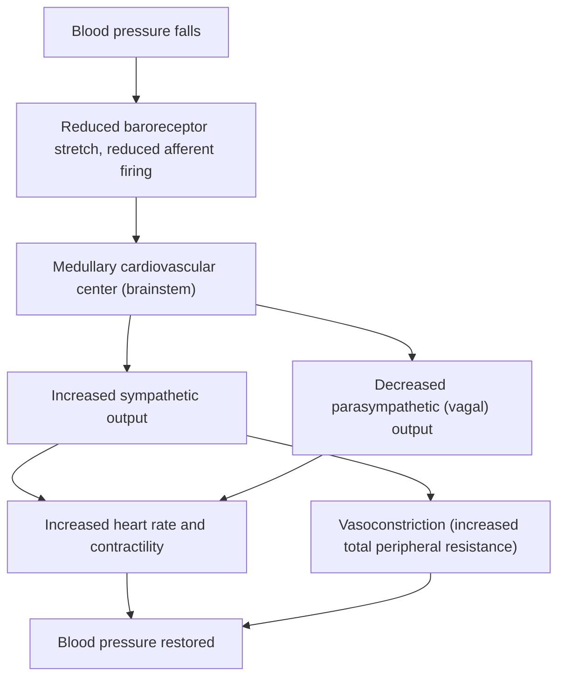




## Overview

The [Human Circulatory System](../../2-animal-anatomy/human-circulatory-system/) anatomy page covers heart wall structure, the conduction system, and the cardiac cycle's mechanical phases. This page covers the regulatory physiology built on top of that structure: how cardiac output is controlled and matched to demand, how blood pressure is held within a narrow range by a fast neural reflex and a slower hormonal system, and how fluid actually crosses the capillary wall.

## Key Concepts

### Cardiac Output and the Frank-Starling Mechanism

**Cardiac output (CO)**, the volume of blood the heart pumps per minute, is the product of **heart rate (HR)** and **stroke volume (SV)**: CO = HR × SV. Heart rate is set by the SA node's intrinsic rhythm (see [Human Circulatory System](../../2-animal-anatomy/human-circulatory-system/)) but modulated continuously by autonomic input: sympathetic stimulation (norepinephrine, acting on β1-adrenergic receptors) increases both rate and contractility, while parasympathetic input via the vagus nerve decreases rate.

Stroke volume itself is tuned by the **Frank-Starling mechanism**: within physiological limits, a greater volume of blood returning to the heart (**venous return**) stretches cardiac muscle fibers further before contraction, and this greater initial stretch (**preload**) produces a more forceful contraction and thus a larger stroke volume. This is a direct length-tension relationship, mechanistically the same principle underlying skeletal muscle's own optimal-length force generation (see [Muscle Physiology](../muscle-physiology/)), but here serving a specific regulatory purpose: it automatically matches the output of the right and left ventricles beat to beat without requiring any neural signal, since any transient mismatch in the volume each side pumps directly changes the preload the other side receives next beat.

*Source: Dee Unglaub Silverthorn, Human Physiology: An Integrated Approach*

*Source: Wikipedia*

### Blood Pressure Regulation: The Baroreceptor Reflex

**Baroreceptors**, stretch receptors embedded in the walls of the carotid sinus and aortic arch, continuously monitor arterial blood pressure via the degree of vessel wall stretch, providing the fast, moment-to-moment regulatory complement to the slower hormonal RAAS mechanism already covered on the [Homeostasis & Osmoregulation](../homeostasis-osmoregulation/) page:

*Source: user-provided (via Facebook repost)*

A drop in blood pressure reduces baroreceptor stretch and thus afferent firing rate to the brainstem's cardiovascular center, which responds by increasing sympathetic output (raising heart rate, contractility, and vasoconstriction) and decreasing parasympathetic output, all within seconds. This reflex operates on a timescale of seconds, in direct contrast to RAAS (minutes to hours, since it depends on sequential enzymatic cleavage and new aldosterone synthesis/action). The two systems are complementary, not redundant: the baroreceptor reflex provides rapid correction of transient pressure changes (e.g., standing up suddenly), while RAAS provides sustained correction of longer-term volume/pressure deficits (e.g., after blood loss). Exam tip A question describing an *immediate* heart-rate change upon standing is testing the baroreceptor reflex; a question describing blood pressure correction unfolding over tens of minutes to hours is testing RAAS.

**Total peripheral resistance (TPR)**, the other major determinant of blood pressure (Blood Pressure ≈ CO × TPR) alongside cardiac output, is set primarily by arteriole diameter (see [Human Circulatory System](../../2-animal-anatomy/human-circulatory-system/) for arteriole wall structure) — sympathetic vasoconstrictor tone is the main moment-to-moment lever on TPR, with local metabolic factors (e.g., a tissue's own accumulated CO₂/lactate/adenosine causing local vasodilation) overriding sympathetic tone in actively metabolizing tissue, redirecting flow toward the tissue that needs it most.

### Capillary Fluid Exchange (Starling Forces)

Fluid movement across the capillary wall (see [Human Circulatory System](../../2-animal-anatomy/human-circulatory-system/) for capillary histology) is governed by the balance of two opposing pressures at any point along the capillary:

- **Hydrostatic pressure**: blood pressure inside the capillary, pushing fluid *out* into the interstitial space (filtration).
- **Oncotic (colloid osmotic) pressure** — generated by plasma proteins (mainly albumin) too large to cross the capillary wall, drawing fluid *back into* the capillary (reabsorption).

Because hydrostatic pressure is highest at the capillary's arterial end and progressively falls along its length (while oncotic pressure remains roughly constant), net filtration dominates at the arterial end and net reabsorption dominates at the venous end, a positional, not purely averaged, filtration/reabsorption balance. The small persistent excess of filtration over reabsorption across the capillary bed as a whole is exactly the fluid collected by the lymphatic system (see [Human Circulatory System](../../2-animal-anatomy/human-circulatory-system/) for lymphatic capillary structure) — directly connecting this page's fluid-dynamics mechanism to that page's structural detail.

*Source: Public domain*

## Comparative Structures

| Regulatory mechanism | Timescale | Trigger | Primary action |
|---|---|---|---|
| Baroreceptor reflex | Seconds | Arterial stretch change | Autonomic adjustment of HR, contractility, TPR |
| RAAS (see [Homeostasis & Osmoregulation](../homeostasis-osmoregulation/)) | Minutes–hours | Renal perfusion pressure drop | Vasoconstriction + Na⁺/water retention (raises blood volume) |
| Local metabolic autoregulation | Seconds–minutes, localized | Local metabolite accumulation | Local vasodilation, overriding systemic sympathetic tone |

## Common Exam Questions

- "Explain the Frank-Starling mechanism and why it automatically balances left and right ventricular output without neural input."
- "Trace the baroreceptor reflex from a sudden drop in blood pressure (e.g., standing up) to its correction, naming every structure and contrasting its timescale with RAAS."
- "Explain why net fluid movement favors filtration at a capillary's arterial end but reabsorption at its venous end."
- "Explain why local metabolic vasodilation can override systemic sympathetic vasoconstriction in an actively exercising muscle."
- "A patient's heart rate rises immediately upon standing, before any measurable hormonal change. Which regulatory mechanism is responsible?"

## Visual Reference

**Interactive**

- **Baroreceptor reflex simulator (Plotly)**: a graph of blood pressure vs. time with a "stand up suddenly" event button; triggering it shows the baroreceptor firing rate drop, the resulting sympathetic/parasympathetic output change, and the corrective HR/TPR rise, all plotted on synced traces with real relative timescales — makes the reflex's speed and sequence explicit rather than asserted.



- **Starling forces capillary explorer (SVG/JS, draggable position)** — a capillary cross-section with a marker draggable along its arterial-to-venous length; at each position, hydrostatic and oncotic pressure values update and an arrow shows net fluid movement direction and magnitude, visually demonstrating the shift from net filtration to net reabsorption along the vessel.



**Static** *(placed inline in Key Concepts above, next to the concept each one illustrates, rather than collected here; no image was sourced for the RAAS vs. baroreceptor timescale comparison chart; that comparison remains text-only, in the Comparative Structures table below)*

## Practice Problems

1. Define cardiac output in terms of its two components and state which autonomic branch increases each.
2. Explain, mechanistically, why increased venous return increases stroke volume without requiring any nervous signal.
3. Trace the full baroreceptor reflex sequence following a sudden 20 mmHg drop in blood pressure.
4. A tissue's local capillary bed shows unusually high blood flow during intense local exercise despite systemic sympathetic vasoconstrictor tone elsewhere. Explain this apparent contradiction.
5. Explain why the small excess of capillary filtration over reabsorption does not cause progressive tissue swelling under normal conditions.
