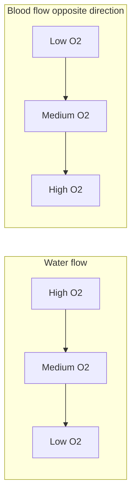



## Overview

The [Respiratory Physiology](../respiratory-physiology/) page covered gas transport and ventilation control mechanism in general (built around the human/mammalian tidal-breathing system); the [Fish & Amphibian Anatomy](../../2-animal-anatomy/fish-amphibian-anatomy/) and [Reptile & Bird Anatomy](../../2-animal-anatomy/reptile-bird-anatomy/) pages covered gill and avian lung structure. This page compares the actual gas-exchange *efficiency* these different structural solutions achieve, and covers two specific physiological challenges — breath-hold diving and chronic high-altitude exposure — that push respiratory/circulatory physiology to its limits.

## Key Concepts

### Gill Countercurrent Gas Exchange

Fish gills achieve markedly higher O₂ extraction efficiency than mammalian lungs because water flows over the gill lamellae in the direction **opposite** to blood flow within them (see [Fish & Amphibian Anatomy](../../2-animal-anatomy/fish-amphibian-anatomy/) for lamellar structure). This **countercurrent exchange** arrangement means blood, however much O₂ it has already picked up, is always meeting water that is *even less* depleted of O₂ further along the exchange surface — maintaining a favorable diffusion gradient along the entire length of the gill, rather than the gradient collapsing as blood and water equilibrate (as it would in a co-current, same-direction arrangement). This is the same counter-flow logic already seen twice elsewhere in this section — the renal countercurrent multiplier and countercurrent heat exchange in limbs (see [Homeostasis & Osmoregulation](../homeostasis-osmoregulation/) and [Comparative Thermoregulation](../comparative-thermoregulation/)) — here applied to gas rather than solute or heat exchange, and it allows fish gills to extract up to ~80% of dissolved O₂ from water passing over them.

### Tidal Ventilation: The Mammalian Limit

Mammalian lungs (see [Human Respiratory System](../../2-animal-anatomy/human-respiratory-system/)) are **tidal**: air moves in and out through the same passageway, meaning fresh incoming air always mixes with residual, already gas-exchanged air remaining in the airways ("dead space") from the previous breath, and alveolar air is never fully replaced in a single breath. This co-mingling structurally caps mammalian gas-exchange efficiency well below the countercurrent gill system's — typically extracting only ~25% of the O₂ present in inhaled air, a direct structural cost of a tidal, blind-ended lung design.

### Unidirectional Bird Lung Ventilation

Birds achieve substantially higher gas-exchange efficiency than mammals via a structurally distinct solution: air flows **unidirectionally** through rigid, tube-like **parabronchi** (rather than in and out of blind-ended alveoli), driven by a system of **air sacs** (see [Reptile & Bird Anatomy](../../2-animal-anatomy/reptile-bird-anatomy/)) that act as bellows, requiring **two full breath cycles** for a single volume of air to completely transit the system (inhaled air first fills posterior air sacs, then on the next cycle passes through the parabronchi to anterior air sacs before being exhaled) — but ensuring continuous, unidirectional, fresh airflow across the gas-exchange surface during both inhalation and exhalation, unlike the mammalian tidal system where gas exchange only usefully occurs on inhalation. Blood flow across the parabronchi runs roughly perpendicular to airflow (**cross-current exchange** — less efficient than true countercurrent, but still substantially better than tidal ventilation), contributing to birds' well-documented ability to sustain activity at high altitudes where mammalian tidal ventilation struggles.

### Insect Tracheal Systems: Direct Diffusion

Insects bypass the circulatory system for gas transport entirely: external **spiracles** (valved openings, see [Invertebrate Body Plans II](../../2-animal-anatomy/invertebrate-body-plans-2/) for exoskeletal structure) lead to a branching network of **tracheae** and progressively finer **tracheoles** that extend directly to essentially every individual cell, delivering O₂ and removing CO₂ by direct diffusion (assisted by active abdominal pumping ventilation in larger/more active insects) without hemolymph (insect "blood") playing any significant role in gas transport at all — a structural point worth stating explicitly, since it is a common exam trap to assume all animals with an open circulatory system must transport gases in that circulatory fluid. This direct-diffusion strategy is only viable at small body scale, since diffusion distance limits how deep the tracheal network can effectively reach — a structural constraint on maximum insect body size.

### Diving Physiology: The Dive Reflex

Breath-hold diving mammals (seals, whales) and diving birds rely on a coordinated **mammalian dive reflex**, triggered primarily by water contacting the face/nasal passages: immediate **bradycardia** (heart rate drops sharply, reducing overall O₂ consumption), and selective peripheral **vasoconstriction** that shunts blood flow away from non-essential tissue (skin, digestive organs, skeletal muscle) toward the brain and heart specifically — prioritizing O₂ delivery to the organs least tolerant of hypoxia. Skeletal muscle, receiving reduced blood flow during a dive, relies heavily on its own **myoglobin** stores (a single-subunit O₂-binding protein structurally related to but distinct from hemoglobin — see [Respiratory Physiology](../respiratory-physiology/) for hemoglobin's cooperative binding — with a higher O₂ affinity than hemoglobin, allowing myoglobin to extract and store O₂ from blood for local use during the dive and tolerate the resulting anaerobic glycolysis/lactate buildup once those local stores are depleted) rather than continuous circulatory O₂ delivery during the dive itself.

### High-Altitude Adaptation

Chronic exposure to the lower atmospheric PO₂ at high altitude triggers both short-term and long-term physiological adjustments: **hyperventilation** (peripheral chemoreceptor-driven, see [Respiratory Physiology](../respiratory-physiology/) for the peripheral chemoreceptor mechanism, which becomes a dominant ventilatory driver specifically at the significantly lowered PO₂ altitude provides) and increased **erythropoietin (EPO)** release from the kidney, driving increased red blood cell production and raising blood O₂-carrying capacity over a longer (days-to-weeks) acclimatization timescale. Some high-altitude specialist species carry a further, genetically fixed structural adaptation: bar-headed geese (which migrate over the Himalayas) express a hemoglobin variant with intrinsically higher O₂ affinity than lowland bird hemoglobin, allowing effective O₂ loading even at the very low PO₂ of high-altitude air — a permanent molecular solution layered on top of the acclimatization mechanisms available to any individual short-term.

## Comparative Structures

| System | Exchange geometry | Approx. O₂ extraction efficiency | Structural basis |
|---|---|---|---|
| Fish gill | Countercurrent | ~80% | Water and blood flow in opposite directions across lamellae |
| Bird lung | Cross-current, unidirectional airflow | High (better than tidal) | Air sacs drive one-way flow through rigid parabronchi |
| Mammalian lung | Tidal (bidirectional, same passage) | ~25% | Fresh air mixes with residual dead-space air each breath |
| Insect tracheal system | Direct diffusion, no circulatory gas transport | N/A (diffusion-limited, not extraction-limited) | Tracheae/tracheoles reach individual cells directly |

## Common Exam Questions

- "Explain why countercurrent gas exchange in fish gills achieves higher O₂ extraction efficiency than the tidal ventilation used by mammalian lungs."
- "Explain why a single volume of air requires two full respiratory cycles to pass completely through a bird's respiratory system, and why bird gas exchange is still more efficient than mammalian tidal ventilation despite this added complexity."
- "Explain why insects do not rely on hemolymph for gas transport, and identify the structural feature that limits maximum insect body size as a consequence."
- "Describe the mammalian dive reflex and explain why blood flow is redirected specifically toward the brain and heart during a dive."
- "Explain the difference between short-term (ventilatory/EPO-driven) and long-term evolutionary (hemoglobin variant) adaptations to high altitude, using the bar-headed goose as the example of the latter."

## Visual Reference

**Interactive**

- **Countercurrent vs. co-current gas exchange comparator (Plotly)** — two side-by-side O₂-partial-pressure-vs-position graphs (blood and water/air traces) for a countercurrent and a co-current arrangement, showing the countercurrent case maintaining a diffusion gradient along the full exchange length while the co-current case's gradient collapses partway along — directly demonstrates why direction of flow matters, extending the same countercurrent logic used for the kidney and limb heat exchange elsewhere in this section.
- **Dive reflex trigger simulator (SVG/JS)** — a diagram of a diving mammal with a "submerge" button; triggering it animates heart rate dropping and blood flow redirecting away from skin/gut/muscle toward brain/heart in real time, with a running blood-O₂-conservation estimate — makes the reflex's protective logic direct and interactive rather than a described list of effects.

**Static**

- Fish gill lamellar cross-section with countercurrent water/blood flow arrows (paired with the Plotly comparator above)
- Bird respiratory system schematic: air sacs, parabronchi, and the two-cycle airflow path
- Mammalian tidal ventilation diagram showing dead-space air mixing with fresh incoming air
- Insect tracheal system: spiracles, tracheae, tracheoles reaching individual cells
- Mammalian dive reflex effects diagram: heart rate, vasoconstriction targets, myoglobin O₂ release in muscle
- Bar-headed goose hemoglobin O₂ affinity curve vs. lowland bird hemoglobin, side by side

## Practice Problems

1. Explain, using a diagram, why countercurrent flow allows fish gills to extract a much higher percentage of available O₂ than mammalian lungs extract from inhaled air.
2. A single breath of air takes two full respiratory cycles to pass through a bird's system. Explain why this does not make bird respiration less efficient than mammalian respiration.
3. Explain why an insect's maximum body size is constrained by its respiratory system's reliance on direct diffusion.
4. During a dive, why does skeletal muscle continue to function despite reduced blood flow to it?
5. Distinguish an individual's short-term physiological response to moving to high altitude from a bar-headed goose's evolved hemoglobin adaptation, in terms of timescale and mechanism.
