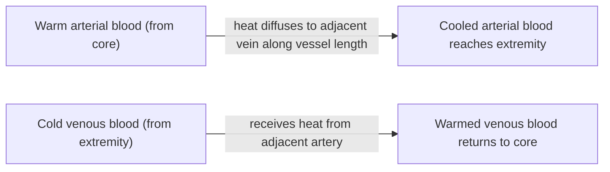




## Overview

Body temperature affects every enzyme-catalyzed reaction rate (see [Homeostasis & Osmoregulation](../homeostasis-osmoregulation/) for feedback control in general), making thermoregulation one of the most universally tested physiological themes across taxa. This page covers the physical modes of heat exchange every strategy below is built from, the endotherm/ectotherm axis, specific structural adaptations (countercurrent heat exchange, insulation), and torpor/hibernation/estivation as a distinct, actively regulated third strategy.

## Key Concepts

### Endotherms vs. Ectotherms

- **Endotherms** (birds, mammals) generate the majority of their body heat internally via metabolism (see [Muscle Physiology](../muscle-physiology/) for shivering thermogenesis, below, and cellular respiration generally) and regulate body temperature within a narrow range largely independent of external temperature, at high energetic cost (a resting endotherm's metabolic rate is typically 5-10x that of a similarly-sized resting ectotherm), but with the benefit of sustained activity capacity across a wide range of external temperatures.
- **Ectotherms** (fish, amphibians, non-avian reptiles, invertebrates) derive most body heat from the external environment and regulate temperature primarily behaviorally, at far lower energetic cost, but with body temperature (and therefore metabolic/activity rate) directly tracking environmental temperature.

Exam tip "Cold-blooded"/"warm-blooded" are misleading terms best avoided on an exam answer. A desert ectotherm basking in the sun can reach a higher body temperature than a mammal, and "ecto-/endo-therm" refers to the *source* of body heat (external vs. internal), not the resulting temperature itself.

### Modes of Heat Exchange

Every thermoregulatory mechanism below works by manipulating one of four physical heat-transfer modes:

| Mode | Mechanism | Example |
|---|---|---|
| **Radiation** | Electromagnetic emission/absorption, no contact needed | A lizard basking in direct sunlight |
| **Conduction** | Direct heat transfer between touching surfaces | An ectotherm resting on a warm rock |
| **Convection** | Heat transfer to a moving fluid (air/water) | Wind or water flow stripping heat from a body surface |
| **Evaporation** | Heat lost as liquid (sweat, saliva, water) converts to vapor | Sweating, panting |

*Source: Shutterstock*

### Ectotherm Behavioral Thermoregulation

Because ectotherms cannot generate substantial internal heat, temperature regulation is achieved almost entirely behaviorally: **basking** (maximizing radiative/conductive heat gain by orienting body surface toward a heat source), **shuttling** (moving between sun and shade, or burrow and surface, to track a preferred temperature range across the day), and posture changes (flattening the body to maximize surface-area heat gain while basking, or minimizing exposed surface area to reduce heat loss). Because ectotherm metabolic rate is temperature-dependent (enzyme kinetics, a roughly 2-3x increase in reaction rate per 10°C rise, the **Q10 effect**), behavioral thermoregulation in an ectotherm is functionally also a form of metabolic rate control, not merely comfort-seeking.

### Endotherm Heat Production and Insulation

Endotherms generate heat via **shivering thermogenesis** (rapid, asynchronous, involuntary skeletal muscle contraction, see [Muscle Physiology](../muscle-physiology/) for the underlying cross-bridge cycling mechanism, that produces heat as a metabolic byproduct rather than net directional movement) and **non-shivering thermogenesis** (in **brown adipose tissue**, dense with mitochondria containing **uncoupling protein 1 (UCP1)**, which dissipates the mitochondrial proton gradient as heat directly rather than using it to synthesize ATP, a direct, deliberate uncoupling of respiration from ATP production for the specific purpose of heat generation).

*Source: ResearchGate, fig. 1*

Heat *retention* is a separate, structural problem solved by insulation: fur, feathers, and subcutaneous fat (blubber in marine mammals) all trap a layer of still air or provide direct thermal resistance, reducing convective/conductive heat loss; **piloerection** (fur/feather fluffing, via the arrector pili muscles, see [Human Integumentary System](../../2-animal-anatomy/human-integumentary-system/)) increases the thickness of this trapped-air layer on demand. Surface-area-to-volume ratio also matters structurally: **Bergmann's rule** (within a species/clade, populations in colder climates tend toward larger body size, lowering relative surface area and thus relative heat loss) and **Allen's rule** (colder-climate populations tend toward shorter limbs/appendages, similarly reducing surface area available for heat loss) describe this relationship at the population level.

### Countercurrent Heat Exchange

Many endotherms (and some regionally endothermic fish, below) limit heat loss from poorly insulated extremities using **countercurrent heat exchange**: in a limb, the artery carrying warm blood outward runs immediately adjacent to the vein carrying cooled blood back, and heat diffuses directly from the warm arterial blood into the adjacent cooler venous blood along the entire vessel length, progressively pre-cooling the arterial blood before it reaches the extremity and pre-warming the venous blood before it returns to the core. This is mechanistically the same counter-flow principle as the kidney's countercurrent multiplier (see [Homeostasis & Osmoregulation](../homeostasis-osmoregulation/)), here exchanging heat rather than building an osmotic gradient. Net effect: substantially less heat is lost to the environment at the extremity than would occur if warm arterial blood reached it undiminished, at the cost of the extremity itself running colder.

*Source: bybio (bybio.wordpress.com)*

Some large, active marine fish (certain tuna and lamnid sharks) use the same countercurrent principle in a specialized vascular arrangement (the **rete mirabile**) to retain metabolically generated heat in swimming muscle, elevating muscle temperature above surrounding water temperature, **regional endothermy**, a functional (though not whole-body) form of endothermy layered onto an otherwise ectothermic fish body plan, improving sustained swimming performance in cold water.

*Source: ResearchGate, fig. 10*

### Torpor, Hibernation, and Estivation

Rather than continuously paying the high energetic cost of maintaining a normal body temperature, some endotherms actively lower their hypothalamic set point (see [Homeostasis & Osmoregulation](../homeostasis-osmoregulation/) for set-point theory) and enter a state of dramatically reduced metabolic rate and body temperature: **torpor** (a short-term, often daily bout of reduced metabolic rate, e.g. in hummingbirds overnight), **hibernation** (an extended, typically winter/cold-season version of the same mechanism, in mammals like ground squirrels), and **estivation** (the warm/dry-season equivalent, seen in some desert-adapted amphibians and reptiles, see [Comparative Osmoregulation & Excretion](../comparative-osmoregulation-excretion/) for the spadefoot toad example). Critically, this is an actively regulated physiological state (a deliberately lowered, defended set point) rather than a passive failure of thermoregulation: the animal still defends its new, lower set point via the same feedback mechanisms operating around a normal set point, just at a far lower energetic baseline.

*Source: ResearchGate, fig. 1*

## Comparative Structures

| Strategy | Body temperature source | Energetic cost | Key structural adaptation | Example |
|---|---|---|---|---|
| Ectothermy | External environment | Low | Behavioral (basking, shuttling) | Lizards |
| Endothermy | Internal metabolism | High | Insulation, shivering/non-shivering thermogenesis | Mammals, birds |
| Regional endothermy | Mixed | Intermediate | Rete mirabile (localized countercurrent heat retention) | Tuna, lamnid sharks |
| Torpor/hibernation/estivation | Internal, but deliberately lowered set point | Very low (during the dormant state) | Active hypothalamic set-point reduction | Ground squirrels, spadefoot toads |

## Common Exam Questions

- "Distinguish endotherms from ectotherms by heat source, not resulting body temperature, and explain why 'cold-blooded' is a misleading term."
- "Explain the Q10 effect and why it makes ectotherm behavioral thermoregulation functionally equivalent to metabolic rate control."
- "Explain the mechanism of non-shivering thermogenesis, naming the specific protein responsible for uncoupling respiration from ATP synthesis."
- "Explain countercurrent heat exchange in a limb, and why this is mechanistically analogous to the renal countercurrent multiplier despite exchanging heat rather than solutes."
- "Explain why hibernation is considered an actively regulated physiological state rather than a passive shutdown of thermoregulation."

## Visual Reference

**Interactive**

- **Q10 metabolic rate calculator (Plotly)**, an adjustable-temperature slider driving a live-updating ectotherm metabolic rate curve (using a Q10 of ~2-3), letting a student see how a rise from, say, 20°C to 30°C changes metabolic rate quantitatively rather than qualitatively.



- **Countercurrent heat exchange animator (SVG/JS, extends the Mermaid diagram above)**: an animated limb cross-section showing heat (color-gradient) diffusing progressively from the arterial to venous vessel along the limb's length, with a toggle comparing this to a "no countercurrent exchange" control case where the artery's temperature stays constant until the extremity, visually demonstrating the heat conserved by the countercurrent arrangement.



**Static** *(placed inline in Key Concepts above, next to the concept each one illustrates, rather than collected here, still outstanding: an ectotherm basking/shuttling behavior diagram across a day-temperature cycle)*

## Practice Problems

1. A snake and a mouse of similar body size are placed in a 10°C environment. Predict and explain the difference in their resulting activity level.
2. Explain why brown adipose tissue mitochondria produce heat instead of ATP, naming the protein responsible.
3. Explain why a wading bird's legs can be much colder than its core body temperature without causing tissue damage, referencing the relevant vascular arrangement.
4. Distinguish torpor, hibernation, and estivation by duration and typical environmental trigger.
5. Explain why hibernation is not simply "thermoregulation failing" at low temperature, referencing the concept of a defended set point.
