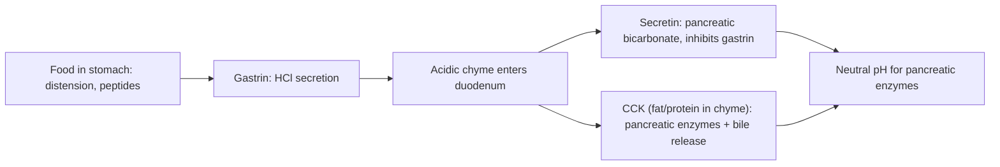




## Overview

The [Human Digestive System](../../2-animal-anatomy/human-digestive-system/) anatomy page covers GI histology region by region. This page covers the enzymatic and hormonal machinery that actually breaks food down and coordinates that breakdown with the right region and the right time, plus the transport mechanisms nutrients use to actually cross the gut epithelium into the blood.

## Key Concepts

### Enzymatic Digestion by Region

Digestion is a sequential division of labor, each region's enzymes matched to the macromolecule state arriving there:

- **Mouth** — salivary **amylase** begins starch digestion (breaking α-1,4 glycosidic bonds into shorter polysaccharides/maltose), halted once swallowed food reaches the acidic stomach (amylase is denatured at low pH).
- **Stomach** — **pepsin** (secreted as inactive **pepsinogen** by chief cells, activated by the stomach's own HCl — itself secreted by parietal cells — and then autocatalytically by existing active pepsin) begins protein digestion, cleaving proteins into shorter polypeptides; the stomach's strongly acidic environment (pH ~1.5-3.5) also denatures proteins (unfolding them for easier enzymatic access) and kills most ingested pathogens.
- **Small intestine (duodenum)** — the major site of enzymatic digestion, drawing on secretions from three sources: the **pancreas** (trypsin and chymotrypsin, both secreted as inactive zymogens and activated only once in the duodenum — trypsinogen by the brush-border enzyme **enterokinase**, chymotrypsinogen by trypsin itself, a safeguard preventing the pancreas from digesting itself; pancreatic **lipase**, emulsified-fat-digesting; pancreatic amylase, continuing starch digestion), the **liver** (bile, an emulsifier rather than an enzyme — see below), and the intestinal **brush border** itself (disaccharidases — maltase, sucrase, lactase — and peptidases completing digestion to monosaccharides and amino acids/dipeptides at the absorptive surface).

Exam tip Pancreatic proteases are secreted as inactive zymogens specifically to prevent the pancreas from autodigesting its own tissue — a direct structural safeguard worth stating explicitly on any question about zymogen activation, not just naming the enzymes.

*Source: GetOnCourse AI (USMLE Step 1 prep)*

### Bile and Lipid Emulsification

**Bile** (produced by the liver, concentrated and stored in the gallbladder, see [Human Digestive System](../../2-animal-anatomy/human-digestive-system/)) contains **bile salts**, amphipathic molecules that emulsify large fat globules into smaller droplets, vastly increasing the surface area available to pancreatic lipase (which, being water-soluble, can only act at a droplet's surface, not within a large globule's interior). This is a purely mechanical/physical action, not enzymatic digestion — bile does not itself break any chemical bond in a lipid.

![Fat digestion overview: liver/gallbladder/stomach/small intestine gross anatomy with lipid droplets and bile salts shown entering the duodenum; a detailed sequence showing bile-salt emulsification of a lipid droplet into emulsion droplets, lipase hydrolysis into free fatty acids/monoglycerides, micelle formation with bile salts, and brush-border absorption into the epithelial cell where triglycerides are resynthesized and packaged into chylomicrons; plus a micelle cross-section showing the hydrophilic-head/hydrophobic-tail arrangement](/ANIMALPHYSIOPICS/bile-emulsification-lipase-action.png)
*Source: classnotes123.com*

### Digestive Hormones and Meal Coordination

Three peptide hormones (mechanistically the water-soluble/surface-receptor class described on the [Endocrine System Physiology](../endocrine-system-physiology/) page), released from specialized endocrine cells in the stomach/duodenal wall, coordinate digestion to the actual presence and composition of food rather than running on a fixed schedule:

| Hormone | Released from | Trigger | Major actions |
|---|---|---|---|
| **Gastrin** | Stomach (G cells) | Stomach distension, peptides/amino acids present, vagal input | Stimulates parietal cell HCl secretion and gastric motility |
| **Secretin** | Duodenum (S cells) | Acidic chyme entering duodenum (low pH) | Stimulates pancreatic **bicarbonate** secretion (neutralizing acidic chyme, protecting the duodenal lining and creating the near-neutral pH pancreatic enzymes require) and inhibits further gastric acid secretion |
| **CCK (cholecystokinin)** | Duodenum (I cells) | Fatty acids/amino acids present in chyme | Stimulates pancreatic **enzyme** secretion and gallbladder contraction (bile release); slows gastric emptying, giving fat/protein more time to be processed |

These three hormones form a coordinated, self-limiting loop: gastrin promotes acid production only while food is actually present in the stomach; secretin then neutralizes that same acid once it reaches the duodenum, simultaneously protecting the duodenal lining and creating the correct pH for pancreatic enzymes CCK is concurrently triggering release of — each hormone's trigger is the direct physical/chemical consequence of the previous step, not an independent timer.

*Source: user-provided (via Instagram repost)*

### Nutrient Absorption Mechanisms

Absorption across the small intestine's brush border (see [Human Digestive System](../../2-animal-anatomy/human-digestive-system/) for villus/microvillus structure) uses mechanisms specific to each nutrient class:

- **Monosaccharides and amino acids** — absorbed by **secondary active transport**: a Na⁺/glucose (or Na⁺/amino acid) **cotransporter** moves the nutrient into the cell alongside Na⁺ moving down its own electrochemical gradient (that gradient itself maintained by the basolateral Na⁺/K⁺-ATPase, the same pump underlying the neuron resting potential on the [Nervous System Physiology](../nervous-system-physiology/) page) — the nutrient itself is not directly using ATP, but is "riding" the Na⁺ gradient that ATP hydrolysis elsewhere maintains, hence "secondary."

*Source: ResearchGate, fig. 5*

- **Lipids** — bile-salt-emulsified fat droplets are further broken down by lipase into free fatty acids and monoglycerides, which associate with bile salts into **micelles** (small, soluble aggregates that shuttle the otherwise water-insoluble lipid products to the brush border membrane, where they diffuse across, being lipid-soluble themselves). Inside the epithelial cell, they are reassembled into triglycerides and packaged with proteins into **chylomicrons**, which exit not into the blood capillary directly but into the **lacteal** (a lymphatic capillary within the villus, see [Human Circulatory System](../../2-animal-anatomy/human-circulatory-system/) for lymphatic structure) — a distinct absorption route from the direct capillary uptake used by monosaccharides and amino acids.

*Source: abdominalkey.com*

### Metabolic Rate

**Basal metabolic rate (BMR)** — the minimum energy expenditure required to sustain basic physiological function at rest — scales with several structural and physiological factors: body size (though not linearly — see [Locomotion & Energetics](../../3-animal-physiology/locomotion-energetics/) for the mass-scaling relationship across species), thyroid hormone level (see [Endocrine System Physiology](../endocrine-system-physiology/), a direct upregulator of cellular metabolic rate), and body composition (metabolically active lean tissue contributes far more to BMR per unit mass than fat storage tissue).

## Comparative Structures

| Hormone | Analogous trigger logic | Net physiological role |
|---|---|---|
| Gastrin | Responds to food's continued presence | Sustains acid/motility while digestion is active |
| Secretin | Responds to the acidic consequence of gastrin's own action | Protects downstream tissue, enables enzyme function |
| CCK | Responds to the specific macronutrients (fat/protein) needing the most processing | Matches enzyme/bile output and gastric emptying rate to the meal's actual composition |

## Common Exam Questions

- "Explain why pancreatic proteases are secreted as inactive zymogens and name the enzyme responsible for activating trypsinogen specifically."
- "Distinguish the action of bile from that of pancreatic lipase, and explain why confusing the two is a common error."
- "Trace the gastrin-secretin-CCK sequence across a meal, explaining what triggers each hormone's release and how one hormone's effect creates the trigger for the next."
- "Explain why glucose absorption is described as secondary active transport rather than either passive diffusion or primary active transport."
- "Explain why absorbed lipids enter the lymphatic lacteal rather than the blood capillary directly, unlike monosaccharides and amino acids."

## Visual Reference

**Interactive**

- **Meal-response hormone timeline (Plotly)** — a timeline chart plotting gastrin, secretin, and CCK levels against time since a meal begins, with toggleable curves and annotations marking when food enters the stomach vs. duodenum — makes the sequential, trigger-based hormone cascade visible as a timeline rather than a static three-row table.



- **Nutrient absorption pathway selector (click-through SVG/JS)** — selecting "carbohydrate/protein" vs. "lipid" animates that nutrient's specific path from the intestinal lumen through the brush border and into either the blood capillary or the lacteal, visually contrasting the two absorption routes side by side.



**Static** *(placed inline in Key Concepts above, next to the concept each one illustrates, rather than collected here — still outstanding: a GI tract diagram with each region's major enzyme(s)/secretion(s) labeled in sequence)*

## Practice Problems

1. Name the enzyme(s) active in the stomach and explain why the stomach's acidity is necessary for their function.
2. A patient with chronically low secretin secretion would be expected to have duodenal tissue damage. Explain why, referencing secretin's normal function.
3. Explain why trypsinogen and chymotrypsinogen require different activating enzymes despite both being pancreatic zymogens.
4. Explain the role of Na⁺ in glucose absorption at the brush border, and why this is classified as secondary rather than primary active transport.
5. Trace a fatty acid's path from the intestinal lumen to its entry into general circulation, naming every structure/mechanism involved.
