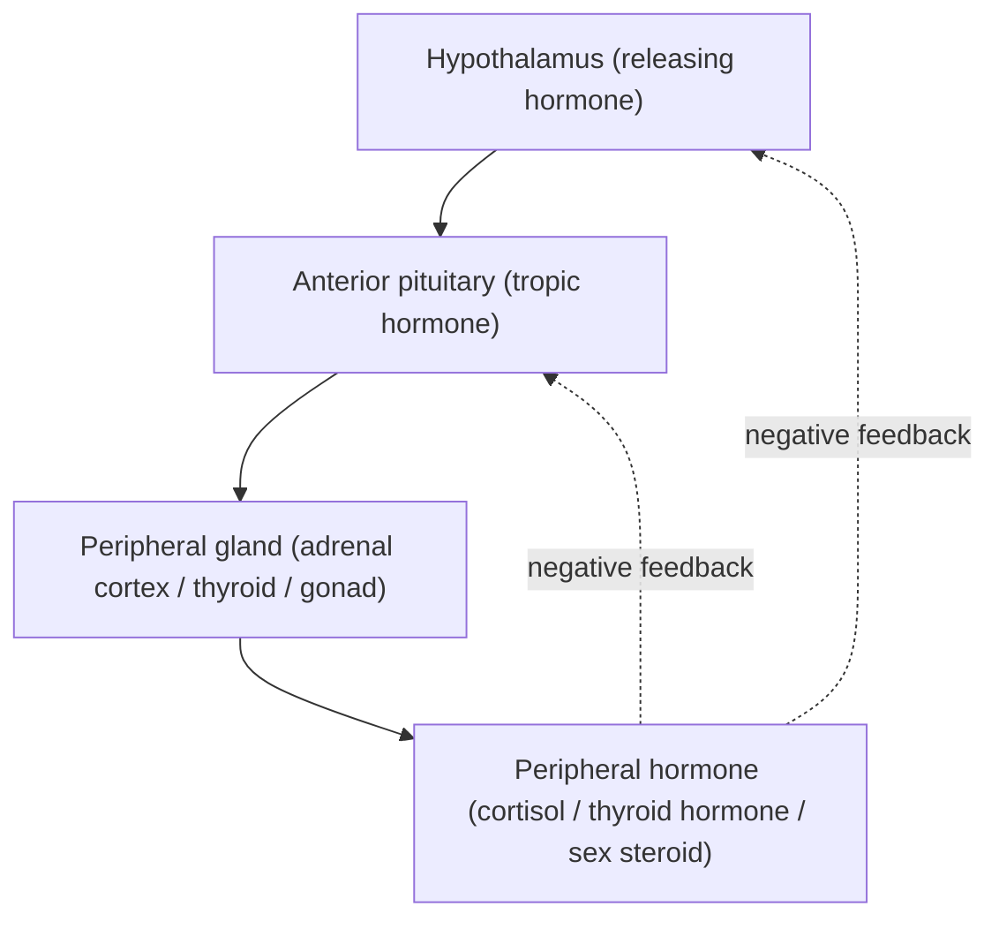




## Overview

The endocrine system is the slower, longer-acting, more diffuse counterpart to the nervous system's fast point-to-point signaling (contrast with [Nervous System Physiology](../nervous-system-physiology/)): glands release hormones into the bloodstream, reaching every tissue but acting only on cells bearing the matching receptor. This page covers hormone signaling mechanism in general, then the major regulatory axes not already covered in full elsewhere: the **HPG axis** (hypothalamic-pituitary-gonadal) is developed in complete mechanistic detail on the [Reproductive Physiology](../reproductive-physiology/) page and is only summarized here for completeness.

## Key Concepts

### Hormone Classes and Receptor Mechanism

Hormones fall into two mechanistically distinct classes based on solubility, which dictates where their receptor is located and how fast their effect unfolds:

- **Lipid-soluble hormones** (steroid hormones — cortisol, aldosterone, estrogen, progesterone, testosterone; and thyroid hormone, which is not a steroid but shares this mechanism) cross the plasma membrane directly and bind **intracellular receptors** (cytoplasmic or nuclear), and the hormone-receptor complex itself acts as a **transcription factor**, binding DNA hormone-response elements to alter gene expression directly. This mechanism is inherently slow (hours, since it requires new protein synthesis) but produces long-lasting effects, and requires these hormones to travel bound to carrier proteins in blood (being lipid-soluble, they are not water-soluble).
- **Water-soluble hormones** (peptide hormones — insulin, glucagon, ADH, growth hormone; and amine hormones derived from tyrosine — epinephrine, norepinephrine) cannot cross the plasma membrane and instead bind **cell-surface receptors**, triggering a **second-messenger cascade** inside the target cell (e.g., a G-protein-coupled receptor activating adenylyl cyclase, raising intracellular **cyclic AMP**, which activates protein kinase A, which phosphorylates existing enzymes). This mechanism is fast (seconds to minutes, since it modifies existing proteins rather than requiring new synthesis) but shorter-lived.

*Source: Scoolam Foundation*

Exam tip A hormone's chemical class predicts its mechanism without memorizing each one individually: lipid-soluble → intracellular receptor → gene transcription → slow/sustained; water-soluble → surface receptor → second messenger → fast/transient. Given an unfamiliar hormone's solubility, the mechanism can be inferred from this rule alone.

### General Endocrine Feedback Logic

Nearly all endocrine axes are organized hierarchically and controlled by **negative feedback** (see [Homeostasis & Osmoregulation](../homeostasis-osmoregulation/) for the general theory): the hypothalamus releases a **releasing hormone**, driving the anterior pituitary to release a **tropic hormone**, which drives a peripheral endocrine gland to release its hormone, which then feeds back to suppress both the hypothalamus and pituitary, a **long-loop negative feedback** structure shared across the HPA, HPT, and HPG axes below, differing only in which peripheral gland and hormone sit at the bottom of the hierarchy.

*Source: Dee Unglaub Silverthorn, Human Physiology: An Integrated Approach (Fig. 7.11)*

### The HPA Axis (Hypothalamic-Pituitary-Adrenal)

The hypothalamus releases **CRH** (corticotropin-releasing hormone), stimulating the anterior pituitary to release **ACTH** (adrenocorticotropic hormone), which stimulates the **adrenal cortex** to release **cortisol**. Cortisol raises blood glucose (stimulating gluconeogenesis and inhibiting peripheral glucose uptake in non-essential tissues, sparing glucose for the brain), suppresses immune/inflammatory response, and feeds back to inhibit both CRH and ACTH release, the physiological basis of the sustained ("chronic") stress response, distinct from the rapid epinephrine-driven acute response below.

### The HPT Axis (Hypothalamic-Pituitary-Thyroid)

The hypothalamus releases **TRH** (thyrotropin-releasing hormone), stimulating the anterior pituitary to release **TSH** (thyroid-stimulating hormone), which stimulates the thyroid gland to release **thyroid hormone** (T3/T4). Thyroid hormone raises basal metabolic rate in essentially every tissue (increasing mitochondrial density and Na⁺/K⁺-ATPase activity) and is required for normal nervous system development, and, following the same hierarchical logic as the HPA axis, feeds back to suppress TRH and TSH release.

### Adrenal Medulla and the Acute Stress Response

Unlike the adrenal cortex (steroid-producing, HPA-axis-controlled, slow), the **adrenal medulla** is directly innervated by sympathetic preganglionic neurons (see [Nervous System Physiology](../nervous-system-physiology/)) and releases **epinephrine** and **norepinephrine** directly into the blood within seconds of a sympathetic trigger: the "fight-or-flight" response (elevated heart rate/contractility, bronchodilation, blood flow shunted from digestive/renal beds to skeletal muscle, glycogenolysis). The adrenal medulla is developmentally and functionally a modified sympathetic ganglion, not a classic endocrine gland controlled by a hypothalamic-pituitary axis — worth stating explicitly, since it is the one major exception to the hierarchical pattern above.

*Source: Wikipedia*

### Growth Hormone and Insulin/Glucagon

**Growth hormone (GH)**, released by the anterior pituitary under hypothalamic **GHRH** stimulation, acts both directly (lipolysis, decreased glucose uptake in some tissues) and indirectly via **insulin-like growth factor 1 (IGF-1)**, released from the liver in response to GH, which drives actual tissue growth (bone/cartilage elongation at the epiphyseal plate, protein synthesis).

**Insulin** (beta cells of the pancreatic islets) and **glucagon** (alpha cells) form a paired, mutually antagonistic negative feedback system regulating blood glucose directly (not routed through the hypothalamic-pituitary hierarchy above): rising blood glucose after a meal stimulates insulin release, which increases glucose uptake into muscle/adipose tissue (via GLUT4 translocation) and promotes hepatic glycogen synthesis, lowering blood glucose; falling blood glucose stimulates glucagon release, which promotes hepatic glycogenolysis and gluconeogenesis, raising blood glucose. *(Digestive-tract-specific hormones, gastrin, secretin, CCK, are covered on the [Digestive & Metabolic Physiology](../digestive-metabolic-physiology/) page; the HPG axis governing gonadal hormones is covered in full on the [Reproductive Physiology](../reproductive-physiology/) page.)*

*Source: Dee Unglaub Silverthorn, Human Physiology: An Integrated Approach (Fig. 22.14)*

## Comparative Structures

| Axis | Releasing hormone | Tropic hormone | Peripheral gland | Peripheral hormone | Primary effect |
|---|---|---|---|---|---|
| HPA | CRH | ACTH | Adrenal cortex | Cortisol | Sustained stress response, glucose sparing |
| HPT | TRH | TSH | Thyroid | T3/T4 | Basal metabolic rate |
| HPG | GnRH | FSH/LH | Gonads | Estrogen/progesterone/testosterone | Gametogenesis, secondary sex characteristics (full detail: [Reproductive Physiology](../reproductive-physiology/)) |
| GH axis | GHRH | GH | Liver (IGF-1) | IGF-1 | Growth |

## Common Exam Questions

- "A hormone is shown to act via a nuclear receptor that alters gene transcription. Is it more likely lipid-soluble or water-soluble, and what does this predict about its onset and duration of action?"
- "Trace the HPA axis from a stressor to elevated blood cortisol, naming every hormone in sequence, and explain how cortisol terminates its own signal."
- "Explain why the adrenal medulla's control mechanism differs fundamentally from the adrenal cortex's, despite both glands being anatomically part of the same organ."
- "Distinguish the mechanism of insulin/glucagon regulation of blood glucose from the hypothalamic-pituitary axis pattern shown by cortisol and thyroid hormone."
- "Explain, mechanistically, why a peptide hormone's effects appear within seconds while a steroid hormone's effects take hours."

## Visual Reference

**Interactive**

- **Hormone mechanism comparator (click-through SVG/JS)**: click a lipid-soluble or water-soluble hormone from a list, and watch an animated sequence of that hormone's specific mechanism (membrane crossing + nuclear receptor + transcription, vs. surface receptor + second messenger cascade) play out on a generic target cell, with a running timer emphasizing the speed difference between the two mechanisms.



- **Axis builder (drag-and-drop)** — drag hormone-name tiles into blank boxes on the generic Mermaid hierarchy above to correctly reconstruct the HPA, HPT, or GH axis from memory, with immediate correct/incorrect feedback per box — turns axis memorization into active recall rather than passive diagram reading.



**Static** *(placed inline in Key Concepts above, next to the concept each one illustrates, rather than collected here)*

## Practice Problems

1. Classify cortisol and epinephrine by chemical class (steroid/amine) and predict, from that classification alone, which acts faster.
2. A patient has elevated TSH but low T3/T4. Propose a mechanism (at the level of the thyroid gland itself) that would produce this specific hormone profile.
3. Explain why growth hormone's growth-promoting effects are largely indirect, naming the intermediate hormone and organ responsible.
4. Distinguish the adrenal cortex from the adrenal medulla by developmental origin, controlling input, and hormone class released.
5. After a meal, blood glucose rises. Name the hormone released, its source, its two major target-tissue effects, and the opposing hormone/gland pair that would respond if blood glucose instead fell too low.
