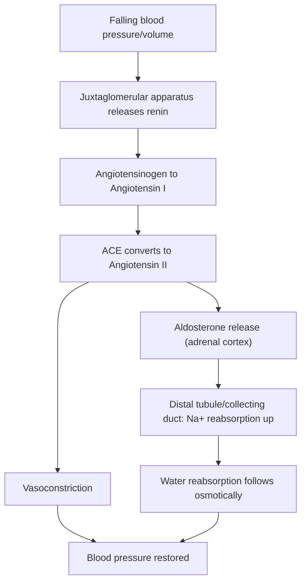




## Overview

Anatomy describes what a structure *is*; physiology describes what it *does* and, more specifically, how the body keeps what it does within survivable limits. This page opens the Animal Physiology section with the two ideas every later page assumes: **feedback control** as the universal mechanism animals use to regulate any internal variable, and **osmoregulation/excretion** as the first fully worked example of that mechanism in action, paired with the nephron structure already covered on the [Human Excretory System](../../2-animal-anatomy/human-excretory-system/) page. Where that page detailed the glomerulus, podocytes, and tubule segments structurally, this page covers the hormonal control loops that make the same structure actually regulate blood volume, blood pressure, and osmolarity moment to moment.

## Key Concepts

### Feedback Loop Theory

**Homeostasis** is the maintenance of internal variables (temperature, blood glucose, blood osmolarity, blood pH, blood pressure) within a narrow range around a **set point**, despite a constantly changing external environment. Every homeostatic loop shares the same three structural components: a **receptor** (detects the variable and its deviation from set point), a **control center** (compares the detected value to the set point, often the hypothalamus or a region of the brainstem, see [Nervous System Physiology](../nervous-system-physiology/)), and an **effector** (a muscle or gland that acts to correct the deviation).

- **Negative feedback**: the effector's response opposes the initial deviation, driving the variable back toward set point. This is by far the dominant feedback mode in physiology (thermoregulation, blood glucose regulation, blood pressure regulation, osmoregulation below) because it is inherently self-limiting and stabilizing.
- **Positive feedback**, the effector's response amplifies the initial deviation rather than opposing it, driving the variable further away from its starting value until an external event breaks the loop. Positive feedback is comparatively rare precisely because it is destabilizing by design: it is reserved for processes that need to complete rapidly and decisively once triggered, rather than being held near a set point (e.g., the LH surge preceding ovulation, detailed on the [Reproductive Physiology](../reproductive-physiology/) page; blood clotting cascades; the depolarization phase of an action potential, see [Nervous System Physiology](../nervous-system-physiology/)).

*Source: Dee Unglaub Silverthorn, Human Physiology: An Integrated Approach*

Exam tip A reliable way to distinguish the two under exam pressure: ask whether the response could plausibly continue indefinitely without an external stopping event. If yes, it's positive feedback (something else, full cervical dilation, membrane repolarization, ovulation itself, has to intervene to end it); if the response naturally tapers as the variable approaches set point, it's negative feedback.

### Osmoregulation Strategy

Every animal faces a physical problem: its internal fluid osmolarity will drift toward equilibrium with its external environment across any permeable surface, unless actively opposed. Two broad strategies exist:

- **Osmoconformers**, internal osmolarity is allowed to match the external environment (nearly all marine invertebrates). This eliminates the energetic cost of active regulation but restricts these animals to environments with a stable external osmolarity (open ocean), since their cells cannot tolerate large or rapid osmotic swings.
- **Osmoregulators**, internal osmolarity is actively held constant regardless of external conditions, at continuous energetic cost (ATP-dependent ion transport). Nearly all vertebrates are osmoregulators, as are many invertebrates living in osmotically variable or challenging environments (estuaries, fresh water, terrestrial habitats).

The specific osmoregulatory challenge an animal faces depends on the osmotic gradient between it and its environment: a freshwater animal is **hyperosmotic** to its surroundings (water constantly enters by osmosis, ions are constantly lost by diffusion, so the core problem is excreting excess water while conserving ions), while a marine bony fish is **hypoosmotic** to seawater (water is constantly lost, ions constantly gained, the reverse problem). *(Each specific vertebrate/invertebrate solution to these opposing challenges, elasmobranch urea retention, marine bird salt glands, the desert kangaroo rat's kidney, is developed in full on the [Comparative Osmoregulation & Excretion](../../3-animal-physiology/comparative-osmoregulation-excretion/) page; this page covers only the shared regulatory mechanism.)*

*Source: pediaa.com*

### Nitrogenous Waste Strategy

Protein and nucleic acid catabolism releases amino groups that must be excreted, and the chemical form chosen reflects a direct three-way trade-off between toxicity, energetic cost of synthesis, and water cost of excretion:

| Form | Toxicity | Synthesis cost | Water cost to excrete | Typical animals |
|---|---|---|---|---|
| **Ammonia (NH₃)** | High, must be excreted immediately and diluted | None (direct deamination product) | Very high (large volumes of dilute urine/constant diffusion) | Most aquatic animals (bony fish, aquatic invertebrates), unlimited water available to dilute it |
| **Urea** | Low | Moderate (urea cycle, ATP-consuming) | Moderate (can be concentrated into a smaller urine volume) | Mammals, adult amphibians, elasmobranchs; access to water is intermittent, some energy budget available |
| **Uric acid** | Very low, insoluble | High (energetically expensive synthesis) | Minimal (excreted as a semi-solid paste, essentially no water lost) | Birds, reptiles, insects; water conservation is critical (desert habitats, the amniotic egg's closed system, flight mass constraints) |

This table is a direct example of an evolutionary trade-off made visible through physiology: no animal excretes the "best" nitrogenous waste in isolation, because there is no form that is simultaneously non-toxic, cheap, and water-free, each lineage's choice tracks its specific water availability and energy budget.

*Source: SlideShare*

### Kidney Function Mechanism

The nephron's structural segments (glomerulus, proximal/distal convoluted tubule, loop of Henle, collecting duct, see [Human Excretory System](../../2-animal-anatomy/human-excretory-system/) for histology) perform three sequential processes: **filtration** (glomerulus, bulk, non-selective, pressure-driven), **reabsorption** (tubule segments recover useful solutes/water from the filtrate), and **secretion** (tubule segments add additional wastes/excess ions into the filtrate). Three regulatory mechanisms tune this process to maintain blood volume, pressure, and osmolarity:

- **The countercurrent multiplier**: the descending and ascending limbs of the **loop of Henle** run parallel but carry fluid in opposite directions, with the ascending limb (impermeable to water, but actively pumping Na⁺/K⁺/Cl⁻ out into the surrounding medullary interstitium) progressively concentrating the interstitial fluid deeper into the medulla. Because the descending limb (permeable to water but not solutes) runs alongside this increasingly concentrated interstitium, water is progressively drawn out of the descending limb's filtrate by osmosis. The net effect, built up incrementally along the loop's length rather than in one step, is a steep osmotic gradient in the renal medulla (dilute near the cortex, highly concentrated near the papilla) that the collecting duct can then exploit to concentrate urine well beyond blood osmolarity, impossible with simple, single-pass filtration.

*Source: Khan Academy, precise match, numeric medullary gradient shown as specified.*
- **ADH (antidiuretic hormone / vasopressin)**: released from the posterior pituitary in response to rising blood osmolarity (detected by hypothalamic osmoreceptors) or falling blood volume/pressure. ADH inserts **aquaporin** water channels into the collecting duct's luminal membrane, making it water-permeable; water then moves passively out of the collecting duct filtrate into the hyperosmotic medullary interstitium built by the countercurrent multiplier above, concentrating the urine and returning water to the blood. Without ADH, the collecting duct remains largely water-impermeable and dilute urine is produced regardless of how concentrated the medullary interstitium is. The gradient is necessary but not sufficient; ADH is what allows the collecting duct to use it.
- **RAAS (renin-angiotensin-aldosterone system)**: triggered by falling blood pressure/volume detected at the **juxtaglomerular apparatus** (specialized cells at the afferent arteriole/distal tubule contact point). Falling pressure triggers **renin** release, which cleaves circulating angiotensinogen (produced by the liver) to **angiotensin I**; angiotensin-converting enzyme (ACE, largely in lung capillaries) converts this to **angiotensin II**, a potent vasoconstrictor that also stimulates **aldosterone** release from the adrenal cortex. Aldosterone acts on the distal tubule/collecting duct to increase Na⁺ reabsorption (water follows osmotically), directly raising blood volume and pressure, a slower-acting, longer-duration complement to the fast neural baroreceptor reflex covered on the [Cardiovascular Physiology](../cardiovascular-physiology/) page.

## Comparative Structures

| Environment | Osmotic challenge | Dominant strategy summary |
|---|---|---|
| Marine invertebrate | None (isosmotic with seawater) | Osmoconformer |
| Marine bony fish | Hypoosmotic to seawater (loses water, gains ions) | Drinks seawater, excretes excess ions via gills |
| Elasmobranch (sharks/rays) |, | Retains urea/TMAO to raise internal osmolarity near-isosmotic with seawater |
| Freshwater fish | Hyperosmotic to fresh water (gains water, loses ions) | Excretes large volumes of dilute urine, actively absorbs ions via gills |
| Terrestrial vertebrate | Continuous evaporative/excretory water loss | ADH/RAAS-regulated kidney, concentrated urine, low-water nitrogenous waste (urea or uric acid) |

*(Full mechanistic detail on each of these strategies is developed on the [Comparative Osmoregulation & Excretion](../comparative-osmoregulation-excretion/) page; this table previews the axis of comparison only.)*

## Common Exam Questions

- "Distinguish negative from positive feedback using a criterion other than a memorized example list, then classify blood clotting and blood glucose regulation using that criterion."
- "Explain why an animal's choice of nitrogenous waste product represents a trade-off, naming the three relevant variables."
- "Explain, mechanistically, why the loop of Henle alone cannot concentrate urine without ADH acting on the collecting duct."
- "Trace the RAAS pathway from a drop in blood pressure to its restoration, naming every intermediate signal."
- "Explain why marine bony fish and freshwater fish face opposite osmoregulatory challenges despite both living in water."

## Visual Reference

**Interactive**

- **Countercurrent multiplier builder (SVG/JS, step-through)**: a schematic loop of Henle where clicking "step" repeatedly shows one incremental round of ascending-limb ion pumping and descending-limb water loss, with a numeric interstitial-concentration readout at each medullary depth building up over successive steps, replaces the static "steep gradient" claim with a visible, incremental construction of it.



- **RAAS/ADH pathway flowchart (extends the Mermaid diagram above, click-through)**, clicking each node (JGA → renin → angiotensin I → ACE → angiotensin II → aldosterone) reveals that step's specific trigger and effect, and a toggle overlays where ADH acts separately on the same nephron diagram, clarifying that RAAS and ADH are parallel, not sequential, mechanisms.



**Static** *(placed inline in Key Concepts above, next to the concept each one illustrates, rather than collected here)*

## Practice Problems

1. A hospitalized patient's blood osmolarity rises. Name the hormone released in response, its site of secretion, its target tissue, and its cellular mechanism of action there.
2. Explain why a marine bird excretes concentrated salt via a nasal salt gland in addition to normal kidney function, referencing its osmoregulatory challenge.
3. Rank ammonia, urea, and uric acid by water cost of excretion, and explain why an actively flying bird's nitrogenous waste choice is not a coincidence.
4. A drop in blood pressure is detected at the juxtaglomerular apparatus. Trace every step from this detection to the restoration of blood pressure.
5. Classify the depolarization phase of a neuron's action potential as negative or positive feedback, and justify your answer using the definition of each.
