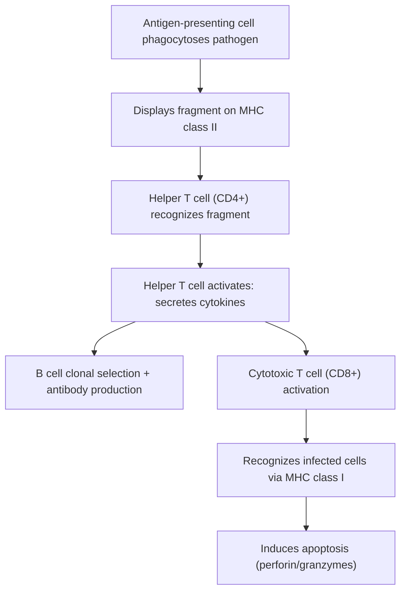




## Overview

The [Human Circulatory System](../../2-animal-anatomy/human-circulatory-system/) anatomy page introduced the five leukocyte types structurally. This page covers what each cell type actually does functionally, organized around the immune system's two-tier strategy: a fast, non-specific **innate** response mounted against any pathogen, and a slower, highly specific **adaptive** response that improves on repeat exposure to the same pathogen.

## Key Concepts

### Innate Immunity: Barriers and Phagocytes

The first line of defense is physical/chemical, not cellular: intact skin (see [Human Integumentary System](../../2-animal-anatomy/human-integumentary-system/)), mucus trapping particles in ciliated respiratory epithelium (see [Human Respiratory System](../../2-animal-anatomy/human-respiratory-system/)), and stomach acid (see [Digestive & Metabolic Physiology](../digestive-metabolic-physiology/)) all prevent pathogen entry without any immune recognition step at all.

Once a pathogen breaches these barriers, **phagocytes** provide the first cellular response: **neutrophils** (the most abundant leukocyte, first responders, short-lived) and **macrophages** (differentiated from circulating monocytes upon entering tissue, longer-lived, also function as antigen-presenting cells linking to the adaptive response below) recognize conserved molecular patterns common to broad classes of pathogens (e.g., bacterial cell wall components) via **pattern recognition receptors**, engulf the pathogen by phagocytosis, and destroy it within a phagolysosome (fusion of the phagocytic vacuole with lysosomal digestive enzymes).

*Source: GeeksforGeeks*

**Natural killer (NK) cells** patrol for host cells that have already been compromised — virus-infected or cancerous cells that have downregulated their surface **MHC class I** display (see antigen presentation below) — and induce these cells to undergo apoptosis, providing an innate-level check against the specific failure mode of "cells hiding from" the adaptive T cell response described below (a T cell needs MHC I display to recognize an infected cell; NK cells specifically target cells that have *lost* that display to evade T cells).

### The Complement System

**Complement** is a cascade of ~30 plasma proteins, normally circulating in inactive form, that activate in sequence upon encountering a pathogen surface (via any of three initiating pathways) to produce three convergent effects: **opsonization** (complement proteins coat the pathogen surface, tagging it for more efficient phagocyte recognition and engulfment), direct pathogen lysis (the **membrane attack complex**, a protein ring that inserts into and perforates the pathogen's membrane), and recruitment of additional immune cells to the site (chemotactic fragments released during the cascade). Complement is considered part of innate immunity despite sometimes being triggered by antibodies (adaptive) because the cascade itself and its lytic/opsonizing machinery are non-specific once triggered.

*Source: ResearchGate, fig. 2*

### Inflammation

**Inflammation** is the coordinated local vascular and cellular response to tissue damage or infection, producing its four classical signs (redness, heat, swelling, pain) through a direct physiological mechanism: damaged tissue and activated immune cells release signaling molecules (histamine, prostaglandins, cytokines) that cause local **vasodilation** (increased blood flow — redness, heat) and increased capillary permeability (plasma and immune cells leak into the tissue more readily — swelling, and pain from both swelling pressure and direct nerve sensitization by these same signaling molecules). This is a direct, adaptive amplification of local defenses — not incidental damage — since increased blood flow and vascular permeability actively deliver more phagocytes and plasma proteins (including complement) to the site of infection.

### Adaptive Immunity: Humoral Response

**B lymphocytes** each display a unique, genetically rearranged surface antibody (immunoglobulin) generated during development, such that the total B cell population collectively displays an enormous diversity of possible antigen specificities before ever encountering a pathogen. Upon a B cell's surface antibody binding its specific matching antigen (with critical costimulation from a helper T cell recognizing the same antigen, see below), that one B cell undergoes **clonal selection**: proliferation into a large population of identical daughter cells, most differentiating into antibody-secreting **plasma cells** and a smaller fraction becoming long-lived **memory B cells**.

*Source: **© Encyclopædia Britannica, Inc.** — explicit copyright notice visible in the image itself. This is a confirmed commercial copyright, not merely an unconfirmed license — must not go on the public site without a license or replacement. Precise spec match otherwise.*

Secreted **antibodies** (Y-shaped proteins, two antigen-binding sites per molecule formed by variable regions, plus a constant region determining antibody class/function) act by **neutralization** (physically blocking a pathogen or toxin from binding its target host cell receptor), **opsonization** (tagging pathogens for phagocytosis, functionally parallel to complement's opsonizing role above), and **agglutination** (clumping multiple pathogens together via their multiple binding sites, limiting spread and aiding clearance) — antibodies themselves do not directly destroy a pathogen, but mark and immobilize it for destruction by other mechanisms (phagocytes, complement).

### Adaptive Immunity: Cell-Mediated Response and Antigen Presentation

Unlike B cells (which recognize free antigen directly), **T lymphocytes** only recognize antigen fragments displayed on a host cell surface bound to **major histocompatibility complex (MHC)** proteins — a structural requirement called **MHC restriction**:

- **MHC class I** — displayed on essentially all nucleated cells, presenting fragments of proteins synthesized *inside* that cell (including viral proteins, if the cell is infected). **Cytotoxic T cells (CD8⁺)** recognize infected/abnormal cells via MHC I display of foreign peptide and induce apoptosis directly (releasing perforin, which perforates the target membrane, and granzymes, which trigger the apoptotic cascade inside).
- **MHC class II** — displayed only on specialized **antigen-presenting cells** (macrophages, dendritic cells, B cells), presenting fragments of extracellular material the cell has phagocytosed/endocytosed. **Helper T cells (CD4⁺)** recognize antigen via MHC II display and, upon activation, secrete cytokines that amplify both the B cell response (the costimulation required for full B cell activation, above) and cytotoxic T cell activity — functioning as a coordinating hub rather than a direct effector cell.

*Source: kingofthecurve.org (USMLE Step 1 guide)*

### Immunological Memory

*Source: pharmacy180.com (Fig. 9.5) — precise spec match.*

Both the B cell and T cell responses generate long-lived **memory cells** following a primary exposure — this is the physiological basis of both natural immunity after infection and vaccination. On a subsequent exposure to the same antigen, the pre-existing memory cell population allows a **secondary immune response** that is faster (no need to generate the response from scratch) and of greater magnitude (a larger starting population of antigen-specific cells) than the primary response, typically neutralizing the pathogen before symptoms even develop.

## Comparative Structures

| Feature | Innate immunity | Adaptive immunity |
|---|---|---|
| Specificity | Broad, pattern-based | Highly specific to one antigen |
| Response speed | Immediate (minutes-hours) | Slow on first exposure (days), fast on re-exposure |
| Memory | None | Yes (memory B/T cells) |
| Key cells | Neutrophils, macrophages, NK cells | B cells, helper T cells, cytotoxic T cells |
| Improves with repeated exposure? | No | Yes |

## Common Exam Questions

- "Distinguish innate from adaptive immunity along specificity, speed, and memory, and classify the complement system's placement between the two."
- "Explain why NK cells specifically target host cells with reduced MHC class I display, and how this complements the cytotoxic T cell mechanism."
- "Explain clonal selection in B cells and why it requires helper T cell costimulation in addition to antigen binding."
- "Distinguish the antigen-recognition requirements of a B cell from those of a T cell, referencing MHC restriction."
- "Explain why a secondary immune response is faster and larger than a primary response, referencing a specific cell type."

## Visual Reference

**Interactive**

- **Immune response pathway simulator (click-through, extends the Mermaid diagram above)** — clicking through a pathogen's path from initial phagocytosis by an antigen-presenting cell through helper T cell activation to both the B cell (humoral) and cytotoxic T cell (cell-mediated) branches, with each node revealing the specific molecular interaction (MHC class, receptor, cytokine) involved.



- **Primary vs. secondary response chart (Plotly)** — antibody titer vs. time plotted for both a first and second exposure to the same antigen on the same axes, showing the secondary response's shorter lag and higher peak — makes immunological memory's practical effect directly visible and quantitative.



**Static** *(placed inline in Key Concepts above, next to the concept each one illustrates, rather than collected here — still outstanding: a standalone innate-vs-adaptive comparison diagram to pair with the Comparative Structures table)*

## Practice Problems

1. Name three innate immune mechanisms a pathogen encounters before any adaptive response begins.
2. Explain why complement is generally classified as part of innate rather than adaptive immunity, despite antibodies (adaptive) being one of its activation triggers.
3. A virus-infected cell has downregulated its MHC class I display to evade cytotoxic T cells. Explain which innate immune cell type would still detect and eliminate it, and how.
4. Explain why a helper T cell, rather than a B cell alone, is required for full B cell clonal selection and antibody production.
5. Explain, in terms of memory cell populations, why a vaccinated individual's response to a real infection is faster than an unvaccinated individual's first exposure.
