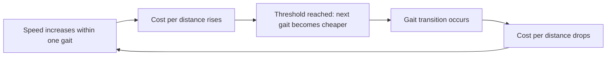



## Overview

The [Muscle Physiology](../muscle-physiology/) page covered how a single muscle fiber generates force and regenerates ATP; this closing page scales that mechanism up to whole-animal energetics — how metabolic rate scales with body size across species, why swimming is cheaper than running per unit distance, why animals switch gait at predictable speeds, and how elastic tissue lets some animals recycle mechanical energy rather than paying its full metabolic cost each stride.

## Key Concepts

### Metabolic Scaling and Kleiber's Law

Basal metabolic rate (see [Digestive & Metabolic Physiology](../digestive-metabolic-physiology/)) does not scale linearly with body mass across species — **Kleiber's law** describes an empirical relationship of BMR ∝ mass^0.75 (a three-quarter-power scaling law), meaning a 10,000-fold increase in body mass (a mouse to an elephant) corresponds to roughly a 1,000-fold increase in metabolic rate, not 10,000-fold. A simpler surface-area argument (heat loss scales with surface area, mass scales with volume, and surface-area-to-volume ratio itself scales as mass^(2/3)) predicts a 2/3-power exponent, close to but not exactly matching the empirically observed 3/4; the discrepancy between the simple surface-area prediction and the actual 3/4 exponent remains an active area of physiological research (proposed explanations include the fractal geometry of internal resource-distribution networks such as the circulatory system), but the practical, testable consequence is consistent either way: **metabolic rate per unit mass (mass-specific metabolic rate) decreases as body size increases** — a mouse's tissue burns energy far faster per gram than an elephant's tissue does, which is why small endotherms must eat disproportionately more relative to their body mass and lose heat disproportionately faster (higher surface-area-to-volume ratio, see [Comparative Thermoregulation](../comparative-thermoregulation/)).

### Net Cost of Transport

The **net cost of transport (COT)** — energy expended per unit body mass per unit distance traveled — differs substantially by locomotion mode, largely for physical rather than physiological reasons:

| Mode | Relative net cost of transport | Physical basis |
|---|---|---|
| **Swimming** | Lowest | Water buoyancy supports body weight, eliminating the energetic cost of counteracting gravity that walking/running/flying all pay; the primary cost is overcoming drag |
| **Flying** | Intermediate | Must generate lift to counteract gravity continuously, but covers ground very quickly, lowering cost *per unit distance* despite a high cost per unit time |
| **Running** | Highest | Must support full body weight against gravity at every stride with no buoyant or lift-based assistance, while repeatedly decelerating and re-accelerating the body's center of mass each step |

This is a direct case of physical constraint shaping physiological strategy: swimming's low cost of transport is why aquatic migration (e.g., whale migration) can cover vastly greater distances on a comparable energy budget than an equivalent-mass terrestrial migration.

### Gait Transitions as Energy Minimization

Terrestrial animals do not simply move faster within a single gait as speed increases — they switch gaits (walk → trot → gallop in horses, for instance) at fairly predictable speed thresholds, and this transition is itself an energy-minimization behavior: at any given speed, one gait pattern minimizes metabolic cost per unit distance more than the alternatives, and measured oxygen consumption in animals allowed to choose their own gait freely shows a characteristic sawtooth pattern — cost per distance rising within a gait as speed increases, then dropping sharply at the moment of a gait transition, as the animal adopts a mechanically more efficient stride pattern for the new speed range, before rising again. This provides direct experimental evidence that an animal's freely chosen gait transition points are not arbitrary but track the specific speed at which the *next* gait becomes more economical than continuing the current one.

### Elastic Energy Storage

Some locomotor systems reduce the metabolic cost of movement further by storing and returning mechanical energy elastically rather than dissipating and re-generating it via muscle contraction each cycle: tendons (particularly the Achilles tendon in running mammals, and specialized tendon structures in hopping kangaroos) stretch under load during one phase of a stride (storing elastic strain energy, much like a compressed spring) and recoil during the next phase, returning a substantial fraction of that stored energy to assist the following stride — reducing the muscular/metabolic work that would otherwise be required to re-accelerate the limb or body each cycle. This is why a kangaroo's cost of transport rises only modestly with increasing hopping speed compared to a similarly sized quadruped's running cost, since more of the mechanical energy at higher speed is being recycled elastically through the tendon rather than newly supplied by muscle metabolism.

### Muscle Fiber Recruitment Across the Speed Range

Energetic strategy at the whole-animal level connects directly back to the fiber-type recruitment pattern covered on the [Muscle Physiology](../muscle-physiology/) page: sustained, submaximal locomotion (e.g., long-distance running or steady swimming) draws primarily on Type I (slow oxidative) fibers and the oxidative phosphorylation energy system, while a sudden burst of maximal-speed locomotion (a sprint, or a rapid escape response) recruits Type IIx (fast glycolytic) fibers running on the ATP-PCr and anaerobic glycolysis systems — meaning an animal's *locomotor energy strategy* at any given moment is really a direct expression of which fiber types and energy systems from that earlier page are currently dominant.

## Comparative Structures

| Factor | Effect on energetics | Underlying principle |
|---|---|---|
| Increasing body size | Mass-specific metabolic rate decreases | Kleiber's law (BMR ∝ mass^0.75) |
| Swimming vs. running | Swimming has much lower cost of transport | Buoyancy eliminates weight-support cost |
| Gait transition | Cost per distance drops at the transition point | Each gait is more efficient over a specific speed range |
| Elastic tendon storage | Reduces metabolic cost at higher speed | Stored strain energy returned each stride, reducing new muscular work needed |

## Common Exam Questions

- "State Kleiber's law and explain why mass-specific metabolic rate decreases with increasing body size."
- "Explain why swimming has a lower net cost of transport than running, referencing the physical role of buoyancy."
- "Explain why an animal switches gait at a specific speed rather than simply moving faster within its current gait, using the concept of cost-per-distance minimization."
- "Explain how elastic energy storage in tendons reduces the metabolic cost of hopping locomotion at higher speeds."
- "Connect an animal's choice of muscle fiber type during a sprint versus a marathon-distance effort to the corresponding whole-body cost-of-transport strategy."

## Visual Reference

**Interactive**

- **Kleiber's law scaling plot (Plotly, log-log axes)** — body mass vs. basal metabolic rate plotted on log-log axes across several example species, with the 0.75-power-law regression line shown and a draggable point letting a student place a hypothetical new species' mass and read off its predicted BMR — makes the power-law relationship a manipulable, quantitative tool rather than a memorized exponent.
- **Cost-of-transport-by-gait sawtooth chart (Plotly)** — oxygen consumption per unit distance vs. speed, showing the characteristic sawtooth pattern across walk/trot/gallop with the actual gait-transition speeds marked, directly visualizing the energy-minimization argument made in the text.

**Static**

- Surface-area-to-volume ratio diagram across increasing body size, connecting to both metabolic scaling here and thermoregulation on the [Comparative Thermoregulation](../comparative-thermoregulation/) page
- Net cost of transport bar chart comparing swimming/flying/running at equivalent body mass
- Gait transition diagram (walk/trot/gallop footfall patterns) paired with the sawtooth energy chart above
- Tendon elastic energy storage and return cycle, shown across one hopping stride

## Practice Problems

1. If a species' body mass increases 16-fold, predict the approximate fold-increase in its basal metabolic rate using Kleiber's law.
2. Explain why a swimming animal of a given mass can typically migrate a much greater distance on the same energy budget than a running animal of similar mass.
3. A horse increases speed and, at a specific point, switches from trot to gallop. Explain why this transition itself reduces the horse's cost of transport rather than simply reflecting its top trotting speed being reached.
4. Explain why a kangaroo's cost of transport increases only modestly with hopping speed, referencing tendon elasticity.
5. An animal transitions from a steady jog to a maximal sprint. Predict the shift in dominant muscle fiber type and energy system, referencing the Muscle Physiology page.
