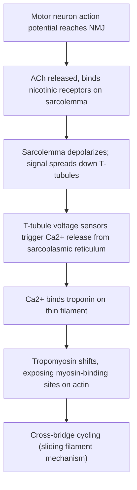



## Overview

The [Human Muscular System](../../2-animal-anatomy/human-muscular-system/) anatomy page covers sarcomere and neuromuscular junction structure; this page covers the mechanism that converts a motor neuron's action potential into an actual shortening contraction, and the metabolic systems that keep that contraction supplied with ATP.

## Key Concepts

### Excitation-Contraction Coupling

The sequence linking a neural signal to mechanical contraction is a single continuous chain, not two separate events:

At the **neuromuscular junction**, presynaptic **acetylcholine (ACh)** release (mechanistically identical to the chemical synapse mechanism on the [Nervous System Physiology](../nervous-system-physiology/) page) binds nicotinic receptors on the muscle fiber's motor end plate, depolarizing the **sarcolemma**. This depolarization travels inward along **T-tubules** (deep membrane invaginations positioned at every sarcomere, ensuring the signal reaches the fiber's interior essentially simultaneously rather than only from the surface inward), where voltage sensors mechanically coupled to Ca²⁺ release channels on the adjacent **sarcoplasmic reticulum** trigger a rapid flood of stored Ca²⁺ into the sarcoplasm.

### The Sliding Filament Mechanism

Released Ca²⁺ binds **troponin**, a regulatory protein complex on the thin (actin) filament; this binding causes **tropomyosin** (which otherwise physically blocks myosin-binding sites on actin at rest) to shift position, exposing those sites. **Myosin cross-bridge cycling** then proceeds through a fixed mechanical sequence:

1. **Cross-bridge formation** — the myosin head (already ADP+Pi-bound from the previous cycle) binds the now-exposed actin site.
2. **Power stroke** — the myosin head releases Pi then ADP, pivoting and pulling the thin filament past the thick filament (this pivot is the actual force-generating step, and is why the mechanism is termed "sliding" — filament *length* does not change, only the degree of overlap).
3. **Rigor** — briefly, myosin remains tightly bound to actin with no bound nucleotide (this is the state responsible for rigor mortis after death, when ATP synthesis stops and no fresh ATP is available to allow detachment).
4. **Detachment** — a fresh ATP molecule binds myosin, causing it to release actin.
5. **Cocking** — myosin hydrolyzes the bound ATP to ADP+Pi, re-cocking the head to its high-energy conformation, ready to bind actin again if Ca²⁺/troponin/tropomyosin still permit it.

This cycle repeats asynchronously across the many myosin heads in a sarcomere for as long as cytosolic Ca²⁺ remains elevated. Contraction ends when Ca²⁺ is actively pumped back into the sarcoplasmic reticulum (by a dedicated Ca²⁺-ATPase), allowing tropomyosin to re-block the actin binding sites — relaxation, like contraction, is an active, ATP-dependent process, not merely the passive absence of stimulation.

Exam tip ATP is required for *both* the power stroke's re-cocking step *and* for myosin-actin detachment — a classic exam trap is assuming ATP is only needed for the power stroke itself; without ATP, muscle cannot relax (rigor), it does not merely fail to contract.

### Skeletal Muscle Fiber Types

Skeletal muscle fibers are classified by contraction speed and the metabolic pathway dominating their ATP supply, which together determine fatigue resistance:

| Fiber type | Contraction speed | Dominant metabolism | Mitochondria/myoglobin | Fatigue resistance | Example use |
|---|---|---|---|---|---|
| **Type I (slow oxidative)** | Slow | Oxidative phosphorylation | High (red muscle) | High | Postural muscles, marathon running |
| **Type IIa (fast oxidative-glycolytic)** | Fast | Both oxidative and glycolytic | Intermediate | Intermediate | Middle-distance running |
| **Type IIx (fast glycolytic)** | Fastest | Anaerobic glycolysis | Low (white muscle) | Low, fatigues quickly | Sprinting, powerlifting |

The myoglobin/mitochondrial density difference is why Type I fibers appear structurally red and Type IIx fibers appear pale/white in gross tissue — a direct structure-function link testable from a fresh muscle cross-section alone.

### Energy Systems

Sustained contraction requires continuous ATP regeneration from one of three systems, distinguished by speed, capacity, and oxygen dependence:

- **ATP-phosphocreatine (ATP-PCr) system** — phosphocreatine directly donates its phosphate to ADP (catalyzed by creatine kinase), regenerating ATP within seconds with no oxygen requirement; extremely fast but limited by the small stored phosphocreatine pool (depleted within ~10 seconds of maximal effort).
- **Anaerobic glycolysis** — glucose/glycogen broken down to pyruvate, net 2 ATP per glucose, with pyruvate reduced to **lactate** when oxygen delivery cannot keep pace with demand; faster than oxidative phosphorylation but far less ATP-efficient, and the accumulating lactate/H⁺ contributes to the muscle fatigue and burning sensation of sustained near-maximal effort.
- **Oxidative phosphorylation** — pyruvate fully oxidized via the citric acid cycle and electron transport chain (mitochondria-dependent), yielding far more ATP per glucose than glycolysis alone, but at a slower rate — the dominant system for sustained, submaximal effort once the first two systems' fast-but-limited capacity is exhausted.

These three systems are not alternatives an animal chooses between but a **sequential recruitment** by relative demand and duration: the ATP-PCr system dominates the first few seconds of any effort regardless of ultimate intensity, glycolysis dominates as intensity remains high beyond that window, and oxidative phosphorylation dominates once effort is sustained at a submaximal level — explaining why the same muscle can power both a sprint start and a subsequent longer run using different energy systems in sequence, not a fixed single pathway.

## Comparative Structures

| Muscle type | Control | Striated? | Key structural/functional distinction |
|---|---|---|---|
| Skeletal | Voluntary (somatic motor neuron, NMJ) | Yes | Fast excitation-contraction coupling described above; multinucleated fibers |
| Cardiac | Involuntary, autorhythmic (see [Human Circulatory System](../../2-animal-anatomy/human-circulatory-system/)) | Yes | Intercalated discs (gap junctions) allow direct electrical coupling between cells, so the whole tissue contracts as a functional syncytium rather than each cell requiring individual NMJ input |
| Smooth | Involuntary (autonomic, hormonal) | No | No troponin — Ca²⁺ instead binds **calmodulin**, activating myosin light-chain kinase directly; lacks sarcomeres, allowing sustained, graded contraction (e.g., vascular smooth muscle tone, gut peristalsis) |

## Common Exam Questions

- "Trace excitation-contraction coupling from neuromuscular junction ACh release to Ca²⁺ binding troponin, naming every intermediate structure."
- "Explain why ATP is required for muscle relaxation as well as contraction, and connect this to the physiological basis of rigor mortis."
- "Given a fresh muscle cross-section showing predominantly pale fibers with few mitochondria, predict its fiber type and most likely function."
- "Explain why the three energy systems are recruited sequentially rather than simultaneously at full capacity, referencing a specific sustained athletic effort."
- "Distinguish the Ca²⁺-triggered contraction mechanism of smooth muscle from that of skeletal muscle."

## Visual Reference

**Interactive**

- **Cross-bridge cycle stepper (SVG/JS, click-through)** — clicking "step" advances a myosin head through cross-bridge formation → power stroke → rigor → detachment → cocking in sequence, with the actin/myosin filament positions updating each step and the current nucleotide state (ATP/ADP+Pi/none) displayed — makes the cycle's ATP-dependence at two distinct points explicit rather than a single memorized diagram.
- **Energy system recruitment graph (Plotly)** — a stacked-area chart of ATP contribution from the three energy systems over time during a simulated maximal effort, with a draggable time marker showing which system(s) dominate at any given moment — turns "sequential recruitment" into a visible, quantitative claim.

**Static**

- Excitation-contraction coupling schematic: NMJ, sarcolemma, T-tubules, sarcoplasmic reticulum, Ca²⁺ release, labeled in sequence (paired with the Mermaid diagram above)
- Sarcomere with troponin/tropomyosin position shown in both the Ca²⁺-absent (blocked) and Ca²⁺-bound (exposed) states, side by side
- Cross-bridge cycle five-step diagram (paired with the interactive stepper above)
- Type I / IIa / IIx fiber cross-sections at relative mitochondrial density and color
- Skeletal vs. cardiac vs. smooth muscle histology, side by side, striation and nucleation differences visible

## Practice Problems

1. Name, in order, every structure a signal passes through from motor neuron action potential to actin-myosin cross-bridge formation.
2. Explain why a muscle fiber deprived of ATP after death remains rigid (rigor mortis) rather than simply going limp.
3. A muscle biopsy shows fibers with high mitochondrial density and myoglobin content. Classify the fiber type and predict its most likely functional role.
4. Explain why lactate accumulates during intense anaerobic exercise, and name the energy system responsible.
5. Explain why smooth muscle contraction is not triggered by troponin, naming the calcium-binding protein that substitutes for it and the kinase it activates.
