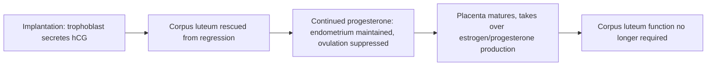
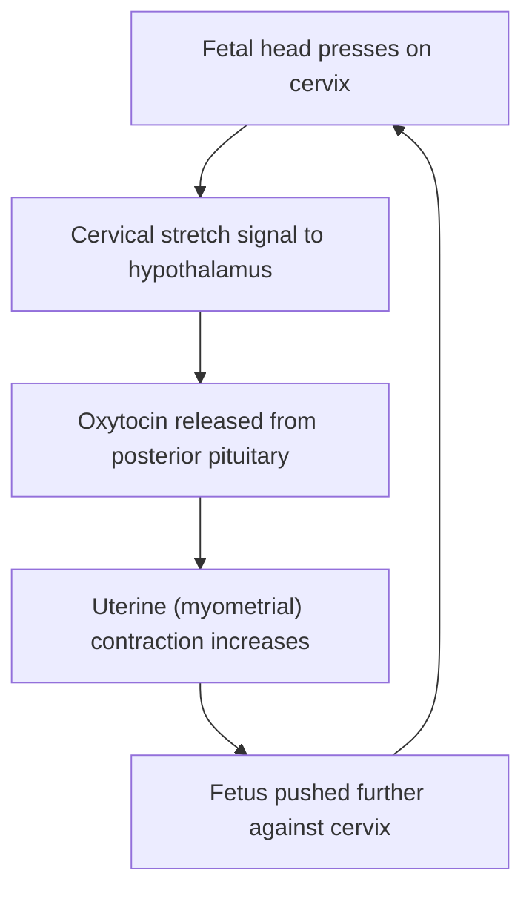



## Overview

The [Human Reproductive System](../../2-animal-anatomy/human-reproductive-system/) anatomy page already covers the HPG axis mechanism in full detail as it drives spermatogenesis, follicular development, and the ovarian/endometrial cycle — that material is not repeated here. This page picks up where that page's scope ends: what happens physiologically once fertilization succeeds — how a pregnancy is hormonally maintained, what actually triggers labor, and how lactation is controlled — plus a brief unifying recap of the HPG axis as a feedback system, since pregnancy physiology is best understood as a specific, temporary override of that same axis.

## Key Concepts

### The HPG Axis, Recapped as a Feedback System

As detailed on the [Human Reproductive System](../../2-animal-anatomy/human-reproductive-system/) page, hypothalamic GnRH drives pituitary FSH/LH release, which drives gonadal hormone production; in males this forms a continuous negative feedback loop (testosterone and inhibin suppressing GnRH/LH and FSH respectively), while in females estrogen's feedback sign flips from negative to positive late in the follicular phase, triggering the LH surge and ovulation. The physiological significance worth adding here: this entire axis is a **releasing-hormone-driven hierarchy** structurally identical in organization to the HPA and HPT axes on the [Endocrine System Physiology](../endocrine-system-physiology/) page, differing only in which peripheral gland and hormone sit at the axis's base — GnRH/FSH/LH/gonadal-steroids instead of CRH/ACTH/cortisol or TRH/TSH/thyroid hormone.

### Pregnancy Maintenance

If fertilization occurs, the resulting blastocyst implants in the endometrium (see [Human Reproductive System](../../2-animal-anatomy/human-reproductive-system/) for endometrial structure) and its outer layer, the **trophoblast**, begins secreting **human chorionic gonadotropin (hCG)** — an LH-like hormone whose critical physiological role is rescuing the **corpus luteum** from the regression it would otherwise undergo (the corpus luteum normally regresses to the corpus albicans once LH falls after the mid-cycle surge, since no further LH stimulus follows without hCG). hCG maintains the corpus luteum's progesterone output through roughly the first trimester, and progesterone is essential in early pregnancy to maintain the endometrium (preventing menstrual shedding, which would abort the pregnancy) and suppress further ovulation via the same negative-feedback logic that governs the non-pregnant luteal phase. (hCG's presence in maternal blood/urine within days of implantation is the physiological basis of pregnancy testing.)

By the second trimester, the **placenta** itself takes over as the dominant source of estrogen and progesterone, and the corpus luteum's contribution becomes physiologically unnecessary — a hand-off from an ovarian to a placental hormone source, without which pregnancy would depend indefinitely on a structure (the corpus luteum) not built for multi-month hormone output.

### Parturition as Positive Feedback

Labor onset is triggered by a cascade of hormonal and mechanical events that, once initiated, reinforce themselves rather than self-correcting — a clear worked example of **positive feedback** (see [Homeostasis & Osmoregulation](../homeostasis-osmoregulation/) for the general theory) with a defined biological stopping point (delivery):

Rising fetal size and shifting placental hormone balance near term increase myometrial sensitivity to **oxytocin**; the initial contractions this produces push the fetus against the cervix, mechanically stretching it, and that stretch is itself the signal that triggers further oxytocin release — each contraction increases the stimulus for the next, rather than the response tapering as it would under negative feedback, until delivery physically removes the stretch stimulus and ends the cycle. Prostaglandins produced locally in the uterine wall act alongside oxytocin, further increasing contractile force and helping ripen (soften) the cervix.

### Lactation and the Milk-Ejection Reflex

Mammary gland development during pregnancy is driven by rising estrogen and progesterone, but actual milk *production* is primarily driven by **prolactin** (anterior pituitary) — during pregnancy, high circulating progesterone/estrogen actually inhibit prolactin's milk-producing effect on breast tissue despite prolactin levels rising, and full lactation begins only once progesterone/estrogen fall sharply after delivery of the placenta, releasing this inhibition.

Milk **ejection** (as opposed to production) is a separate, faster reflex, and — like parturition above — is a positive feedback loop built on the same hormone: an infant suckling mechanically stimulates sensory receptors in the nipple, signaling the hypothalamus to trigger oxytocin release from the posterior pituitary; oxytocin causes **myoepithelial cells** surrounding the mammary alveoli to contract, ejecting stored milk. Continued/effective suckling sustains continued oxytocin release, and (in a distinct, separate signal) suckling itself also stimulates further prolactin release, meaning continued nursing both extracts the current milk supply and stimulates the production of the next — a demand-driven regulatory system rather than one set to a fixed schedule.

## Comparative Structures

| Process | Primary hormone(s) | Feedback type | Terminating event |
|---|---|---|---|
| Non-pregnant ovarian/menstrual cycle | GnRH/FSH/LH/estrogen/progesterone | Mixed (negative, briefly positive at ovulation) | Corpus luteum regression if no implantation |
| Early pregnancy maintenance | hCG, progesterone | Negative (suppresses further ovulation) | Placental hormone takeover |
| Parturition | Oxytocin, prostaglandins | Positive | Delivery (removes cervical stretch stimulus) |
| Milk ejection reflex | Oxytocin | Positive (per suckling bout) | End of suckling bout |

## Common Exam Questions

- "Explain the physiological necessity of hCG in early pregnancy, referencing what would happen to the corpus luteum without it."
- "Classify parturition as negative or positive feedback and justify your answer using the specific stimulus-response loop involved."
- "Explain why full lactation does not begin until after delivery despite prolactin levels rising during pregnancy."
- "Distinguish the hormonal control of milk production from milk ejection, naming the primary hormone responsible for each."
- "Explain the hand-off in progesterone source from the corpus luteum to the placenta across pregnancy, and why this hand-off is physiologically necessary."

## Visual Reference

**Interactive**

- **Pregnancy hormone timeline (Plotly)** — hCG, progesterone (corpus-luteum-derived vs. placenta-derived, separately toggleable), and estrogen levels plotted across all three trimesters, with an annotation marking the corpus-luteum-to-placenta hand-off point — makes the "hand-off," described qualitatively above, into a visible crossing point between two curves.
- **Positive feedback loop animator (extends both Mermaid diagrams above, click-through)** — select "parturition" or "milk ejection," then click through the loop step by step, with each pass around the loop shown intensifying (larger contraction arrows / more milk ejected) rather than resetting, visually distinguishing this from the self-correcting negative feedback loops shown on the Homeostasis & Osmoregulation page.

**Static**

- hCG/progesterone/estrogen levels across pregnancy trimesters, corpus luteum vs. placental contribution shaded separately (paired with the Plotly chart above)
- Parturition positive feedback loop diagram (paired with the Mermaid diagram above)
- Mammary gland cross-section showing alveoli, myoepithelial cells, and duct structure
- Milk-ejection reflex pathway: suckling stimulus → hypothalamus → posterior pituitary oxytocin release → myoepithelial contraction

## Practice Problems

1. Explain what would happen to a pregnancy in the first trimester if hCG secretion suddenly stopped, and why.
2. A pregnant patient is near term. Explain, mechanistically, why labor contractions tend to intensify once started rather than tapering off.
3. Explain why progesterone is described as inhibiting lactation during pregnancy despite prolactin levels being elevated at the same time.
4. Distinguish the roles of oxytocin and prolactin in lactation, one sentence each.
5. Classify the milk-ejection reflex as negative or positive feedback, and identify the specific event that ends one cycle of the loop.
