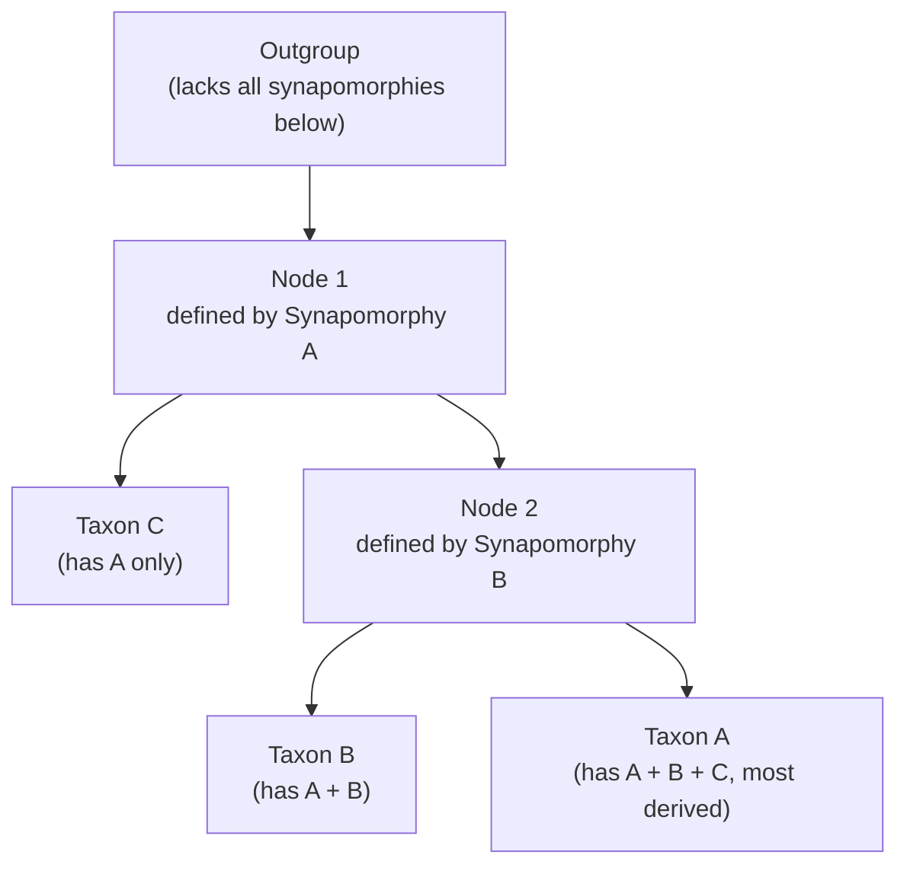



## Overview

Modern classification is built from **phylogenetics** — inferring evolutionary relationships and expressing them as branching trees — rather than from surface resemblance alone. This page covers **cladistics**, the specific method of building and reading those trees from shared derived characters, and the vocabulary (synapomorphy, monophyly, parsimony) that IBO/USABO tree-reading and tree-building questions are built around. [Molecular Systematics](../molecular-systematics/) extends this to DNA/protein sequence data and statistical tree-building methods; this page covers the character-based logic that underlies all of it, whether the characters are morphological or molecular.

## Key Concepts

### Character States and Homology

A cladistic analysis starts from a **character matrix**: a table of taxa (rows) against characters (columns — a trait that can take more than one state, e.g. "number of limbs," "presence of amniotic membrane"), each cell filled with that taxon's **character state**. Only **homologous** characters (traits shared due to common ancestry, not independently evolved) are valid for building a tree — a trait that arose independently in two unrelated lineages is **analogous** (or, more precisely for phylogenetics, **homoplasious**), and including it as if it were homologous actively corrupts the resulting tree. Wings in birds and wings in insects are the classic case: both fly, neither wing is inherited from a shared winged ancestor, so treating "has wings" as one shared character would incorrectly group birds with insects.

### Plesiomorphy vs. Synapomorphy

Every character state is classified relative to the group being analyzed:

- **Plesiomorphy (ancestral state)** — the character state present in the common ancestor of the whole group under study, retained unchanged in some descendants. A **symplesiomorphy** is an ancestral state *shared* by two or more taxa — critically, **symplesiomorphies do not indicate close relationship**, since they're just retained ancestral baggage every member of the group inherited; grouping taxa by shared ancestral traits alone is the single most common cladistics mistake tested on exams.
- **Apomorphy (derived state)** — a character state that has changed from the ancestral condition. A **synapomorphy** is a derived state *shared* by two or more taxa **because they inherited it from a more recent common ancestor that first evolved it** — synapomorphies, and only synapomorphies, are valid evidence for grouping taxa together in a cladogram. An **autapomorphy** is a derived state unique to a single taxon — real evolutionary information, but useless for grouping since by definition nothing else shares it.

The single sentence worth memorizing: **cladograms are built from shared derived characters (synapomorphies), never from shared ancestral characters (symplesiomorphies) or from convergently-evolved similarities (homoplasies).**

### Monophyly, Paraphyly, Polyphyly

A group of taxa, evaluated against a phylogenetic tree, falls into exactly one of three categories:

| Group type | Definition | Example |
|---|---|---|
| **Monophyletic** (a **clade**) | An ancestor + *all* of its descendants | Aves (birds), including all descendants of the first bird |
| **Paraphyletic** | An ancestor + *some but not all* of its descendants (one or more descendant lineages excluded) | "Reptilia" in its traditional sense — excludes birds, despite birds descending from within that same ancestral group |
| **Polyphyletic** | A group that excludes the most recent common ancestor of its members (typically united by convergent, not inherited, traits) | "Warm-blooded animals" (mammals + birds) — the two lineages' most recent common ancestor was not warm-blooded |

Modern classification aims to name only **monophyletic** groups, precisely because only a clade is guaranteed to be defined by real, inherited synapomorphies rather than an arbitrary or convergent cutoff — this is *why* "Reptilia" (paraphyletic, as traditionally drawn) has fallen out of favor in strict cladistic taxonomy in favor of **Sauropsida** (a monophyletic grouping that includes birds).

### Building a Cladogram

Given a character matrix, a cladogram is built by grouping taxa according to shared synapomorphies, working outward from the least specialized branching to the most:

Structural vocabulary this diagram illustrates: a **node** represents a hypothesized common ancestor (and the point where a synapomorphy first arose); a **branch (lineage)** connects nodes/taxa across time; a **clade** is any node plus everything branching from it; a **polytomy** is a node with more than two branches emerging, used when the data don't resolve the branching order among three or more lineages (an honest "unresolved" mark, not a claim that three lineages literally split simultaneously). Branch *length* in a basic cladogram carries no time or distance information — it is purely a branching-order diagram; a **phylogram** (branch lengths scaled to amount of evolutionary change) and a **chronogram/timetree** (branch lengths scaled to elapsed time, usually calibrated using the molecular clock — see [Molecular Systematics](../molecular-systematics/)) are related but distinct tree types worth telling apart on sight.

### The Outgroup

Determining which character states are ancestral versus derived (**polarizing** the characters) requires an external point of reference: the **outgroup**, a taxon or group known (from independent evidence) to have branched off *before* the common ancestor of the taxa being studied (the **ingroup**). Whatever character state the outgroup has is inferred to be the ancestral state for the whole analysis; any ingroup taxon differing from the outgroup state is inferred to carry the derived state. Outgroup choice matters enormously — too distant an outgroup shares too few comparable characters to be useful; too close an outgroup risks actually belonging inside the ingroup, corrupting the polarity calls for every character it's used to root.

### The Parsimony Principle

With real data, more than one cladogram is usually consistent with the character matix, since convergent evolution (homoplasy) can make unrelated taxa share a derived-looking state by coincidence. **Maximum parsimony** resolves this by preferring the tree requiring the **fewest total evolutionary changes** (character-state transitions) to explain the observed data — an application of Occam's razor to tree-building, not a claim that evolution literally always takes the shortest path, but a working assumption that convergence is less common than shared inheritance, so the simplest explanation is the best starting hypothesis given the available evidence. A tree that requires invoking the same synapomorphy evolving independently in two unrelated branches (rather than once, in a shared ancestor) is **less parsimonious** and is rejected in favor of any competing tree that explains the same data with fewer independent origins of that trait.

## Comparative Structures

| Term | Shared derived? | Valid for grouping taxa? |
|---|---|---|
| Synapomorphy | Yes (shared, derived) | Yes — this is the basis of cladistics |
| Symplesiomorphy | No (shared, but ancestral) | No — common grouping error |
| Autapomorphy | Yes, but unique to one taxon | No (nothing else shares it) |
| Homoplasy (convergence) | Appears shared, but not inherited from a common ancestor | No — actively misleading if included |

## Common Exam Questions

- "Explain why grouping taxa by a shared ancestral character (symplesiomorphy) produces an invalid cladogram, using a specific example."
- "Distinguish a paraphyletic group from a polyphyletic group, and explain why traditional 'Reptilia' is paraphyletic rather than monophyletic."
- "Explain the role of the outgroup in polarizing character states, and what happens to an analysis if the outgroup is chosen too closely related to the ingroup."
- "Given two competing cladograms for the same character matrix, explain how the parsimony principle selects between them."
- "Define a polytomy, and explain what it represents about the underlying data rather than about evolutionary history itself."
- "Given a simple character matrix (4 taxa, 4 binary characters), construct the most parsimonious cladogram and identify the synapomorphy supporting each internal node."

## Visual Reference

**Interactive**

- **Character matrix → cladogram builder (interactive SVG/JS, no new library)** — the user is given a small character matrix (4-6 taxa, 4-6 binary characters) and an outgroup, and drags taxa into a tree structure; the tool tallies the total number of character-state changes required by the user's tree versus the true most-parsimonious tree, letting the user directly discover why one arrangement beats another rather than being told the answer.

- **Monophyly/paraphyly/polyphyly classifier (click-through quiz, HTML/JS)** — presented with a series of pre-drawn trees, each with a shaded group of taxa, the user classifies the shaded group as mono-, para-, or polyphyletic and receives immediate feedback with the specific missing/excluded lineage highlighted when wrong.


**Static**

- Annotated cladogram showing nodes, branches, a clade, and a polytomy all labeled on one diagram
- Side-by-side monophyletic / paraphyletic / polyphyletic tree diagrams using the same six taxa, shaded differently in each
- Worked character matrix (taxa × characters table) alongside its resulting most-parsimonious cladogram, with each synapomorphy labeled at the node where it arose
- Cladogram vs. phylogram vs. chronogram comparison, same topology drawn three ways to show what branch length does and doesn't encode in each

## Practice Problems

1. Four taxa share a character (presence of a notochord at some life stage); a fifth, the outgroup, lacks it. Is "notochord present" a synapomorphy, symplesiomorphy, or autapomorphy for the four taxa as a group?
2. Explain why "has four limbs" is a symplesiomorphy, not a synapomorphy, for distinguishing amphibians from mammals within Tetrapoda.
3. A proposed cladogram requires 9 independent character-state changes to explain a dataset; a competing cladogram for the same data requires 6. Which does maximum parsimony favor, and why?
4. Explain, with a labeled example, why "Invertebrata" is not a valid monophyletic taxon.
5. A researcher selects a very distantly related organism as an outgroup, sharing almost no comparable characters with the ingroup. Explain the specific problem this creates for character polarization.
