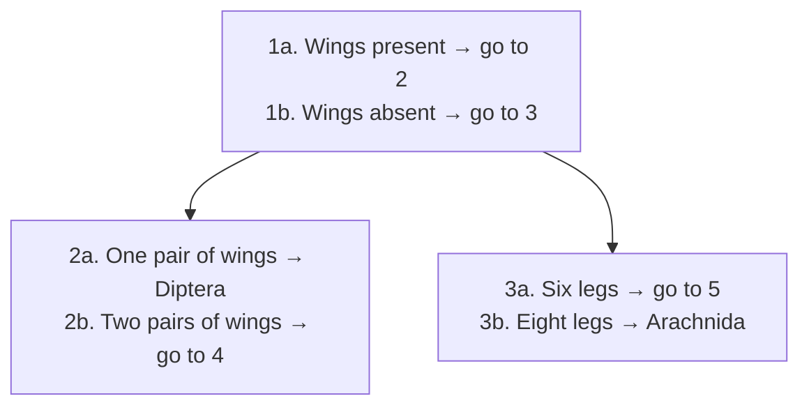



## Overview

Everything else in this section builds the classification system; this page is the applied skill of *using* it to identify an actual unknown specimen — directly relevant to IBO practical stations, which routinely hand a student an unlabeled specimen and a key and grade the identification. The underlying logic leans on the [Morphological Species Concept](../species-concepts/) (identification-by-key is essentially the MSC applied procedurally) and on stable [nomenclature](../classification-principles-nomenclature/) to make the key's endpoint names meaningful.

## Key Concepts

### The Dichotomous Key

A **dichotomous key** identifies an unknown specimen through a fixed sequence of **couplets** — paired, mutually exclusive statements about an observable character — where choosing one statement over the other either leads to the next couplet or terminates at a name. Structurally, a dichotomous key is nothing more than a **cladogram or classification tree read as a linear script**: each couplet corresponds to a branching decision point, and reaching a name means the specimen has been placed at a specific terminal node.

A well-constructed key follows several non-negotiable design principles, each one directly testable as an exam scenario where a badly-written couplet is given and the student must diagnose the flaw:

- **Mutual exclusivity** — the two statements in a couplet must never both be true of the same specimen, and must cover every possibility between them (no specimen should be unable to choose either option).
- **Independent, directly observable characters** — each couplet should rely on a character visible without dissection or specialized equipment where possible (leaf shape, number of legs, presence/absence of a structure) rather than a character requiring destructive sampling or a trait irrelevant at the specimen's actual life stage (e.g. a couplet keying on flower color is useless for a non-flowering juvenile plant).
- **Stable, non-variable characters** — a character that varies with age, sex, season, or individual variation within a species (e.g. body size alone) makes an unreliable couplet; keys favor structural, qualitatively fixed traits over continuously variable ones.
- **Sequential logic, not shortcutting** — couplets should proceed from broad, reliable distinguishing features toward progressively finer ones, mirroring the actual nested taxonomic hierarchy rather than jumping straight to a fine species-level character before broader group membership is established.

### Multi-Access (Polyclave) Keys

Unlike a dichotomous key's fixed, linear couplet sequence, a **multi-access key** (or **polyclave**) lets the user select observed characters **in any order**, progressively filtering a list of candidate taxa as each character is entered — the format underlying most modern digital/app-based identification tools. Its practical advantage over a dichotomous key is resilience: if one character is ambiguous, damaged, or simply not visible on the specimen in hand (a common real-world problem a strictly sequential dichotomous key cannot recover from, since skipping a couplet breaks the whole path), a multi-access key can simply proceed using the remaining characters instead of dead-ending.

### Character Choice in Practice

The single most common practical-station failure mode is choosing or misreading a character that looks decisive but isn't — worth naming explicitly since it's exactly what a well-designed practical exam tests:

- **Convergent (homoplasious) characters** — see [Phylogenetic Trees & Cladistics](../phylogenetic-trees-cladistics/) for the underlying concept — make poor key characters at higher taxonomic levels precisely because they can put unrelated taxa on the same branch of the key by coincidence (e.g. keying broadly on "has wings" would incorrectly route both an insect and a bird toward the same couplet branch if the key weren't scoped to a single class already).
- **Ontogenetic/seasonal/sexual variation** — a character true of an adult male may be entirely absent in a juvenile or female of the same species (antlers, for instance); a well-scoped key either restricts itself to one life stage/sex or explicitly branches for this variation rather than silently assuming it away.
- **Damage and incompleteness** — field and museum specimens are frequently incomplete (a broken wing, a specimen missing its original flower/fruit); this is the practical, real-world argument for preferring redundant, multiple confirming characters and multi-access keys over a single fragile dichotomous path wherever possible.

## Comparative Structures

| Key type | Character order | Resilience to missing/ambiguous characters | Typical use |
|---|---|---|---|
| Dichotomous | Fixed, sequential | Low — one bad couplet breaks the path | Printed field guides, classic taxonomy |
| Multi-access (polyclave) | Any order, user-chosen | High — missing characters are simply skipped | Digital/app-based identification tools |

## Common Exam Questions

- "Explain why a couplet that keys on flower color would be a poor choice for identifying a non-flowering juvenile plant, and propose a more stable alternative character."
- "Given a specimen missing the structure needed for couplet 4 of a dichotomous key, explain why identification cannot simply skip to couplet 5, and explain how a multi-access key avoids this specific problem."
- "Explain why 'has wings' would be an invalid or misleading couplet character if a key's scope spans both insects and birds."
- "State the two properties every couplet in a well-constructed dichotomous key must satisfy."
- "Explain, structurally, why a dichotomous key can be understood as a cladogram read as a linear sequence of instructions."

## Visual Reference

**Interactive**

- **Dichotomous key builder/solver (interactive SVG/JS, no new library)** — given a small set of specimens (illustrated, with 4-5 visible characters each) and a blank couplet-writing interface, the user constructs their own working dichotomous key, and the tool tests it against each specimen, flagging any couplet that fails mutual exclusivity or fails to uniquely resolve a specimen — a direct, hands-on practical-station simulator.
- **Multi-access key demo (HTML/JS filter interface)** — a small candidate-taxon list (8-10 named organisms) with a bank of selectable characters; as the user toggles characters on, the candidate list filters live, demonstrating the any-order, missing-character-tolerant behavior directly against the same rigid dichotomous key built in the tool above.

**Static**

- A worked dichotomous key (6-8 couplets) for a small illustrated specimen set (e.g. common insect orders), fully laid out as printed field guides present them
- Side-by-side diagram of the same key drawn as a linear couplet list versus as an equivalent branching cladogram, to make the structural equivalence explicit
- Annotated "bad couplet" examples gallery — one couplet violating mutual exclusivity, one relying on an unstable character, one relying on a convergent character — each with the specific flaw labeled
- Multi-access key interface mockup showing a character-selection panel and a live-filtering candidate list

## Practice Problems

1. Write a two-couplet dichotomous key (four total statements) that correctly separates four given organisms (e.g. a spider, a beetle, a centipede, a millipede) using leg-count and body-segmentation characters.
2. A dichotomous key couplet reads: "2a. Large. 2b. Small." Identify the specific design flaw and rewrite it as a valid couplet.
3. Explain why a key scoped only to distinguishing oak species should avoid a couplet based on leaf color in autumn.
4. A field specimen has lost the one structure a printed dichotomous key relies on at couplet 3. Explain two different practical strategies (one about key design, one about identification approach) that could have avoided a dead end here.
5. Explain why a multi-access key is generally preferred for mobile/app-based field identification tools over a traditional printed dichotomous key.
