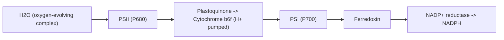



## Overview

Photosynthesis is conventionally split into two linked stages: the **light reactions**, which convert light energy into the chemical energy carriers ATP and NADPH, and **carbon fixation**, which uses those carriers to build sugar from CO₂ (covered on [Carbon Fixation: Calvin Cycle, Photorespiration & C4/CAM Biochemistry](../calvin-cycle-photorespiration-c4-cam/)). This page covers the light reactions: how chlorophyll captures a photon, how that energy is used to strip electrons from water, and how the resulting electron flow across the thylakoid membrane is coupled to ATP synthesis. [Leaf Anatomy](../../6-plant-anatomy/leaf-anatomy/) covered where this happens (chloroplast-dense mesophyll cells) and, for C4/CAM plants, the anatomical arrangement that later separates this from carbon fixation spatially or temporally; this page covers the biochemistry itself, which Leaf Anatomy explicitly deferred.

## Key Concepts

### Photosystem Structure and Light Capture

A **photosystem** is a large pigment-protein complex embedded in the thylakoid membrane, consisting of a **light-harvesting complex** (an antenna of chlorophyll *a*, chlorophyll *b*, and accessory carotenoid pigments, each absorbing a slightly different wavelength range so the complex collectively captures a broader slice of the visible spectrum than any single pigment could) surrounding a **reaction center** — a specific pair of chlorophyll *a* molecules where the captured energy is ultimately used to eject an electron. Energy absorbed anywhere in the antenna is passed molecule to molecule by **resonance energy transfer** until it reaches the reaction center, where it excites an electron enough to be donated to a primary electron acceptor — the point at which light energy first becomes chemical (redox) energy.

Two spectrally distinct photosystems exist in the thylakoid membrane, named historically by order of discovery rather than order of function:

- **Photosystem II (PSII)**, reaction center **P680** (absorbs maximally near 680 nm)
- **Photosystem I (PSI)**, reaction center **P700** (absorbs maximally near 700 nm)

### The Z-Scheme: Linear Electron Flow

The two photosystems operate in series, connected by an electron transport chain, in a pathway conventionally drawn as a redox-potential diagram shaped like the letter Z (rising at each photosystem, falling between them):

1. Light excites **P680** in PSII, ejecting an electron to the primary acceptor. The resulting P680⁺ is an extremely strong oxidant — strong enough to pull electrons from water itself.
2. The **oxygen-evolving complex** (a manganese-cluster catalytic site associated with PSII) splits water: $$ 2\text{H}_2\text{O} \rightarrow 4\text{H}^+ + 4e^- + \text{O}_2 $$ replacing the electrons P680 lost, and releasing O₂ as a byproduct — the source of essentially all atmospheric photosynthetic oxygen, and the reaction the entire light-reaction system exists to drive.
3. The ejected electron passes down an electron transport chain (plastoquinone → cytochrome b₆f complex → plastocyanin), losing energy at each step; this energy loss is harnessed at the cytochrome b₆f complex to pump additional protons into the thylakoid lumen (see chemiosmosis below).
4. The electron reaches **PSI**, replacing an electron that PSI's own reaction center, P700, lost when it absorbed light independently.
5. The electron ejected from P700 passes through a short second transport chain (ferredoxin) to **NADP⁺ reductase**, which reduces NADP⁺ to **NADPH** — the second energy carrier the Calvin cycle requires.

Because electrons flow in one direction only, from water through both photosystems to NADP⁺, and are never recycled back to PSII, this route is called **linear (noncyclic) electron flow**, and it produces both ATP (via the proton gradient built up along the way) and NADPH in a fixed ratio.

### Chemiosmotic ATP Synthesis

Protons accumulate in the thylakoid lumen from two sources acting together: directly from water-splitting (step 2 above) and from active pumping by the cytochrome b₆f complex (step 3). Because the thylakoid membrane is otherwise impermeable to H⁺, this produces a steep proton gradient (both a concentration gradient and, since the lumen becomes positively charged, an electrical gradient) across the membrane — a **proton motive force** conceptually identical to the one driving oxidative phosphorylation in mitochondrial respiration, but built from light-driven electron transport instead. Protons can only cross back out through **ATP synthase**, a membrane-embedded enzyme that couples the energetically favorable flow of H⁺ down its gradient to the energetically unfavorable synthesis of ATP from ADP + Pᵢ — the process of **photophosphorylation**, mechanistically chemiosmotic (a proton gradient across a membrane driving ATP synthase) rather than substrate-level.

### Cyclic Electron Flow

When a chloroplast's NADPH supply is already saturated relative to its ATP demand (common when Calvin cycle activity, and therefore NADPH consumption, is limited relative to other cellular ATP needs), electrons ejected from PSI's P700 can be redirected back into the cytochrome b₆f complex instead of continuing to NADP⁺ reductase — a route called **cyclic electron flow**. This bypasses PSII entirely (no water-splitting, no O₂ released, no NADPH produced) but still pumps protons via cytochrome b₆f, generating additional ATP without additional NADPH — a way to fine-tune the ATP:NADPH ratio the Calvin cycle actually needs (a ratio the strict linear pathway alone cannot supply, since it always produces both products in a fixed proportion).

## Comparative Structures

| Feature | Linear (noncyclic) electron flow | Cyclic electron flow |
|---|---|---|
| Photosystems involved | Both PSII and PSI | PSI only |
| Electron source | Water (via oxygen-evolving complex) | Recycled from PSI itself |
| O2 released? | Yes | No |
| NADPH produced? | Yes | No |
| ATP produced? | Yes | Yes |
| When favored | Balanced ATP/NADPH demand | NADPH supply already sufficient, additional ATP needed |

## Common Exam Questions

- "Trace an electron's path from water to NADPH, naming every intermediate carrier and both photosystems in order."
- "Explain why splitting water is necessary for PSII to continue functioning, referencing the redox potential of P680+."
- "Explain chemiosmotic ATP synthesis in the chloroplast, identifying the two sources of the thylakoid lumen proton gradient."
- "Explain why cyclic electron flow produces ATP but no NADPH, and under what physiological circumstance a chloroplast would favor it over linear flow."
- "Explain why atmospheric oxygen is considered a byproduct of the light reactions rather than their purpose."

## Visual Reference

**Interactive**

- **Z-scheme electron flow tracer (click-through SVG/JS, no new library)** — a redox-potential Z-diagram; clicking "step" moves a highlighted electron marker from water through the oxygen-evolving complex, PSII, the electron transport chain, PSI, and finally to NADP+ reductase, with each step's energy change and any proton-pumping event annotated as it happens.
- **Linear vs. cyclic electron flow toggle** — the same thylakoid membrane diagram toggles between full linear flow (both photosystems, O2 released, NADPH produced) and cyclic flow (PSI only, electron rerouted back to cytochrome b6f, no O2/NADPH), making the "PSII bypass" visible as a rerouting rather than a separate diagram to memorize.

**Static**

- Photosystem structure diagram: light-harvesting antenna complex surrounding a reaction center, resonance energy transfer arrows shown converging on the reaction center chlorophyll pair
- Full Z-scheme redox potential diagram, PSII and PSI both labeled with their reaction center absorption maxima
- Thylakoid membrane cross-section showing proton accumulation in the lumen from both water-splitting and cytochrome b6f pumping, with ATP synthase shown using the gradient
- Oxygen-evolving complex close-up, water molecules and the manganese cluster catalytic site
- Cyclic electron flow diagram isolated (PSI, ferredoxin, cytochrome b6f loop, no PSII involvement)

## Practice Problems

1. A chemical inhibitor blocks the oxygen-evolving complex specifically. Predict the effect on O2 release, PSII electron flow, and ultimately NADPH production, and explain the causal chain connecting them.
2. Explain why PSII and PSI are numbered in the order they were discovered rather than the order electrons pass through them, and state the correct functional order.
3. A chloroplast's ATP:NADPH output ratio needs to increase without any additional water being split. Identify the mechanism that could achieve this and explain why it does not increase NADPH output.
4. Explain why the thylakoid lumen becomes both more acidic and more positively charged during active linear electron flow, and how ATP synthase uses this combined gradient.
5. Distinguish photophosphorylation from substrate-level phosphorylation, referencing the specific mechanism ATP synthase depends on.
