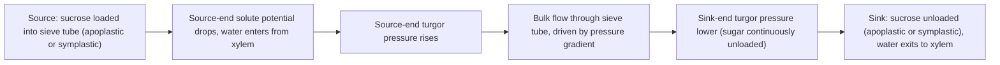



## Overview

[Xylem, Phloem & Vascular Tissue](../../6-plant-anatomy/xylem-phloem-vascular-tissue/) described the sieve tube element and companion cell structurally — a living conducting cell stripped of its nucleus and most organelles, kept metabolically functional by a companion cell wired to it through elaborated plasmodesmata. This page covers the transport mechanism that structure supports: **translocation**, the bulk movement of sugars (mainly sucrose) from where they are produced or stored to where they are used or stored, driven by a pressure gradient rather than by the water-potential-driven passive movement covered on [Water Transport & Transpiration](../water-transport-transpiration/).

## Key Concepts

### Source and Sink

Phloem transport is defined relationally, not by fixed anatomical location: a **source** is any tissue that is a net exporter of sugar (mature photosynthesizing leaves; germinating seeds mobilizing stored reserves; storage organs during regrowth), and a **sink** is any tissue that is a net importer (growing shoot and root tips, developing fruits and seeds, storage organs during accumulation). The same organ can switch roles across a plant's life cycle — a storage root is a sink while accumulating starch and a source when that starch is later mobilized to support new growth — which is why phloem flow direction is not fixed like xylem's root-to-shoot direction, but reverses according to which tissues are currently acting as source and which as sink.

### Phloem Loading

At the source end, sucrose produced by photosynthesis (or released from storage) must be concentrated into the sieve tube against its concentration gradient, which happens by one of two routes:

- **Apoplastic loading** — sucrose is first exported from mesophyll cells into the cell wall space (apoplast) near the minor vein, then actively taken up into the sieve tube element/companion cell complex by **sucrose-H⁺ symporters**, powered by a proton gradient that H⁺-ATPases maintain across the plasma membrane. This is an active, energy-consuming step, and it is why **transfer cells** (specialized companion cells with wall ingrowths that amplify surface area, see [Xylem, Phloem & Vascular Tissue](../../6-plant-anatomy/xylem-phloem-vascular-tissue/)) are concentrated exactly where apoplastic loading is most intense.
- **Symplastic loading** — sucrose moves cell-to-cell via plasmodesmata all the way from mesophyll to sieve tube without ever entering the apoplast. Many species using this route additionally convert sucrose into larger sugars (raffinose, stachyose) once inside the phloem, a mechanism called **polymer trapping**: because plasmodesmata size-exclude molecules above a threshold, the larger sugars cannot diffuse back out the way they came in, maintaining the concentration gradient needed for continued loading without added transporter proteins.

Either route achieves the same essential outcome: sieve tube solute concentration at the source is driven well above that of surrounding tissue, sharply lowering the sieve tube's water potential there.

### The Pressure-Flow (Münch) Hypothesis

Once sucrose is loaded at the source, water follows osmotically from the adjacent xylem (the two vascular tissues run alongside each other precisely so this water exchange is fast, see [Xylem, Phloem & Vascular Tissue](../../6-plant-anatomy/xylem-phloem-vascular-tissue/)), raising **turgor pressure** in the sieve tube at the source end. At the sink end, sugar is continuously removed (unloaded, see below), keeping sieve tube solute concentration — and therefore turgor pressure — low there. The resulting pressure difference between source and sink, transmitted through the continuous, plasmodesmata- and sieve-plate-connected sieve tube lumen, drives **bulk flow** of the entire sap (water and dissolved sugars together) from source to sink — mechanistically distinct from xylem transport, which is pulled by tension rather than pushed by a pressure gradient, and from simple diffusion, which would be far too slow to account for the observed translocation rates. Because the driving pressure difference depends only on the relative concentrations at the two ends, not on which end is physically higher or lower, phloem sap can move in any direction — including downward from a leaf source to a root sink, upward from a storage root source to a growing shoot sink, or laterally between two leaves at the same height — a direct, testable contrast with xylem's exclusively upward flow.

### Phloem Unloading

At the sink end, sugar exits the sieve tube by routes mirroring the loading options: **symplastic unloading** (plasmodesmata, common in rapidly growing sinks like root tips, where cells need bulk sugar delivery without fine metabolic control) or **apoplastic unloading** (sucrose exported into the apoplast, then actively or passively taken up by sink cells, common where the sink needs to regulate its own uptake rate independently of phloem pressure — e.g. developing seeds, where the maternal phloem and the offspring embryo are genetically distinct tissues not connected by plasmodesmata at all, making apoplastic unloading the only option). Continuous removal of sugar at the sink, by whichever route, is what keeps sink-end turgor low and therefore keeps the pressure gradient driving bulk flow from collapsing.

## Comparative Structures

| Feature | Xylem transport | Phloem transport |
|---|---|---|
| Driving force | Tension (negative pressure) from transpiration | Positive pressure gradient (source high, sink low) |
| Direction | Root to shoot only | Source to sink, either direction |
| Conducting cell state | Dead at maturity | Alive at maturity |
| What moves | Water and dissolved minerals | Sugars (mainly sucrose) and other organic solutes |
| Energy requirement | None directly (passive, physical) | Active (loading requires ATP-driven transport) |

## Common Exam Questions

- "Define source and sink in phloem transport, and explain why the same organ can act as either depending on developmental stage."
- "Distinguish apoplastic from symplastic phloem loading, and explain the specific role of polymer trapping in the symplastic route."
- "Explain the pressure-flow hypothesis, tracing the full sequence from sucrose loading at the source to bulk flow arriving at the sink."
- "Explain why phloem transport, unlike xylem transport, is not restricted to one direction."
- "Explain why a developing seed must unload phloem sugar apoplastically rather than symplastically."

## Visual Reference

**Interactive**

- **Pressure-flow (Münch) demonstrator (SVG/JS, step-through)** — two connected chambers (source, sink) linked by a tube, with a slider controlling source-end sucrose loading rate; increasing loading visibly raises source turgor (rendered as chamber pressure) and drives flow toward the sink chamber, letting the user confirm that flow direction reverses if the sink-chamber loading is set higher instead.
- **Loading pathway toggle (click-through)** — a single minor-vein cross-section that toggles between apoplastic loading (sucrose crossing the apoplast, sucrose-H+ symporter highlighted) and symplastic loading (plasmodesmata route, polymer trapping shown converting sucrose to raffinose/stachyose once inside).

**Static**

- Source-to-sink whole-plant diagram showing multiple simultaneous source/sink relationships (mature leaf to root, storage root to new shoot) with arrows in different directions
- Apoplastic phloem loading diagram: mesophyll → apoplast → sucrose-H+ symporter → sieve tube/companion cell complex
- Symplastic phloem loading diagram: mesophyll → plasmodesmata → sieve tube, with polymer trapping conversion shown
- Pressure-flow hypothesis full diagram: source loading, water entry from xylem, bulk flow through sieve tube, sink unloading, water exit to xylem
- Xylem vs. phloem transport direction comparison, whole-plant scale

## Practice Problems

1. A germinating seed's cotyledons are shrinking as their stored starch is converted to sucrose and exported. Identify whether the cotyledon is currently acting as a source or sink, and justify your answer.
2. Explain why blocking a plant's sucrose-H+ symporters with a chemical inhibitor would prevent apoplastic loading but not symplastic loading.
3. A developing fruit is not connected to maternal phloem tissue by plasmodesmata. Explain how it nonetheless receives sugar, naming the specific unloading route involved.
4. Using the pressure-flow hypothesis, explain why phloem sap can move downward from a leaf to a root at the same time xylem sap is moving upward through the same region of stem.
5. Predict what would happen to sink-end turgor pressure, and therefore to bulk flow rate, if a sink tissue's sugar consumption suddenly stopped.
