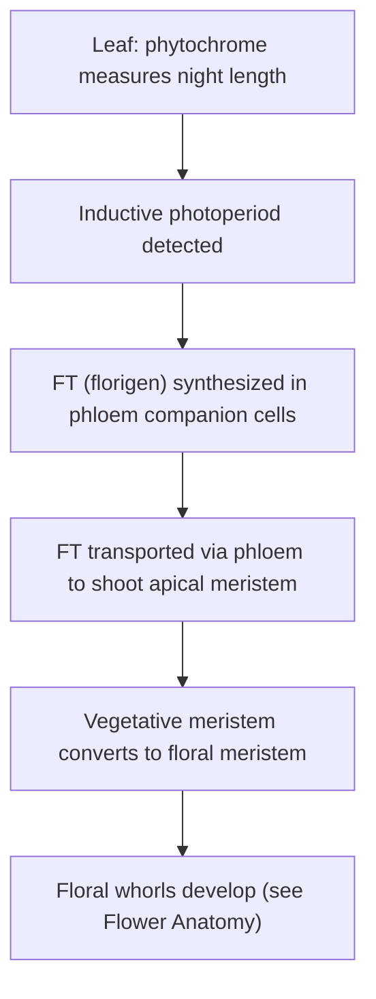



## Overview

[Flower Anatomy & Reproductive Structures](../../6-plant-anatomy/flower-anatomy-reproductive-structures/) covers what a flower is built from once the plant has committed to flowering — the four whorls, microsporogenesis, megasporogenesis. This page covers the upstream decision: how a plant determines *when* to make that commitment, using day length and, in some species, a prior cold exposure, as environmental timing cues, and what mobile internal signal actually carries that decision from the leaf (where the cue is sensed) to the shoot apical meristem (where the floral transition physically occurs).

## Key Concepts

### Phytochrome and the Red/Far-Red Switch

**Phytochrome** is a photoreversible pigment-protein that exists in two interconvertible forms: **Pr** (absorbs red light, ~660 nm) and **Pfr** (absorbs far-red light, ~730 nm) — absorbing red light converts Pr to Pfr, and absorbing far-red light converts Pfr back to Pr. Sunlight contains far more red than far-red light, so Pfr accumulates during the day; in darkness, Pfr slowly and spontaneously reverts to Pr over the course of the night (rather than requiring far-red light specifically), at a roughly constant rate. This slow, dark-driven Pfr-to-Pr conversion is what allows phytochrome to function as a night-length timer: the longer an uninterrupted dark period lasts, the more completely Pfr reverts to Pr, so the Pfr:Pr ratio present at dawn is a direct molecular readout of how long the preceding night was. Critically, this makes phytochrome sensitive to **night length**, not day length directly, which is the basis for the terminology correction in the next section.

### Short-Day, Long-Day, and Day-Neutral Plants

Flowering-time classification is conventionally named by day length but mechanistically determined by **critical night length**, a fact demonstrable by a single classic experiment: interrupting a long night with a brief pulse of red light in the middle prevents flowering in a short-day plant just as effectively as shortening the night itself, while interrupting a short night has no equivalent effect — showing that the plant is measuring the uninterrupted dark period, not daylight directly. On that basis:

- **Short-day (long-night) plants** — flower only when the uninterrupted night exceeds a species-specific critical length (i.e., when days are short), because a sufficiently long night allows Pfr to fall low enough to permit the floral transition. A brief red-light interruption in the middle of an otherwise long night restores enough Pfr to block flowering.
- **Long-day (short-night) plants** — flower only when the uninterrupted night is shorter than the critical length (i.e., when days are long), because flowering here requires that Pfr remain relatively high through the night, which only occurs if the dark period is short enough to prevent much Pfr-to-Pr reversion.
- **Day-neutral plants** — flower based on developmental stage (e.g., reaching a minimum leaf number) rather than photoperiod at all.

### Vernalization

Some species (many biennials and winter annuals) additionally require **vernalization** — a prolonged period of cold exposure, typically during winter, before they become competent to flower even under an otherwise inductive photoperiod the following season. Mechanistically, vernalization involves epigenetic silencing of a floral repressor gene (in the well-studied case, sustained cold progressively represses the *FLC* repressor via chromatin modification), a change that persists through subsequent cell divisions in the meristem (a form of cellular, mitotically heritable memory of the cold exposure) even after the cold period ends and temperatures rise — which is why a single winter's cold, not the plant's continued exposure to cold at flowering time, is sufficient to unlock the response. Vernalization and photoperiod act as independent checkpoints: a species requiring both will not flower on photoperiod alone without prior cold exposure, nor on cold exposure alone without the correct subsequent photoperiod.

### Florigen: The Mobile Flowering Signal

Photoperiod is sensed in leaves (where phytochrome and the night-length-measuring clock operate), but the floral transition itself occurs at the **shoot apical meristem**, often at a considerable distance — classic grafting experiments (an induced leaf grafted onto an otherwise non-induced plant of the same species triggers flowering in the recipient) demonstrated decades before its molecular identity was known that a mobile, graft-transmissible signal, not an electrical or purely local response, carries the flowering decision from leaf to apex. This signal is now identified as **florigen**, the **FT (Flowering Locus T) protein**: synthesized in leaf phloem companion cells under inductive photoperiod, then transported through the phloem (see [Phloem Transport & Translocation](../phloem-transport-translocation/) for the general mechanism carrying it) to the shoot apical meristem, where it triggers the transcriptional program converting the vegetative meristem into a floral meristem — the developmental switch whose structural output (the four floral whorls) is covered on [Flower Anatomy & Reproductive Structures](../../6-plant-anatomy/flower-anatomy-reproductive-structures/).

## Comparative Structures

| Feature | Short-day plant | Long-day plant | Day-neutral plant |
|---|---|---|---|
| Flowering trigger | Night length exceeds critical value | Night length below critical value | Developmental stage, independent of photoperiod |
| Effect of interrupting the night with red light | Blocks flowering | No effect / can promote flowering | No effect |
| Example season | Flowers in autumn/short days | Flowers in late spring/summer | Any season once mature |

## Common Exam Questions

- "Explain why phytochrome is better described as measuring night length rather than day length, referencing the red-light night-interruption experiment."
- "Distinguish short-day, long-day, and day-neutral plants by their response to critical night length."
- "Explain the mechanism of vernalization, including why the cold-induced change persists after the cold period ends."
- "Describe the classical grafting experiment demonstrating florigen's existence, and explain what it proved that simply observing flowering timing could not."
- "Trace florigen's path from its site of synthesis to its site of action, naming the transport tissue involved."

## Visual Reference

**Interactive**

- **Phytochrome Pfr/Pr night-length timer (SVG/JS, slider for night duration)** — a slider sets night length; the diagram shows Pfr-to-Pr reversion accumulating over the dark period, with a threshold marker indicating whether the resulting dawn Pfr:Pr ratio would trigger flowering in a short-day vs. long-day plant, letting the user test the red-light-interruption scenario as a toggle mid-night.
- **Grafting experiment reconstructor (click-through)** — a two-plant diagram (induced donor, non-induced recipient) where clicking "graft" transmits a visible signal marker across the graft union to the recipient's apex, which then transitions to flowering — reproducing the classic experiment's logic before revealing FT protein as the modern molecular identity of that signal.

**Static**

- Phytochrome Pr/Pfr interconversion diagram: red light converting Pr to Pfr, far-red light and dark reversion converting Pfr back to Pr
- Short-day vs. long-day critical night length diagram, showing an uninterrupted long night vs. the same night interrupted by a red-light pulse
- Vernalization timeline diagram: cold exposure period, FLC repressor silencing, subsequent flowering-competent state maintained through later cell divisions
- Florigen pathway diagram: leaf phytochrome/FT synthesis, phloem transport route, shoot apical meristem floral transition
- Classic grafting experiment diagram: induced leaf grafted onto non-induced plant, flowering triggered at the recipient's apex

## Practice Problems

1. A short-day plant is kept under a long uninterrupted night, but a brief flash of red light is applied exactly halfway through. Predict whether it will flower and explain why.
2. A biennial plant is grown entirely in a warm greenhouse and given an inductive photoperiod. It fails to flower. Propose an explanation involving vernalization.
3. Explain why grafting an induced leaf onto a non-induced plant causes the recipient to flower, and what this result rules out as an explanation (a purely local, non-mobile response at the leaf).
4. Using the concept of critical night length, explain why some long-day plants can be induced to flower using a brief light interruption during an otherwise long night, functionally shortening it.
5. Explain why the vernalization response persists in a meristem's descendant cells even after the plant is moved to a warm environment, referencing the type of molecular change involved.
